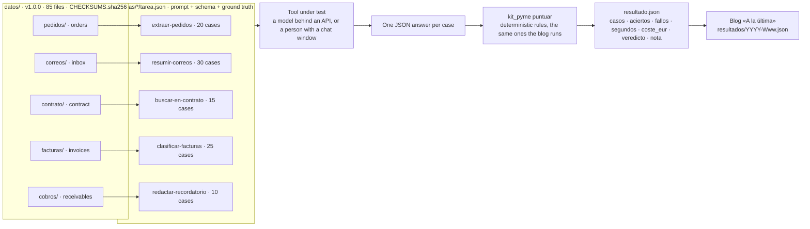
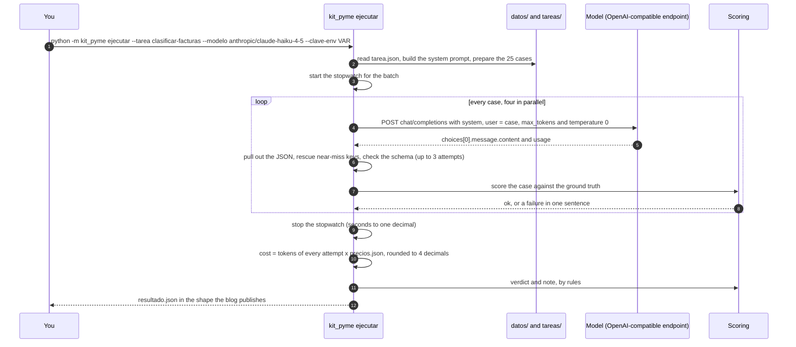
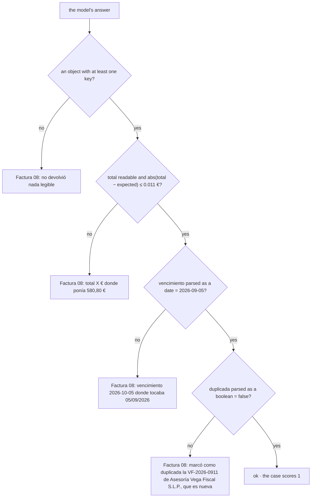
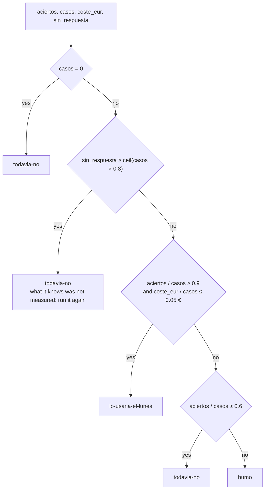
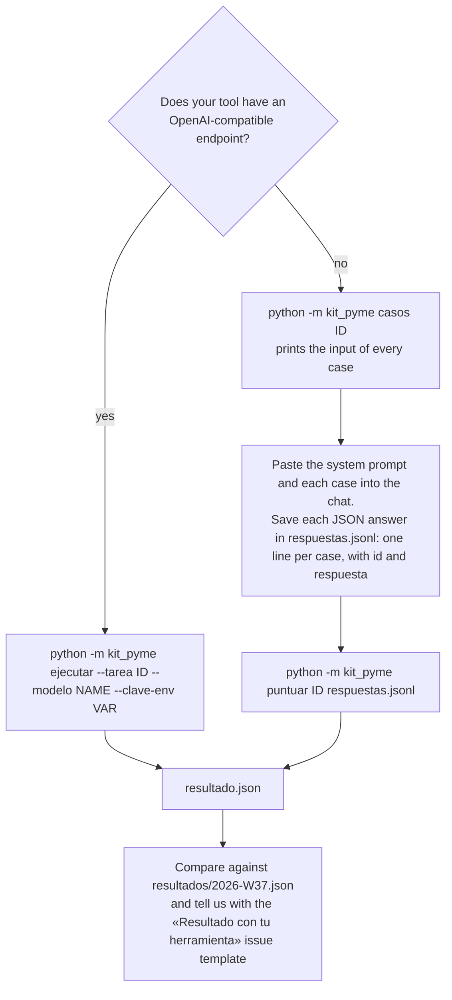
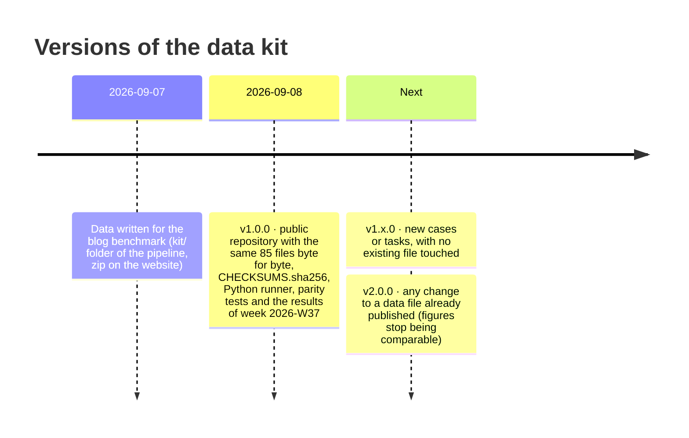

[Español](README.md) · **English**

# Kit de la pyme

[](https://github.com/Bytenauta-Org/Kit_de_la_pyme/actions/workflows/ci.yml)
[](LICENSE)
[](CHANGELOG.md)
[](pyproject.toml)
[](https://github.com/astral-sh/ruff)
[](CONTRIBUTING.md)

1. [What it is and why it exists](#1-what-it-is-and-why-it-exists)
2. [In two minutes](#2-in-two-minutes)
3. [What it measures and what it does not](#3-what-it-measures-and-what-it-does-not)
4. [How it works](#4-how-it-works)
5. [The five tasks](#5-the-five-tasks)
6. [One task in full: clasificar-facturas](#6-one-task-in-full-clasificar-facturas)
7. [How scoring works and where the verdict comes from](#7-how-scoring-works-and-where-the-verdict-comes-from)
8. [Running it with your own tool](#8-running-it-with-your-own-tool)
9. [Published results](#9-published-results)
10. [Data versioning](#10-data-versioning)
11. [Repository layout](#11-repository-layout)
12. [How we know it scores like the blog](#12-how-we-know-it-scores-like-the-blog)
13. [Contributing](#13-contributing)
14. [License, citation and languages](#14-license-citation-and-languages)

## 1. What it is and why it exists

One hundred pieces of back-office work from a small Spanish company, each with the correct answer already written down, so you can measure whether an AI tool gets them right, how long it takes and what it costs.

The data belongs to a company that does not exist: **Conservas Marjal Blanca S.L.**, a fish and vegetable cannery in Almoradí (Alicante, on the Spanish Mediterranean coast) with about 40 employees. No company, person, tax number or email address in it is real.

| Folder | What is in it | Cases | Correct answer |
|---|---|---:|---|
| `datos/pedidos/` | 20 customer orders exactly as they arrive: a plain email, a table pasted out of a spreadsheet, the text of a PDF, a CSV, a photo through OCR with the usual damage, one in Valencian, one in English, one that says "the usual", one split into two deliveries, one product code that does not exist and one price that is not the one on the price list. Plus `tarifa.csv` (40 product codes, five price columns) and `clientes.csv` (13 customers). | 20 | `pedidos-verdad.json` |
| `datos/correos/` | 30 emails from the admin mailbox: complaints, questions, order changes, supplier invoices and notices, the outside bookkeeping firm, the bank, the town hall, the health authority, spam and phishing. | 30 | `correos-verdad.json` |
| `datos/contrato/` | A framework supply contract of 28,396 words, 28 clauses and 8 annexes, and the 15 questions a manager actually asks about it. | 15 | `contrato-preguntas.json` |
| `datos/facturas/` | 25 supplier invoices as text: tinplate, tuna, olive oil at the 4 % VAT rate, electricity, a rent invoice with 19 % withholding, a self-employed contractor with 15 %, an insurance premium with no VAT, an Irish SaaS bill under the reverse charge, a cash receipt for diesel, and two that were already in the books (`registro-previo.csv`). | 25 | `facturas-verdad.json` |
| `datos/cobros/` | `cobros.csv`: 60 issued invoices with due date, status, partial payments, days overdue and notes. Ten of them need a payment reminder written in the right tone. | 10 | `cobros-verdad.json` |

**Spanish words in the data.** The company, its paperwork and its taxes are Spanish, and nine terms the tasks turn on — `pyme`, gestoría, IVA, retención de IRPF, inversión del sujeto pasivo, Plan General Contable, NIF, Valencian and recibo domiciliado — are explained in [§6](#6-one-task-in-full-clasificar-facturas), right before the invoice that uses them.

Numbers keep the Spanish format wherever the program prints them (`0,3822 €`, comma as the decimal separator). This page writes them the English way in its own text and copies program output verbatim.

The weekly column [«A la última»](https://bytenauta.com/a-la-ultima/) by [Bytenauta S.L.](https://bytenauta.com) does not describe AI releases: it runs them over this kit and publishes what comes out. For those figures to be worth arguing about, three things have to hold, and the kit exists for all three:

1. **Anyone can repeat the test** with the tool they already pay for, the one being sold to them, or the one released this week, and compare.
2. **The scoring is the same** here and in the blog. The `kit_pyme` package reproduces the pipeline's code rule by rule, and the tests check it against that code's recorded output ([§12](#12-how-we-know-it-scores-like-the-blog)).
3. **The data cannot change quietly.** It is versioned and checksummed, and `python -m kit_pyme verificar` tells you whether you hold the files the published figures were measured on.

The kit will not tell you which AI vendor is best. It tells you whether one specific tool does five specific back-office jobs of a small Spanish company well, and at what price.

## 2. In two minutes

You need Python 3.11 or later and nothing else. No API key, and nothing to pay.

**1. Get the kit.**

```bash
git clone https://github.com/Bytenauta-Org/Kit_de_la_pyme.git && cd Kit_de_la_pyme
```

**2. Check that you have the published data.**

```console
$ python -m kit_pyme verificar
OK   datos/ y los prompts son los publicados (checksums y sha256 correctos).
```

It recomputes the SHA-256 of the 85 files in `datos/` and of the five prompts, and returns 0. The line says they are the ones the published figures were measured on.

**3. Break one correct answer and see what the kit says.** The repository ships the perfect answers of every task in `tests/oro/respuestas-verdad/` (`oro` is Spanish for gold). Change the due date of one invoice and score them:

```bash
sed '/"id":"factura-08"/s/2026-09-05/2026-10-05/' \
  tests/oro/respuestas-verdad/clasificar-facturas.jsonl > respuestas.jsonl
python -m kit_pyme puntuar clasificar-facturas respuestas.jsonl
```

In PowerShell:

```powershell
(Get-Content tests/oro/respuestas-verdad/clasificar-facturas.jsonl) `
  -replace '(?<="id":"factura-08".*)2026-09-05','2026-10-05' | Out-File -Encoding utf8 respuestas.jsonl
python -m kit_pyme puntuar clasificar-facturas respuestas.jsonl
```

The output is the same either way:

```text
Tarea      clasificar-facturas — Contabilizar 25 facturas recibidas: total, vencimiento y si ya estaba registrada
Modelo     (sin modelo)
Casos      25
Aciertos   24 de 25
Segundos   0
Coste      0 €
Veredicto  lo-usaria-el-lunes
Nota       Acertó 24 de 25 a 0,0 céntimos por caso; sirve el lunes si una persona repasa los casos con incidencia. Ejemplo: Factura 08: vencimiento 2026-10-05 donde tocaba 05/09/2026.
Fallos publicados (hasta 3):
  - Factura 08: vencimiento 2026-10-05 donde tocaba 05/09/2026
```

Everything the program prints is Spanish, so, line by line: task, model (`(sin modelo)`: none was recorded, because nothing was called), cases, correct cases (`aciertos` in the result file), seconds, cost, verdict, the sentence that goes into the post, and the failures published, up to three.

That last line is, word for word, the only failure the blog published on 8 September 2026 when it ran the small Anthropic model over this task ([`resultados/2026-W37.json`](resultados/2026-W37.json)). You have just reproduced a published figure without calling a model: the scoring is not done by an AI, it is done by rules that live in this repository.

Left untouched, the correct answers score 25 out of 25, which is how you check that your copy scores like ours:

```console
$ python -m kit_pyme puntuar clasificar-facturas tests/oro/respuestas-verdad/clasificar-facturas.jsonl
Tarea      clasificar-facturas — Contabilizar 25 facturas recibidas: total, vencimiento y si ya estaba registrada
Modelo     (sin modelo)
Casos      25
Aciertos   25 de 25
Segundos   0
Coste      0 €
Veredicto  lo-usaria-el-lunes
Nota       Acertó los 25 casos a 0,0 céntimos por caso; lo pondría a trabajar el lunes con alguien mirando por encima la primera semana.
```

Measuring a real tool needs one that answers: with an API key the kit calls it case by case and measures seconds and cost; without an API you paste the cases into a chat and save the answers. Both ways are in [§8](#8-running-it-with-your-own-tool).

## 3. What it measures and what it does not

Four figures and a verdict per task:

| Figure | What it is |
|---|---|
| `casos` and `aciertos` | Cases, and correct cases: those whose answer passes every rule of the task. A case scores 1 or 0, with no partial credit |
| `fallos` | The first three failures, each in one sentence with the expected value and the one given |
| `segundos` | Wall-clock time of the whole batch with four cases in flight |
| `coste_eur` | Tokens of every attempt against the price table, rounded to four decimals |
| `veredicto` and `nota` | `lo-usaria-el-lunes`, `todavia-no` or `humo`, decided by rules on the share of correct cases, the cost per case and the cases with no answer |

What it does **not** measure, worth having in front of you while reading any figure:

| Outside the kit | Why |
|---|---|
| How well the text reads | Reminders are scored on data, tone by word list, length, first name and signature, not on whether the email is nicely written |
| PDF extraction and OCR | The orders "from a PDF" or "with OCR" are already-extracted text, defects included |
| Integration | What it costs to wire the tool into the mailbox, the ERP or the accounting package. Only the answer is measured |
| Your real bill | `coste_eur` is a price-table estimate, not the invoice from the provider: discounts, prompt caching, taxes and currency are all out |
| The best prompt available | The prompt is fixed and written the way a small business would write it. A specialist would get more out of any model; that is not what is being measured |

The ten things that are not measured, together with the limits of size, sector and data contamination, are in [`docs/en/metodologia.md`](docs/en/metodologia.md).

## 4. How it works



The tool under test is the replaceable part, and it takes no part in its own scoring. Four pieces, four responsibilities:

- **Data and tasks** (`datos/`, `tareas/`): what the tool is given and what it should answer. No code in them.
- **Runner and scoring** (`kit_pyme/`): builds the prompts, calls the model if there is an API, reads the answers and scores them. Python 3.11+, standard library only.
- **Results** (`resultados/`): one file per blog issue with the published figures and where they came from.
- **Maintenance tools** (`tools/`): four scripts. The CI runs `comprobar_mermaid.py`; the release workflow runs `version_changelog.py`. `verificar_checksums.py` and `validar_esquemas.py` are there to check by hand what the CI does with `sha256sum` and `check-jsonschema`.

A full run, with the conditions that fix what the figures mean:



Details that move the figures and that the runner copies from the blog: temperature 0 (omitted if the model rejects it with a 400), up to three attempts per case when the answer is not JSON or does not match the schema (discarded attempts are paid for too), any 4xx other than 429 aborts the whole task, four cases in flight at a time, no memory between cases, and the time is the whole batch's, not the sum of the cases.

## 5. The five tasks

```console
$ python -m kit_pyme tareas
id                     casos  max_tokens  nombre
extraer-pedidos           20        6000  Sacar las líneas de 20 pedidos tal como llegan por correo
resumir-correos           30        4000  Clasificar 30 correos del buzón de administración y decir qué hay que hacer
buscar-en-contrato        15        4000  Responder 15 preguntas sobre un contrato de suministro de 60 páginas
clasificar-facturas       25        4000  Contabilizar 25 facturas recibidas: total, vencimiento y si ya estaba registrada
redactar-recordatorio     10        4000  Escribir 10 recordatorios de cobro con el tono que toca
```

The ids and names stay Spanish because they are what the program sends, prints and publishes. What each one asks for:

| Id | What the tool has to do | Cases | `max_tokens` | Input of each case | What is scored |
|---|---|---:|---:|---|---|
| `extraer-pedidos` | Turn 20 customer orders, in whatever shape they arrived, into order lines | 20 | 6000 | `pedido-NN.txt` in full; the prompt carries `tarifa.csv` and `clientes.csv` | Customer, lines (product code, boxes, that customer's list price) and mandatory flags |
| `resumir-correos` | Sort 30 mailbox emails by category and urgency and say what to do | 30 | 4000 | `correo-NN.txt` in full | Category and urgency, exact |
| `buscar-en-contrato` | Answer 15 questions about a 60-page supply contract, citing the clause | 15 | 4000 | The question; the prompt carries `contrato.txt` in full (188 KB) | The fact and the clause cited |
| `clasificar-facturas` | Book 25 supplier invoices: total, due date, and whether it is already in the books | 25 | 4000 | `factura-NN.txt` in full; the prompt carries `registro-previo.csv` | Total, due date, duplicate |
| `redactar-recordatorio` | Write 10 payment reminders, each in the tone that case calls for | 10 | 4000 | The overdue invoice and its row in `cobros.csv` | Mandatory data, tone, length, first name and signature |

`max_tokens` is a fixed condition of the test, not a preference: change it and the figures stop being comparable.

## 6. One task in full: `clasificar-facturas`

The other four are documented the same way in [`docs/en/tareas.md`](docs/en/tareas.md). This one is the sample of what sits behind every case.

**The Spanish terms this task turns on.** The invoice below is a Spanish document and the rules that score it are Spanish accounting rules. One line each:

| Term | What it is |
|---|---|
| `pyme` | *Pequeña y mediana empresa*, a company under 250 employees. "Kit de la pyme" means "the small-business kit" |
| Gestoría, asesoría | The outside firm that keeps the books, files the taxes and runs the payroll. Most Spanish small companies use one instead of employing an accountant; invoice 08 in the data is its monthly fee |
| IVA | Value-added tax: 21 % standard, 10 % and 4 % reduced. Food moves between rates, so the invoices mix them |
| Retención de IRPF | Income tax the buyer withholds from the invoice and pays straight to the tax office: 19 % on rent, 15 % on self-employed professionals. It is subtracted, so the total is not base plus VAT |
| Inversión del sujeto pasivo | Reverse charge: a service invoiced from another EU country carries no Spanish VAT and the buyer accounts for it. The Irish SaaS invoice is that case |
| Plan General Contable | The Spanish chart of accounts. The three-digit codes the model is asked to suggest (600, 621, 623, 628) come from it |
| NIF | The tax number of a company or a person (`B38122941`). The ones in the data are invented, with a valid check digit |
| Valencian | A co-official language of the Valencia region, where Alicante is. One order and one email arrive in Valencian, and one order in English from a British importer |
| Recibo domiciliado | A direct debit: the supplier charges the customer's bank account on a fixed day of the month, and that day is the due date. It is the trap in the invoice below |

**The case.** One of the 25, exactly as the kit prints it:

```console
$ python -m kit_pyme casos clasificar-facturas --id factura-08
===== factura-08 =====
De: Asesoría Vega Fiscal S.L.P. <fiscal@vegafiscal.example>
Para: Administración Marjal Blanca <administracion@marjalblanca.example>
Fecha: 01/09/2026
Asunto: Factura VF-2026-0911

Estimado cliente:

Le remitimos la factura VF-2026-0911 de fecha 01/09/2026, emitida a nombre de Conservas Marjal Blanca S.L. (NIF B38122941).

| Concepto | Cantidad | Precio | Importe |
|---|---|---|---|
| Cuota mensual asesoramiento fiscal, contable y laboral – septiembre 2026 | 1 | 480,00 | 480,00 |

Base imponible: 480,00 €
IVA 21 %: 100,80 €
Total: 580,80 €

Recibo domiciliado el día 5 de cada mes.
IBAN ES20 2038 7700 1100 2233 4455

Asesoría Vega Fiscal S.L.P. · B37880192 · c/ Mayor 18, 1.º B · 03160 Almoradí (Alicante)
```

It is the monthly fee of the outside bookkeeping firm: 480 € plus 21 % VAT, 580.80 € to pay. The difficulty is the line «Recibo domiciliado el día 5 de cada mes»: on an invoice dated 01/09/2026, the 5th of each month means 5 September, not 5 October.

**The prompt.** The first lines of the system message, which is the same for all 25 cases:

```text
Trabajas en contabilidad de Conservas Marjal Blanca S.L. (NIF B38122941, Almoradí, Alicante). Te van llegando facturas de proveedores y tienes que dejarlas listas para contabilizar.

Para cada factura devuelve:
- proveedor y numero de factura tal como aparecen.
- fecha de la factura y base imponible, cuota de IVA y total, en euros con dos decimales (número, no texto). Ojo: el total puede llevar retención de IRPF (alquileres 19 %, profesionales autónomos 15 %) que se resta, o impuestos que no son IVA (primas de seguros) que se suman. Las facturas de servicios de fuera de España con inversión del sujeto pasivo van sin IVA.
- vencimiento en formato AAAA-MM-DD. Si la factura dice «30 días fecha factura», «60 días f.f.», «pagaré a 90 días», cuéntalos desde la fecha de la factura; si dice contado, pagado con tarjeta o en efectivo, el vencimiento es la fecha de la factura; si dice que se domicilia o se carga en cuenta en una fecha, esa fecha; si dice «antes del día 5 del mes», el día 5 de ese mes.
[...]
FORMATO DE LA RESPUESTA: un solo objeto JSON con exactamente estas claves, escritas así: proveedor, numero, fecha, base, iva, total, vencimiento, cuenta_sugerida, duplicada. Sin otras claves, sin comentarios y sin texto antes ni después.
```

What that prompt says: who the model works for, that the total may carry withholding to subtract or a non-VAT tax to add, that services invoiced from outside Spain under the reverse charge come without VAT, and how to turn each Spanish payment-terms phrase into a due date. The composed prompt is 2,280 bytes with the register of already-booked invoices included; the system message that is actually sent adds the `FORMATO` line and comes to 2,521. `python -m kit_pyme prompt clasificar-facturas` prints the second one, `--sin-formato` the first.

**The correct answer.** What `datos/facturas/facturas-verdad.json` says for this case, of which only three fields are compared:

```json
{
  "id": "factura-08",
  "proveedor": "Asesoría Vega Fiscal S.L.P.",
  "numero": "VF-2026-0911",
  "fecha": "2026-09-01",
  "base": 480,
  "iva": 100.8,
  "total": 580.8,
  "vencimiento": "2026-09-05",
  "cuenta_sugerida": "623",
  "duplicada": false
}
```

**Scoring the case.** Three rules in a ladder; the first one that fails stops the case and writes the sentence that gets published:



Branch `F2` is the one that fired in the published issue, and the one the command in [§2](#2-in-two-minutes) reproduces. Dates are read in four formats (`2026-09-05`, `05/09/2026`, `5-9-2026`, «5 de septiembre de 2026»), so form is not punished: what fails is the month. Supplier, invoice number, invoice date, taxable base, VAT and the suggested account are asked for and not compared, because on those more than one answer can be defended.

## 7. How scoring works and where the verdict comes from

A case scores 1 or 0. It scores 1 only if it passes every rule of its task; the first failure is described in one sentence a manager can read («Pedido 07: en CONS-MELV-OL-120 puso 26,40 € donde la tarifa dice 29,28 €» — order 07 used 26.40 € where the price list says 29.28 €). Comparisons normalize case, accents, whitespace, number formats («1.234,56 €») and date formats («7 de septiembre de 2026»), so that form is not punished.

| Task | Compared | Not scored |
|---|---|---|
| `extraer-pedidos` | Customer, each line (product code, boxes, list price with a tolerance of 0.011 €), extra lines, mandatory flags | `fecha_entrega`, the wording of non-mandatory flags |
| `resumir-correos` | Category and urgency, exact | `accion`, `resumen` |
| `buscar-en-contrato` | The fact (in any accepted form) and the clause cited | The wording; a literal quote counts for the fact, not for the clause |
| `clasificar-facturas` | Total (±0.011 €), due date, duplicate | Supplier, number, date, base, VAT, account |
| `redactar-recordatorio` | Invoice number, amount, due date, mandatory tone words, forbidden words, 220-word ceiling, first name, signature | Style, spelling, structure |

The verdict comes from the share of correct cases, the cost per case and how many cases came back unreadable:



The three thresholds are constants of the blog's code: 90 % correct and 0.05 € per case for `lo-usaria-el-lunes`, 60 % to stay out of `humo`. The three words that get published are the ones the program writes, untranslated and unsoftened:

| Verdict | Literally | What it means |
|---|---|---|
| `lo-usaria-el-lunes` | "I would use it on Monday" | 90 % correct or more, at 5 cents per case or less |
| `todavia-no` | "not yet" | Between 60 % and 90 %, or right but too expensive, or nothing could be measured |
| `humo` | "smoke" | Under 60 % correct |

The normalization tables with their checked values, the note that goes with each verdict, how cost and seconds are computed and the JavaScript rounding the kit emulates are in [`docs/en/puntuacion.md`](docs/en/puntuacion.md).

## 8. Running it with your own tool



With an API the runner measures the seconds and estimates the cost from `precios.json`. Without one, you note the time yourself and work the cost out from your monthly fee divided by how much you ask of it; the scoring is the same.

Starting with a sample of three cases instead of the full twenty-five costs a few cents and surfaces configuration problems before you pay for them:

```bash
export ANTHROPIC_API_KEY="..."
python -m kit_pyme ejecutar --tarea clasificar-facturas --modelo anthropic/claude-haiku-4-5 \
  --clave-env ANTHROPIC_API_KEY --casos 3
```

The first line it prints says what is being measured against what:

```text
clasificar-facturas: 3 casos contra anthropic/claude-haiku-4-5 en https://api.anthropic.com/v1/chat/completions (concurrencia 4)
```

The six subcommands and their options:

| Command | What it does | Options |
|---|---|---|
| `tareas` | Lists the five tasks with their cases and their `max_tokens` | — |
| `casos <task>` | Prints the input of every case, ready to paste into any tool | `--id <case>` for a single one; `--jsonl` for one `{id, entrada}` JSON line per case |
| `prompt <task>` | Prints the system message that is sent to the model | `--sin-formato` for the prompt without the trailing `FORMATO` line |
| `puntuar <task> <respuestas.jsonl>` | Scores answers you already have: one JSON line per case, `{"id": "...", "respuesta": {...}}` | `--modelo <name>` to label the result; `--salida <folder>` to write `resultado.json` and `detalle.json`; `--json` to print the result instead of the table |
| `ejecutar --tarea <id> --modelo <name>` | Calls the model case by case, measures seconds and tokens, estimates the cost and writes `resultado.json` | `--clave-env <VAR>`, `--endpoint <url>`, `--modelo-api <name>`, `--casos <N>` (sample), `--concurrencia <N>` (4), `--precios <file>`, `--tiempo-maximo <seconds>`, `--salida`, `--novedad-url`, `--json` |
| `verificar` | Checks `datos/CHECKSUMS.sha256`, that no data file is missing or extra, and the SHA-256 of the five prompts | `--regenerar` rewrites `CHECKSUMS.sha256` (only when the kit version goes up) |

Two global options: `--raiz <folder>` to point at another copy of the kit, and `--version`. And one convenience that `--help` does not mention: **`--endpoint` is optional** when the model id starts with `anthropic/`, `openai/`, `google/` or `google-ai-studio/`, and a name with no slash is taken as Anthropic; with any other provider you pass the URL.

A note on `prompt`: its output always ends in a newline, and for two of the five tasks (`resumir-correos` and `redactar-recordatorio`) that is one more than the published prompt has, because theirs does not end in a line break. To check that the prompts are the published ones, use `python -m kit_pyme verificar`, which compares their SHA-256 without going through the terminal.

When something goes wrong the kit says so in one line and returns a non-zero exit code:

```console
$ python -m kit_pyme ejecutar --tarea clasificar-facturas --modelo anthropic/claude-haiku-4-5 --clave-env NO_EXISTE_ESTA_VARIABLE
kit_pyme: la variable de entorno NO_EXISTE_ESTA_VARIABLE está vacía o no existe

$ python -m kit_pyme casos facturas
kit_pyme: tarea desconocida: facturas (no existe .../tareas/facturas/tarea.json)

$ python -m kit_pyme casos clasificar-facturas --id factura-99
kit_pyme: no hay ningún caso «factura-99» en clasificar-facturas
```

In order: the environment variable holding the key is empty or missing, there is no task by that name, there is no such case in that task. Those three exit with code 1. A model that does not exist, or a key the provider rejects, exits with code **3**, so that a script can tell "it could not be measured" from "you typed it wrong":

```text
kit_pyme: el endpoint respondió 401 para un-modelo-raro: no disponible por API todavía
  respuesta: {"error":{"code":"authentication_error","message":"Invalid Anthropic API Key","type":"invalid_request_error","param":null}}
```

The full walkthrough, with examples for Anthropic, OpenAI, Google and local models, and the exact format of `respuestas.jsonl`, is in [`docs/en/reproducir.md`](docs/en/reproducir.md).

## 9. Published results

Every blog issue adds a file to `resultados/` with the figures as they came out and where they came from. Published so far:

| Week | Model | Task | Cases | Correct cases | Seconds | Cost | Verdict |
|---|---|---|---:|---:|---:|---:|---|
| [2026-W37](resultados/2026-W37.json) | `anthropic/claude-haiku-4-5` | `extraer-pedidos` | 20 | 15 | 16.9 | 0.3822 € | `todavia-no` |
| [2026-W37](resultados/2026-W37.json) | `anthropic/claude-haiku-4-5` | `clasificar-facturas` | 25 | 24 | 10.5 | 0.1428 € | `lo-usaria-el-lunes` |

Published in the issue of 8 September 2026, [«The reference went in right, but the price was wrong»](https://bytenauta.com/a-la-ultima/en/2026-09-08-reference-matched-price-didnt-match/) ([in Spanish](https://bytenauta.com/a-la-ultima/2026-09-08-referencia-bien-precio-tarifa/)), measured on data v1.0.0.

In orders there were **five** failures over 20 cases, of which the format publishes the first three; all three are price errors: in two of them (orders 06 and 13) the model took the column of a different customer, and in order 07 it carried over the price of the previous line of the same order. The invoice failure was the due date of `factura-08`, the case in [§6](#6-one-task-in-full-clasificar-facturas).

Three runs were made the same day with the same model: all three gave the same correct cases and the same failures, and only the seconds changed (16.9, 17.5 and 18.2) along with the fourth decimal of the cost. Correct cases are stable; seconds are not. The rules of the folder are in [`resultados/README.md`](resultados/README.md), in Spanish.

## 10. Data versioning

The files in `datos/` follow semantic versioning and do not change without a version bump recorded in [`CHANGELOG.md`](CHANGELOG.md). A published figure always says which data version it was measured on, and is never rewritten.



- **Patch** (1.0.x): documentation, code or tests; not one byte of `datos/` changes.
- **Minor** (1.x.0): new files or tasks; the existing ones do not change and old figures stay comparable.
- **Major** (x.0.0): an existing file changes (a corrected value, a rewritten case). Earlier figures keep their version and are not compared with the new ones.

## 11. Repository layout

```text
Kit_de_la_pyme/
├── README.md                 the same page in Spanish
├── README.en.md              this file
├── LICENSE                   CC BY 4.0
├── CHANGELOG.md              versions of the data kit and of the code
├── CITATION.cff              how to cite the kit
├── CONTRIBUTING.md           how to contribute; Conventional Commits; code style
├── CODE_OF_CONDUCT.md        Contributor Covenant 2.1
├── SECURITY.md               how to report a security problem
├── pyproject.toml            ruff and pytest
├── docs/
│   ├── README.md             bilingual index of the documentation
│   ├── tareas.md             the five tasks: prompt, schema, input, pass criterion
│   ├── datos.md              the invented company, every folder and every file, ER diagram
│   ├── puntuacion.md         normalization, rules, verdict thresholds, cost and time
│   ├── reproducir.md         step by step with any tool, with and without an API
│   ├── metodologia.md        why deterministic, what is not measured, data versioning
│   └── en/                   the five above, in English, under the same file names
├── datos/
│   ├── pedidos/  correos/  contrato/  facturas/  cobros/
│   ├── esquemas/             JSON Schema of every *-verdad.json and of every task answer
│   └── CHECKSUMS.sha256      one line per data file (85)
├── tareas/<id>/tarea.json    id, name, description, prompt, schema, max_tokens, truth, input
├── kit_pyme/                 Python package: tareas, casos, prompt, puntuar, ejecutar, verificar; precios.json
├── tools/
│   ├── comprobar_mermaid.py  renders every diagram with mermaid-cli (the CI runs it)
│   ├── validar_esquemas.py   the five *-verdad.json match their JSON Schema and the cross-file invariants
│   ├── verificar_checksums.py  the checksums, without going through the package
│   └── version_changelog.py  the package version and the CHANGELOG version agree
├── tests/                    pytest: parity with the blog, negative cases per rule, CLI, fake server
├── resultados/               one JSON per blog issue
└── .github/                  CI (ruff, pytest, data, Mermaid), issue and PR templates
```

## 12. How we know it scores like the blog

The blog scores with TypeScript code (`src/pruebas/index.ts`, `tareas.ts` and `puntuar.ts` of its pipeline) running in a Cloudflare Worker. The kit reproduces it in Python. Parity is not asserted, it is checked:

- **654 tests** (`python -m pytest`; the only one that is skipped needs `mmdc` on the `PATH`). Most of them load recorded output of that TypeScript code over this same data — composed prompts with their SHA-256, the input of every case, correct answers that score 100 %, more than a hundred doctored answers with their exact `ok` and failure sentence, normalization tables, 17 verdict-and-note combinations — and require the kit to return the same thing. The rest cover the CLI, the scripts in `tools/`, and that the Spanish and English documents stay paired.
- **The prompts are sealed.** `tests/oro/resumen.json` keeps the SHA-256 of the composed prompt and of the system message of every task, and `python -m kit_pyme verificar` checks them alongside the 85 checksums of `datos/`.
- **JavaScript rounding is emulated.** `Math.round` and `toFixed` do not round the way Python's do, and a published figure depends on that: 0.38215 € has to come out as 0.3822, and 16,850 ms as 16.9 s. There are tests for each operation.
- **Four continuous integration jobs** on every push: `ruff` (lint and format), `pruebas` (pytest and `verificar` on Python 3.11, 3.12 and 3.13), `datos` (checksums with `sha256sum` without going through the package, LF in the git index, UTF-8 without a byte-order mark, valid JSON and YAML schemas) and `mermaid` (the 30 diagrams of both READMEs and of `docs/`, Spanish and English, rendered with mermaid-cli 11.17.0).

Showing how it fails is worth more than swearing that it works. This is what `verificar` answers on data that is not the published data — one byte added to an invoice, one email deleted and one extra file:

```console
$ python -m kit_pyme verificar
MAL  falta datos/correos/correo-30.txt
MAL  datos/facturas/factura-08.txt ha cambiado (sha256 distinto del publicado)
MAL  datos/cobros/extra.csv no está en CHECKSUMS.sha256: sobra o hay que versionar el kit
3 problema(s): los datos NO son los publicados.
```

One line per problem — a missing file, a changed file, an extra file — and exit code 1. If this comes out red, any figure you measure stops being comparable with the published ones. The details of the parity, and what happens when the blog changes a rule, are in [`docs/en/metodologia.md`](docs/en/metodologia.md).

## 13. Contributing

Three kinds of contribution, each with its issue template: a **wrong value** in the data (a tax number that does not check out, a due date miscalculated, a debatable ground-truth answer), a **result with your own tool** (the `resultado.json` you got, with the model and the date) and a **new task**.

Issues and pull requests are accepted in English or Spanish; commit messages are in English and follow Conventional Commits. No change to `datos/` goes in without a version bump. Before opening a pull request, read [`CONTRIBUTING.md`](CONTRIBUTING.md), which is in Spanish, like the rest of the process files.

This project is governed by its [code of conduct](CODE_OF_CONDUCT.md). Security problems are reported the way [`SECURITY.md`](SECURITY.md) says, not in a public issue.

## 14. License, citation and languages

**Kit de la pyme** © 2026 [Bytenauta S.L.](https://bytenauta.com), published under the [Creative Commons Attribution 4.0 International license (CC BY 4.0)](https://creativecommons.org/licenses/by/4.0/): data, documentation and code. You may copy, redistribute, adapt and use it commercially as long as you credit "Kit de la pyme, Bytenauta S.L." and link to the license. The legal text is in [`LICENSE`](LICENSE). No warranty of any kind: this is invented data for testing tools, not accounting, tax or legal advice.

To cite it (also in [`CITATION.cff`](CITATION.cff)):

```bibtex
@misc{kit_de_la_pyme_2026,
  author  = {{Bytenauta S.L.}},
  title   = {Kit de la pyme: banco de pruebas de IA sobre tareas administrativas de una pyme},
  year    = {2026},
  version = {1.0.0},
  url     = {https://github.com/Bytenauta-Org/Kit_de_la_pyme},
  note    = {CC BY 4.0}
}
```

**Languages.** This README and the five documents in `docs/` exist in both languages. The Spanish originals are [`README.md`](README.md) and `docs/<name>.md`; the English siblings are this file and `docs/en/<name>.md`, under the same file names, each with a language switch on its first line. Each version is written in its own language rather than translated word for word; the structure and the figures match, and `tests/test_documentacion.py` checks that. `CONTRIBUTING.md`, `CODE_OF_CONDUCT.md`, `SECURITY.md`, `CHANGELOG.md` and the front pages of `datos/` and `resultados/` are in Spanish only.

What is not translated is the thing being measured: the prompts, the task ids (`clasificar-facturas`), the subcommands and their options, the file names, the JSON keys (`aciertos`, `coste_eur`, `veredicto`), the three verdicts and the failure sentences. They are in Spanish because the published figures were measured in Spanish; translating them would change what is being tested.
