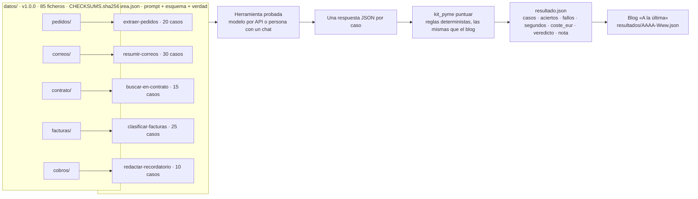
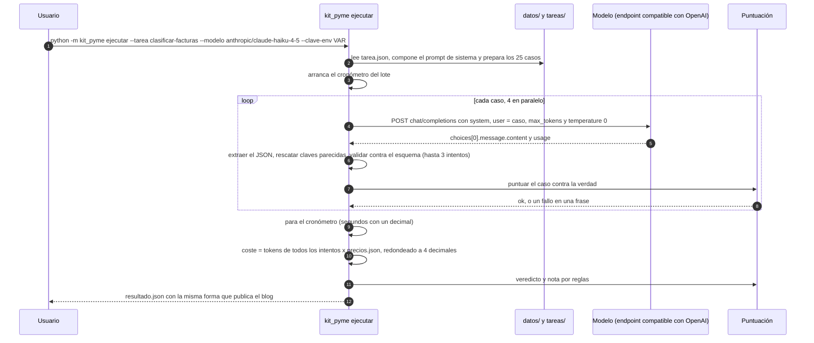
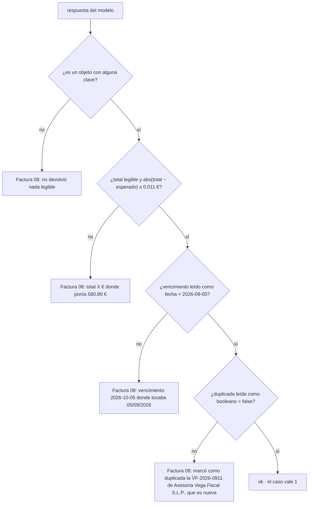
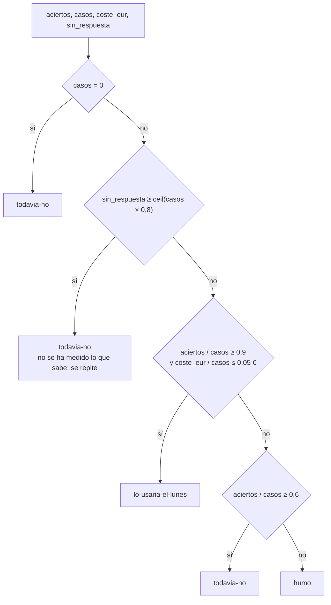
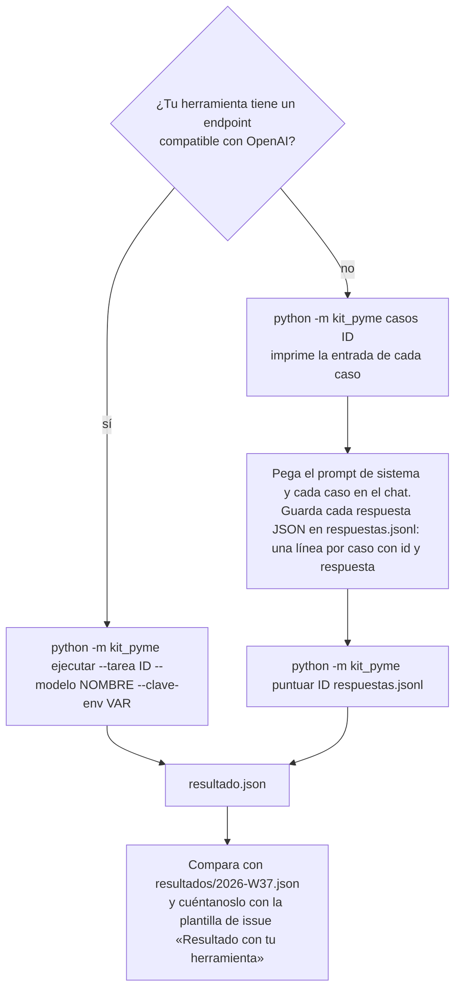
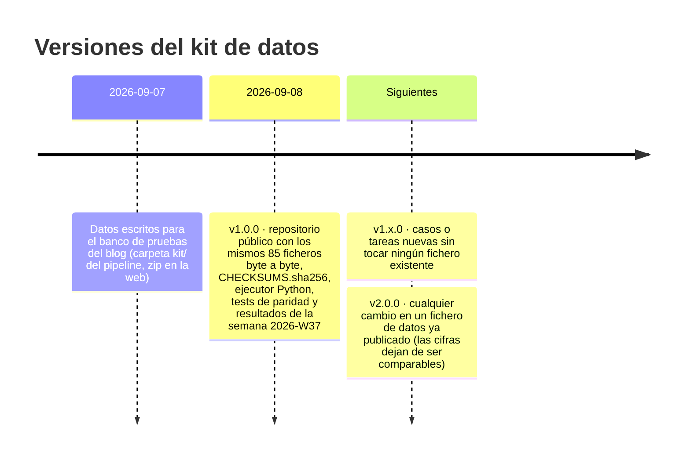

**Español** · [English](README.en.md)

# Kit de la pyme

[](https://github.com/Bytenauta-Org/Kit_de_la_pyme/actions/workflows/ci.yml)
[](LICENSE)
[](CHANGELOG.md)
[](pyproject.toml)
[](https://github.com/astral-sh/ruff)
[](CONTRIBUTING.md)

1. [Qué es y por qué existe](#1-qué-es-y-por-qué-existe)
2. [En dos minutos](#2-en-dos-minutos)
3. [Qué mide y qué no mide](#3-qué-mide-y-qué-no-mide)
4. [Cómo funciona](#4-cómo-funciona)
5. [Las cinco tareas](#5-las-cinco-tareas)
6. [Una tarea entera: clasificar-facturas](#6-una-tarea-entera-clasificar-facturas)
7. [Cómo se puntúa y de dónde sale el veredicto](#7-cómo-se-puntúa-y-de-dónde-sale-el-veredicto)
8. [Repetirlo con tu herramienta](#8-repetirlo-con-tu-herramienta)
9. [Resultados publicados](#9-resultados-publicados)
10. [Versionado de los datos](#10-versionado-de-los-datos)
11. [Estructura del repositorio](#11-estructura-del-repositorio)
12. [Cómo sabemos que puntúa igual que el blog](#12-cómo-sabemos-que-puntúa-igual-que-el-blog)
13. [Contribuir](#13-contribuir)
14. [Licencia, cita e idiomas](#14-licencia-cita-e-idiomas)

## 1. Qué es y por qué existe

Cien casos de trabajo administrativo de una pyme española con la respuesta correcta ya escrita, para medir si una herramienta de IA los hace bien, cuánto tarda y cuánto cuesta.

Los datos son de una empresa inventada: **Conservas Marjal Blanca S.L.**, una conservera de Almoradí (Alicante) de unos 40 empleados. Ninguna empresa, persona, NIF ni dirección de correo es real.

| Carpeta | Contenido | Casos | Respuesta correcta |
|---|---|---:|---|
| `datos/pedidos/` | 20 pedidos de clientes tal como llegan: correo suelto, tabla pegada de Excel, PDF con el texto extraído, CSV, foto con OCR sucio, valenciano, inglés, «lo de siempre», dos entregas, una referencia que no existe y un precio que no es el de tarifa. Con `tarifa.csv` (40 referencias, cinco columnas de precio) y `clientes.csv` (13 clientes). | 20 | `pedidos-verdad.json` |
| `datos/correos/` | 30 correos del buzón de administración: reclamaciones, consultas, cambios de pedido, facturas y avisos de proveedores, gestoría, banco, ayuntamiento, Sanidad, spam y phishing. | 30 | `correos-verdad.json` |
| `datos/contrato/` | Un contrato marco de suministro de 28.396 palabras, 28 cláusulas y 8 anexos, y 15 preguntas de las que hace un gerente. | 15 | `contrato-preguntas.json` |
| `datos/facturas/` | 25 facturas recibidas como texto: hojalata, atún, aceite al 4 %, luz, alquiler con retención del 19 %, un autónomo con retención del 15 %, un seguro sin IVA, un SaaS irlandés con inversión del sujeto pasivo, gasóleo al contado y dos que ya estaban contabilizadas (`registro-previo.csv`). | 25 | `facturas-verdad.json` |
| `datos/cobros/` | `cobros.csv`: 60 facturas emitidas con vencimiento, estado, cobros parciales, días de retraso y notas. Diez recordatorios de cobro que hay que escribir con el tono que toca. | 10 | `cobros-verdad.json` |

El blog semanal [«A la última»](https://bytenauta.com/a-la-ultima/) de [Bytenauta S.L.](https://bytenauta.com) no cuenta las novedades de IA: las ejecuta sobre este kit y publica lo que sale. Para que esas cifras se puedan discutir hacen falta tres cosas, y el kit existe para las tres:

1. **Que cualquiera pueda repetir la prueba** con la herramienta que ya paga, con la que le quieren vender o con la que salió esta semana, y comparar.
2. **Que la puntuación sea la misma** aquí y en el blog. El paquete `kit_pyme` reproduce regla por regla el código del pipeline y los tests lo comprueban contra sus salidas grabadas ([§12](#12-cómo-sabemos-que-puntúa-igual-que-el-blog)).
3. **Que los datos no cambien sin avisar.** Llevan versión semántica y `CHECKSUMS.sha256`, y `python -m kit_pyme verificar` comprueba que tienes los ficheros con los que se midieron las cifras publicadas.

El kit no sirve para elegir un proveedor de IA en general. Sirve para saber si una herramienta concreta hace bien cinco tareas concretas de administración de una pyme española, y a qué precio.

## 2. En dos minutos

Hace falta Python 3.11 o superior y nada más. Sin clave de API y sin gastar un céntimo.

**1. Descarga el kit.**

```bash
git clone https://github.com/Bytenauta-Org/Kit_de_la_pyme.git && cd Kit_de_la_pyme
```

**2. Comprueba que tienes los datos publicados.**

```console
$ python -m kit_pyme verificar
OK   datos/ y los prompts son los publicados (checksums y sha256 correctos).
```

Recalcula el sha256 de los 85 ficheros de `datos/` y el de los cinco prompts, y devuelve 0.

**3. Estropea una sola respuesta correcta y mira qué dice el kit.** El repositorio trae las respuestas perfectas de cada tarea en `tests/oro/respuestas-verdad/`. Cambia el vencimiento de una factura y puntúalas:

```bash
sed '/"id":"factura-08"/s/2026-09-05/2026-10-05/' \
  tests/oro/respuestas-verdad/clasificar-facturas.jsonl > respuestas.jsonl
python -m kit_pyme puntuar clasificar-facturas respuestas.jsonl
```

En PowerShell:

```powershell
(Get-Content tests/oro/respuestas-verdad/clasificar-facturas.jsonl) `
  -replace '(?<="id":"factura-08".*)2026-09-05','2026-10-05' | Out-File -Encoding utf8 respuestas.jsonl
python -m kit_pyme puntuar clasificar-facturas respuestas.jsonl
```

La salida es la misma en los dos:

```text
Tarea      clasificar-facturas — Contabilizar 25 facturas recibidas: total, vencimiento y si ya estaba registrada
Modelo     (sin modelo)
Casos      25
Aciertos   24 de 25
Segundos   0
Coste      0 €
Veredicto  lo-usaria-el-lunes
Nota       Acertó 24 de 25 a 0,0 céntimos por caso; sirve el lunes si una persona repasa los casos con incidencia. Ejemplo: Factura 08: vencimiento 2026-10-05 donde tocaba 05/09/2026.
Fallos publicados (hasta 3):
  - Factura 08: vencimiento 2026-10-05 donde tocaba 05/09/2026
```

Esa última línea es, palabra por palabra, el único fallo que el blog publicó el 8 de septiembre de 2026 al probar el modelo pequeño de Anthropic sobre esta tarea ([`resultados/2026-W37.json`](resultados/2026-W37.json)). Acabas de reproducir una cifra publicada sin llamar a ningún modelo: la puntuación no la hace una IA, la hacen reglas que están en este repositorio.

Sin tocar nada, las respuestas correctas dan 25 de 25, que es la forma de comprobar que tu copia puntúa igual:

```console
$ python -m kit_pyme puntuar clasificar-facturas tests/oro/respuestas-verdad/clasificar-facturas.jsonl
Tarea      clasificar-facturas — Contabilizar 25 facturas recibidas: total, vencimiento y si ya estaba registrada
Modelo     (sin modelo)
Casos      25
Aciertos   25 de 25
Segundos   0
Coste      0 €
Veredicto  lo-usaria-el-lunes
Nota       Acertó los 25 casos a 0,0 céntimos por caso; lo pondría a trabajar el lunes con alguien mirando por encima la primera semana.
```

Para medir de verdad hace falta una herramienta que responda: con una clave de API el kit la llama caso a caso y mide segundos y coste; sin API, pegas los casos en un chat y guardas las respuestas. Las dos formas están en [§8](#8-repetirlo-con-tu-herramienta).

## 3. Qué mide y qué no mide

Por cada tarea salen cuatro cifras y un veredicto:

| Cifra | Qué es |
|---|---|
| `casos` y `aciertos` | Casos con respuesta correcta según las reglas de la tarea. Un caso vale 1 o 0, sin puntos parciales |
| `fallos` | Los tres primeros fallos, cada uno en una frase con el dato esperado y el obtenido |
| `segundos` | Tiempo de pared del lote completo con cuatro casos en vuelo |
| `coste_eur` | Tokens de todos los intentos por la tabla de precios, redondeado a cuatro decimales |
| `veredicto` y `nota` | `lo-usaria-el-lunes`, `todavia-no` o `humo`, por reglas sobre aciertos, coste por caso y casos sin respuesta |

Lo que **no** mide, y conviene tener delante al leer una cifra:

| Fuera del kit | Por qué |
|---|---|
| La calidad de la redacción | En recordatorios se puntúan datos, tono por lista de expresiones, longitud, nombre y firma; no si el correo está bien escrito |
| La extracción de PDF y el OCR | Los pedidos «en PDF» o «con OCR» son el texto ya extraído, con sus defectos incluidos |
| La integración | Lo que cuesta conectar la herramienta al correo, al ERP o a la contabilidad. Solo se mide la respuesta |
| El coste real | `coste_eur` es una estimación por tabla de precios, no la factura del proveedor: fuera quedan descuentos, caché de prompts, impuestos y divisa |
| El mejor prompt posible | El prompt es fijo y de pyme. Un especialista sacaría más de cada modelo; eso no es lo que se mide |

Las diez cosas que no se miden, con las limitaciones de tamaño, sector y contaminación de los datos, están en [`docs/metodologia.md`](docs/metodologia.md).

## 4. Cómo funciona



La herramienta probada es la pieza intercambiable, y no participa en su propia puntuación. Cuatro partes, cuatro responsabilidades:

- **Datos y tareas** (`datos/`, `tareas/`): lo que se le da a la herramienta y lo que tendría que responder. No contienen código.
- **Ejecutor y puntuación** (`kit_pyme/`): compone los prompts, llama al modelo si hay API, lee las respuestas y las puntúa. Python 3.11+, sin dependencias fuera de la biblioteca estándar.
- **Resultados** (`resultados/`): un fichero por número del blog con las cifras publicadas y su procedencia.
- **Herramientas de mantenimiento** (`tools/`): cuatro scripts. La CI ejecuta `comprobar_mermaid.py`; el flujo de publicación, `version_changelog.py`. `verificar_checksums.py` y `validar_esquemas.py` son para comprobar a mano lo que la CI hace con `sha256sum` y `check-jsonschema`.

Una tirada completa, con las condiciones que fijan lo que significan las cifras:



Detalles que afectan a las cifras y que el ejecutor copia del blog: temperatura 0 (se omite si el modelo la rechaza con un 400), hasta tres intentos por caso cuando la respuesta no es JSON o no cumple el esquema (los intentos descartados también se cobran), un 4xx distinto de 429 aborta la tarea entera, cuatro casos en vuelo a la vez, ninguna memoria entre casos, y el tiempo es el del lote completo, no la suma de los casos.

## 5. Las cinco tareas

```console
$ python -m kit_pyme tareas
id                     casos  max_tokens  nombre
extraer-pedidos           20        6000  Sacar las líneas de 20 pedidos tal como llegan por correo
resumir-correos           30        4000  Clasificar 30 correos del buzón de administración y decir qué hay que hacer
buscar-en-contrato        15        4000  Responder 15 preguntas sobre un contrato de suministro de 60 páginas
clasificar-facturas       25        4000  Contabilizar 25 facturas recibidas: total, vencimiento y si ya estaba registrada
redactar-recordatorio     10        4000  Escribir 10 recordatorios de cobro con el tono que toca
```

| Id | Casos | `max_tokens` | Entrada de cada caso | Qué se puntúa |
|---|---:|---:|---|---|
| `extraer-pedidos` | 20 | 6000 | `pedido-NN.txt` íntegro; el prompt lleva `tarifa.csv` y `clientes.csv` | Cliente, líneas (referencia, cajas, precio de tarifa) e incidencias obligatorias |
| `resumir-correos` | 30 | 4000 | `correo-NN.txt` íntegro | Categoría y urgencia exactas |
| `buscar-en-contrato` | 15 | 4000 | La pregunta; el prompt lleva `contrato.txt` íntegro (188 KB) | El dato y la cláusula citada |
| `clasificar-facturas` | 25 | 4000 | `factura-NN.txt` íntegro; el prompt lleva `registro-previo.csv` | Total, vencimiento y duplicada |
| `redactar-recordatorio` | 10 | 4000 | Ficha de la factura vencida y su fila de `cobros.csv` | Datos obligatorios, tono, longitud, nombre y firma |

`max_tokens` es una condición fija de la prueba, no una preferencia: cambiarla hace que las cifras dejen de ser comparables.

## 6. Una tarea entera: `clasificar-facturas`

Las otras cuatro están documentadas igual en [`docs/tareas.md`](docs/tareas.md). Esta sirve de muestra de lo que hay detrás de cada caso.

**El caso.** Uno de los 25, tal cual lo imprime el kit:

```console
$ python -m kit_pyme casos clasificar-facturas --id factura-08
===== factura-08 =====
De: Asesoría Vega Fiscal S.L.P. <fiscal@vegafiscal.example>
Para: Administración Marjal Blanca <administracion@marjalblanca.example>
Fecha: 01/09/2026
Asunto: Factura VF-2026-0911

Estimado cliente:

Le remitimos la factura VF-2026-0911 de fecha 01/09/2026, emitida a nombre de Conservas Marjal Blanca S.L. (NIF B38122941).

| Concepto | Cantidad | Precio | Importe |
|---|---|---|---|
| Cuota mensual asesoramiento fiscal, contable y laboral – septiembre 2026 | 1 | 480,00 | 480,00 |

Base imponible: 480,00 €
IVA 21 %: 100,80 €
Total: 580,80 €

Recibo domiciliado el día 5 de cada mes.
IBAN ES20 2038 7700 1100 2233 4455

Asesoría Vega Fiscal S.L.P. · B37880192 · c/ Mayor 18, 1.º B · 03160 Almoradí (Alicante)
```

La dificultad está en la línea «Recibo domiciliado el día 5 de cada mes»: con fecha de factura 01/09/2026, el día 5 de cada mes es el 5 de septiembre, no el 5 de octubre.

**El prompt.** Los primeros renglones del mensaje de sistema, que es el mismo para los 25 casos:

```text
Trabajas en contabilidad de Conservas Marjal Blanca S.L. (NIF B38122941, Almoradí, Alicante). Te van llegando facturas de proveedores y tienes que dejarlas listas para contabilizar.

Para cada factura devuelve:
- proveedor y numero de factura tal como aparecen.
- fecha de la factura y base imponible, cuota de IVA y total, en euros con dos decimales (número, no texto). Ojo: el total puede llevar retención de IRPF (alquileres 19 %, profesionales autónomos 15 %) que se resta, o impuestos que no son IVA (primas de seguros) que se suman. Las facturas de servicios de fuera de España con inversión del sujeto pasivo van sin IVA.
- vencimiento en formato AAAA-MM-DD. Si la factura dice «30 días fecha factura», «60 días f.f.», «pagaré a 90 días», cuéntalos desde la fecha de la factura; si dice contado, pagado con tarjeta o en efectivo, el vencimiento es la fecha de la factura; si dice que se domicilia o se carga en cuenta en una fecha, esa fecha; si dice «antes del día 5 del mes», el día 5 de ese mes.
[...]
FORMATO DE LA RESPUESTA: un solo objeto JSON con exactamente estas claves, escritas así: proveedor, numero, fecha, base, iva, total, vencimiento, cuenta_sugerida, duplicada. Sin otras claves, sin comentarios y sin texto antes ni después.
```

El prompt compuesto pesa 2.280 bytes con el registro de facturas ya contabilizadas incluido; el mensaje de sistema que se envía le añade la línea `FORMATO` y suma 2.521. `python -m kit_pyme prompt clasificar-facturas` imprime el segundo, y `--sin-formato` el primero.

**La respuesta correcta.** Lo que dice `datos/facturas/facturas-verdad.json` para este caso, de lo que solo se comparan tres campos:

```json
{
  "id": "factura-08",
  "proveedor": "Asesoría Vega Fiscal S.L.P.",
  "numero": "VF-2026-0911",
  "fecha": "2026-09-01",
  "base": 480,
  "iva": 100.8,
  "total": 580.8,
  "vencimiento": "2026-09-05",
  "cuenta_sugerida": "623",
  "duplicada": false
}
```

**La puntuación del caso.** Tres reglas en cascada; la primera que falla corta y escribe la frase que se publica:



La rama `F2` es la que se disparó en el número publicado y la que reproduce el comando de [§2](#2-en-dos-minutos). Las fechas se leen en cuatro formatos (`2026-09-05`, `05/09/2026`, `5-9-2026`, «5 de septiembre de 2026»), así que la forma no penaliza: lo que falla es el mes.

## 7. Cómo se puntúa y de dónde sale el veredicto

Cada caso vale 1 o 0. Un caso está bien solo si pasa todas las reglas de su tarea; el primer fallo se describe en una frase que un gerente entiende («Pedido 07: en CONS-MELV-OL-120 puso 26,40 € donde la tarifa dice 29,28 €»). Las comparaciones normalizan mayúsculas, acentos, espacios, formatos de número («1.234,56 €») y de fecha («7 de septiembre de 2026»), para no penalizar la forma.

| Tarea | Qué se compara | Qué no se puntúa |
|---|---|---|
| `extraer-pedidos` | Cliente, cada línea (referencia, cajas, precio de tarifa con tolerancia de 0,011 €), líneas de más, incidencias obligatorias | `fecha_entrega`, texto de las incidencias no obligatorias |
| `resumir-correos` | Categoría y urgencia exactas | `accion`, `resumen` |
| `buscar-en-contrato` | El dato (alguna de las formas aceptadas) y la cláusula citada | La redacción; la cita literal cuenta para el dato, no para la cláusula |
| `clasificar-facturas` | Total (±0,011 €), vencimiento, duplicada | Proveedor, número, fecha, base, IVA, cuenta |
| `redactar-recordatorio` | Número de factura, importe, vencimiento, expresiones obligatorias del tono, expresiones prohibidas, máximo 220 palabras, nombre de pila, firma | Estilo, ortografía, estructura |

El veredicto sale de la tasa de aciertos, del coste por caso y de cuántos casos quedaron sin respuesta legible:



Los tres umbrales son constantes del código del blog: 90 % de aciertos y 0,05 € por caso para `lo-usaria-el-lunes`, 60 % para no caer en `humo`. Las tres palabras que salen publicadas son las que escribe el programa, sin traducir ni suavizar:

| Veredicto | Qué significa |
|---|---|
| `lo-usaria-el-lunes` | Acierta el 90 % o más y sale a 5 céntimos por caso o menos |
| `todavia-no` | Acierta entre el 60 % y el 90 %, o acierta pero cuesta demasiado, o no se ha podido medir |
| `humo` | Acierta menos del 60 % |

Las tablas de normalización con sus valores comprobados, la nota que acompaña a cada veredicto, el cálculo del coste, el de los segundos y los redondeos de JavaScript que el kit emula están en [`docs/puntuacion.md`](docs/puntuacion.md).

## 8. Repetirlo con tu herramienta



Con API, el ejecutor mide segundos y estima el coste con `precios.json`. Sin API, apunta tú el tiempo y lo que pagas al mes dividido entre lo que le pides; la puntuación es la misma.

Empezar por una muestra de tres casos, en vez de por los veinticinco, cuesta unos céntimos y descubre los problemas de configuración antes de pagarlos:

```bash
export ANTHROPIC_API_KEY="..."
python -m kit_pyme ejecutar --tarea clasificar-facturas --modelo anthropic/claude-haiku-4-5 \
  --clave-env ANTHROPIC_API_KEY --casos 3
```

La primera línea que imprime dice contra qué se está midiendo:

```text
clasificar-facturas: 3 casos contra anthropic/claude-haiku-4-5 en https://api.anthropic.com/v1/chat/completions (concurrencia 4)
```

Los seis subcomandos y sus opciones:

| Comando | Qué hace | Opciones |
|---|---|---|
| `tareas` | Lista las cinco tareas con sus casos y su `max_tokens` | — |
| `casos <tarea>` | Imprime la entrada de cada caso, para pegarla en cualquier herramienta | `--id <caso>` para uno solo; `--jsonl` para una línea JSON `{id, entrada}` por caso |
| `prompt <tarea>` | Imprime el mensaje de sistema que se envía al modelo | `--sin-formato` para el prompt sin la línea `FORMATO` del final |
| `puntuar <tarea> <respuestas.jsonl>` | Puntúa respuestas dadas: una línea JSON por caso, `{"id": "...", "respuesta": {...}}` | `--modelo <nombre>` para etiquetar el resultado; `--salida <carpeta>` para escribir `resultado.json` y `detalle.json`; `--json` para imprimir el resultado en vez de la tabla |
| `ejecutar --tarea <id> --modelo <nombre>` | Llama al modelo caso a caso, mide segundos y tokens, estima el coste y escribe `resultado.json` | `--clave-env <VAR>`, `--endpoint <url>`, `--modelo-api <nombre>`, `--casos <N>` (muestra), `--concurrencia <N>` (4), `--precios <fichero>`, `--tiempo-maximo <segundos>`, `--salida`, `--novedad-url`, `--json` |
| `verificar` | Comprueba `datos/CHECKSUMS.sha256`, que no sobra ni falta ningún fichero de datos, y el sha256 de los cinco prompts | `--regenerar` reescribe `CHECKSUMS.sha256` (solo al subir la versión del kit) |

Dos globales: `--raiz <carpeta>` para apuntar a otra copia del kit y `--version`. Y una comodidad que no está en `--help`: **`--endpoint` es opcional** si el id del modelo empieza por `anthropic/`, `openai/`, `google/` o `google-ai-studio/`, y un nombre sin barra se toma como de Anthropic; con cualquier otro proveedor hay que pasar la URL.

Nota sobre `prompt`: la salida termina siempre en un salto de línea, y en dos de las cinco tareas (`resumir-correos` y `redactar-recordatorio`) ese salto es uno más de los que tiene el prompt publicado, porque el suyo no acaba en línea nueva. Para comprobar que los prompts son los publicados, `python -m kit_pyme verificar`, que compara sus sha256 sin pasar por el terminal.

Cuando algo va mal, el kit lo dice en una línea y devuelve un código de salida distinto de 0:

```console
$ python -m kit_pyme ejecutar --tarea clasificar-facturas --modelo anthropic/claude-haiku-4-5 --clave-env NO_EXISTE_ESTA_VARIABLE
kit_pyme: la variable de entorno NO_EXISTE_ESTA_VARIABLE está vacía o no existe

$ python -m kit_pyme casos facturas
kit_pyme: tarea desconocida: facturas (no existe .../tareas/facturas/tarea.json)

$ python -m kit_pyme casos clasificar-facturas --id factura-99
kit_pyme: no hay ningún caso «factura-99» en clasificar-facturas
```

Esos tres salen con código 1. Un modelo que no existe o una clave que el proveedor rechaza salen con código **3**, para que un script pueda distinguir «no se ha podido medir» de «lo has escrito mal»:

```text
kit_pyme: el endpoint respondió 401 para un-modelo-raro: no disponible por API todavía
  respuesta: {"error":{"code":"authentication_error","message":"Invalid Anthropic API Key","type":"invalid_request_error","param":null}}
```

El paso a paso completo, con ejemplos para Anthropic, OpenAI, Google y modelos locales, y el formato exacto del `respuestas.jsonl`, está en [`docs/reproducir.md`](docs/reproducir.md).

## 9. Resultados publicados

Cada número del blog añade un fichero a `resultados/` con las cifras tal como salieron y de dónde salieron. Lo publicado hasta hoy:

| Semana | Modelo | Tarea | Casos | Aciertos | Segundos | Coste | Veredicto |
|---|---|---|---:|---:|---:|---:|---|
| [2026-W37](resultados/2026-W37.json) | `anthropic/claude-haiku-4-5` | `extraer-pedidos` | 20 | 15 | 16,9 | 0,3822 € | `todavia-no` |
| [2026-W37](resultados/2026-W37.json) | `anthropic/claude-haiku-4-5` | `clasificar-facturas` | 25 | 24 | 10,5 | 0,1428 € | `lo-usaria-el-lunes` |

Publicado en el número del 8 de septiembre de 2026, [«La referencia entró bien y el precio no era el de la tarifa»](https://bytenauta.com/a-la-ultima/2026-09-08-referencia-bien-precio-tarifa/), medido con los datos v1.0.0.

En pedidos fueron **cinco** fallos sobre 20 casos, de los que el formato publica los tres primeros; los tres son errores de precio: en dos (pedidos 06 y 13) el modelo cogió la columna de otro cliente de la tarifa, y en el 07 arrastró el precio de la línea anterior del mismo pedido. El fallo de facturas fue el vencimiento de `factura-08`, el caso de [§6](#6-una-tarea-entera-clasificar-facturas).

El mismo día se hicieron tres tiradas con el mismo modelo: las tres dieron los mismos aciertos y los mismos fallos, y solo cambiaron los segundos (16,9, 17,5 y 18,2) y la cuarta cifra decimal del coste. Los aciertos son estables; los segundos, no. Las reglas de la carpeta están en [`resultados/README.md`](resultados/README.md).

## 10. Versionado de los datos

Los ficheros de `datos/` siguen versionado semántico y no cambian sin subir la versión y anotarlo en [`CHANGELOG.md`](CHANGELOG.md). Una cifra publicada dice siempre con qué versión de los datos se midió, y nunca se reescribe.



- **Parche** (1.0.x): documentación, código o tests; ningún byte de `datos/` cambia.
- **Menor** (1.x.0): ficheros o tareas nuevas; los existentes no cambian y las cifras antiguas siguen siendo comparables.
- **Mayor** (x.0.0): cambia un fichero existente (un dato corregido, un caso reescrito). Las cifras anteriores se conservan con su versión y no se comparan con las nuevas.

## 11. Estructura del repositorio

```text
Kit_de_la_pyme/
├── README.md                 este fichero (español)
├── README.en.md              el mismo, en inglés
├── LICENSE                   CC BY 4.0 (texto legal en inglés, nota en español)
├── CHANGELOG.md              versiones del kit de datos y del código
├── CITATION.cff              cómo citar el kit
├── CONTRIBUTING.md           cómo contribuir; Conventional Commits; estilo del código
├── CODE_OF_CONDUCT.md        Contributor Covenant 2.1
├── SECURITY.md               cómo avisar de un problema de seguridad
├── pyproject.toml            ruff y pytest
├── docs/
│   ├── README.md             índice bilingüe de la documentación
│   ├── tareas.md             las cinco tareas: prompt, esquema, entrada, criterio de acierto
│   ├── datos.md              la empresa inventada, cada carpeta y cada fichero, diagrama entidad-relación
│   ├── puntuacion.md         normalización, reglas, umbrales del veredicto, coste y tiempo
│   ├── reproducir.md         paso a paso con cualquier herramienta, con y sin API
│   ├── metodologia.md        por qué determinista, qué no se mide, versionado de los datos
│   └── en/                   los cinco anteriores, en inglés y con el mismo nombre de fichero
├── datos/
│   ├── pedidos/  correos/  contrato/  facturas/  cobros/
│   ├── esquemas/             JSON Schema de cada *-verdad.json y de la respuesta de cada tarea
│   └── CHECKSUMS.sha256      una línea por fichero de datos (85)
├── tareas/<id>/tarea.json    id, nombre, descripción, prompt, esquema, max_tokens, verdad, entrada
├── kit_pyme/                 paquete Python: tareas, casos, prompt, puntuar, ejecutar, verificar; precios.json
├── tools/
│   ├── comprobar_mermaid.py  renderiza todos los diagramas con mermaid-cli (lo corre la CI)
│   ├── validar_esquemas.py   los cinco *-verdad.json cumplen su JSON Schema y las invariantes entre ficheros
│   ├── verificar_checksums.py  los checksums, sin pasar por el paquete
│   └── version_changelog.py  la versión del paquete y la del CHANGELOG concuerdan
├── tests/                    pytest: paridad con el blog, casos negativos por regla, CLI, servidor falso
├── resultados/               un JSON por número del blog
└── .github/                  CI (ruff, pytest, datos, Mermaid), plantillas de issue y de PR
```

## 12. Cómo sabemos que puntúa igual que el blog

El blog puntúa con código TypeScript (`src/pruebas/index.ts`, `tareas.ts` y `puntuar.ts` de su pipeline) ejecutado desde un Worker de Cloudflare. El kit lo reproduce en Python. La paridad no se afirma, se comprueba:

- **655 pruebas** (`python -m pytest`; la única que se salta necesita `mmdc` en el `PATH`). El grueso carga salidas grabadas de ese código TypeScript sobre los mismos datos —prompts compuestos con su sha256, entradas de cada caso, respuestas correctas que dan el 100 %, más de cien respuestas trucadas con el `ok` y la frase de fallo exactos, tablas de normalización, 17 combinaciones de veredicto y nota— y exige que el kit devuelva lo mismo. El resto comprueba la CLI, los scripts de `tools/` y que los documentos español e inglés siguen emparejados.
- **Los prompts van sellados.** `tests/oro/resumen.json` guarda el sha256 del prompt compuesto y del mensaje de sistema de cada tarea, y `python -m kit_pyme verificar` los comprueba junto a los 85 checksums de `datos/`.
- **Los redondeos de JavaScript están emulados.** `Math.round` y `toFixed` no redondean como los de Python, y una cifra publicada depende de eso: 0,38215 € tiene que dar 0,3822 y 16.850 ms tienen que dar 16,9 s. Hay tests por cada operación.
- **Cuatro trabajos de integración continua** en cada push: `ruff` (lint y formato), `pruebas` (pytest y `verificar` en Python 3.11, 3.12 y 3.13), `datos` (checksums con `sha256sum` sin pasar por el paquete, LF en el índice de git, UTF-8 sin BOM, JSON válido y esquemas de los YAML) y `mermaid` (los 30 diagramas de los dos README y de `docs/`, español e inglés, renderizados con mermaid-cli 11.17.0).

Enseñar cómo falla vale más que jurar que funciona. Así responde `verificar` sobre unos datos que no son los publicados —un byte añadido a una factura, un correo borrado y un fichero de más—:

```console
$ python -m kit_pyme verificar
MAL  falta datos/correos/correo-30.txt
MAL  datos/facturas/factura-08.txt ha cambiado (sha256 distinto del publicado)
MAL  datos/cobros/extra.csv no está en CHECKSUMS.sha256: sobra o hay que versionar el kit
3 problema(s): los datos NO son los publicados.
```

Código de salida 1. Si esto sale en rojo, cualquier cifra que midas deja de ser comparable con las publicadas. Los detalles de la paridad y qué pasa cuando el blog cambia una regla están en [`docs/metodologia.md`](docs/metodologia.md).

## 13. Contribuir

Tres tipos de contribución, cada uno con su plantilla de issue: un **dato incorrecto** (un NIF que no cuadra, un vencimiento mal calculado, una respuesta de verdad discutible), un **resultado con tu herramienta** (el `resultado.json` que te ha salido, con el modelo y la fecha) y una **tarea nueva**.

Los issues y los pull requests se aceptan en español o en inglés; los mensajes de commit son en inglés y siguen Conventional Commits. Ningún cambio en `datos/` entra sin subir la versión. Antes de abrir un pull request, [`CONTRIBUTING.md`](CONTRIBUTING.md).

Este proyecto se rige por el [código de conducta](CODE_OF_CONDUCT.md). Los problemas de seguridad se comunican como dice [`SECURITY.md`](SECURITY.md), no en un issue público.

## 14. Licencia, cita e idiomas

**Kit de la pyme** © 2026 [Bytenauta S.L.](https://bytenauta.com). Se publica bajo licencia [Creative Commons Reconocimiento 4.0 Internacional (CC BY 4.0)](https://creativecommons.org/licenses/by/4.0/deed.es): datos, documentación y código. Puedes copiarlo, redistribuirlo, adaptarlo y usarlo con fines comerciales si citas «Kit de la pyme, Bytenauta S.L.» y enlazas a la licencia. El texto legal está en [`LICENSE`](LICENSE). Sin garantía de ningún tipo: son datos inventados para probar herramientas, no asesoramiento contable, fiscal ni jurídico.

Para citarlo (también en [`CITATION.cff`](CITATION.cff)):

```bibtex
@misc{kit_de_la_pyme_2026,
  author  = {{Bytenauta S.L.}},
  title   = {Kit de la pyme: banco de pruebas de IA sobre tareas administrativas de una pyme},
  year    = {2026},
  version = {1.0.0},
  url     = {https://github.com/Bytenauta-Org/Kit_de_la_pyme},
  note    = {CC BY 4.0}
}
```

**Idiomas.** Este README y los cinco documentos de `docs/` existen en español y en inglés: [`README.en.md`](README.en.md) y `docs/en/<nombre>.md`, con el mismo nombre de fichero que su hermano español y un selector de idioma en la primera línea de los dos. Cada versión está escrita en su idioma, no traducida palabra por palabra; la estructura y las cifras coinciden, y `tests/test_documentacion.py` lo comprueba. `CONTRIBUTING.md`, `CODE_OF_CONDUCT.md`, `SECURITY.md`, `CHANGELOG.md` y las portadas de `datos/` y `resultados/` están solo en español.

Lo que no se traduce es el objeto medido: los prompts, los ids de tarea (`clasificar-facturas`), los subcomandos y sus opciones, los nombres de fichero, las claves del JSON (`aciertos`, `coste_eur`, `veredicto`), los tres veredictos y las frases de fallo. Están en español porque en español se midieron las cifras publicadas; traducirlos cambiaría lo que se está probando.
