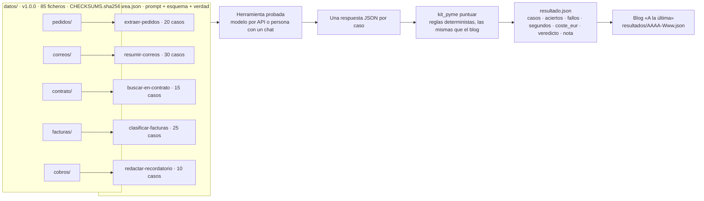
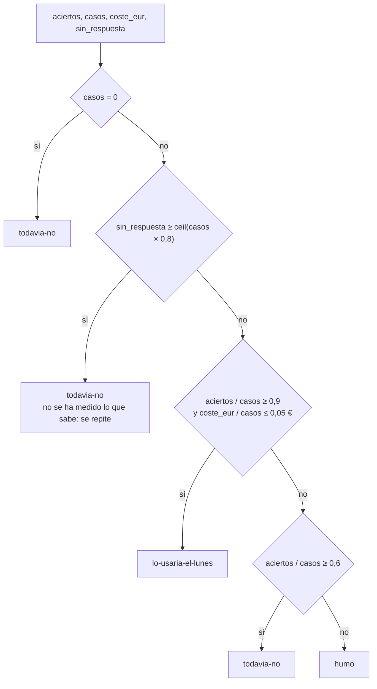
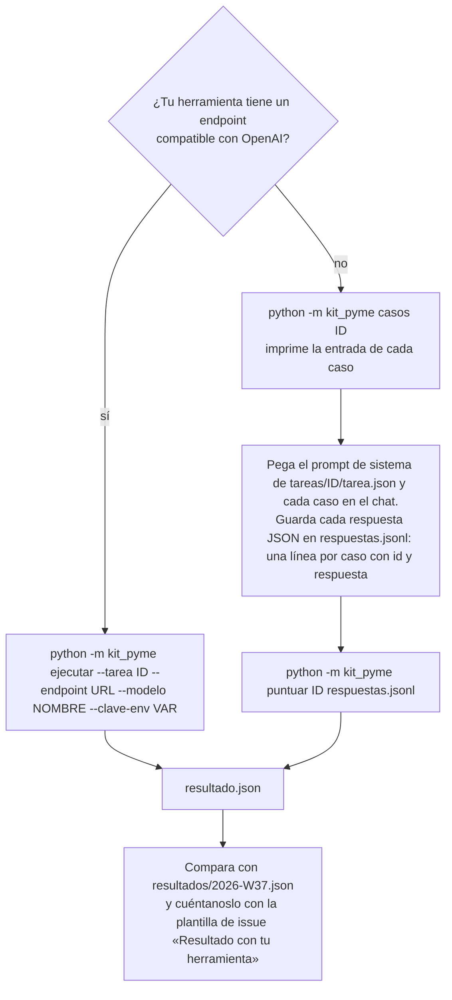
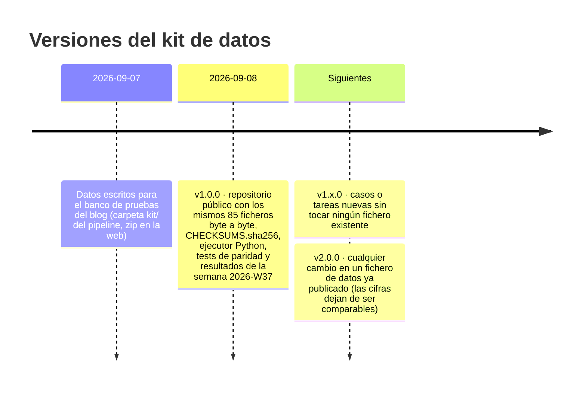

# Kit de la pyme

[](https://github.com/Bytenauta-Org/Kit_de_la_pyme/actions/workflows/ci.yml)
[](LICENSE)
[](CHANGELOG.md)
[](pyproject.toml)
[](https://github.com/astral-sh/ruff)
[](CONTRIBUTING.md)

Banco de pruebas público para medir herramientas de inteligencia artificial sobre el trabajo administrativo de una pyme: 100 casos con respuesta correcta conocida, cinco tareas con su prompt y su esquema de respuesta, una puntuación determinista (reglas, no otra IA que juzga) y un ejecutor en Python que produce las mismas cifras que publica el blog semanal [«A la última»](https://bytenauta.com/a-la-ultima/) de [Bytenauta S.L.](https://bytenauta.com).

Los datos son de una empresa inventada, **Conservas Marjal Blanca S.L.**, una conservera de Almoradí (Alicante) de unos 40 empleados. Ninguna empresa ni persona es real.

## Índice

1. [Qué es](#qué-es)
2. [Por qué existe](#por-qué-existe)
3. [Arquitectura](#arquitectura)
4. [Cómo corre una prueba](#cómo-corre-una-prueba)
5. [Cómo se puntúa](#cómo-se-puntúa)
6. [Cómo repetirla con tu herramienta](#cómo-repetirla-con-tu-herramienta)
7. [Inicio rápido](#inicio-rápido)
8. [Las cinco tareas](#las-cinco-tareas)
9. [Resultados publicados](#resultados-publicados)
10. [Estructura del repositorio](#estructura-del-repositorio)
11. [Versionado de los datos](#versionado-de-los-datos)
12. [Contribuir](#contribuir)
13. [Licencia y cita](#licencia-y-cita)
14. [In English](#in-english)

## Qué es

Cinco carpetas de datos, cinco tareas y un programa que puntúa.

| Carpeta | Contenido | Casos | Respuesta correcta |
|---|---|---:|---|
| `datos/pedidos/` | 20 pedidos de clientes tal como llegan: correo suelto, tabla pegada de Excel, PDF con el texto extraído, CSV, foto con OCR sucio, valenciano, inglés, «lo de siempre», dos entregas, una referencia que no existe y un precio que no es el de tarifa. Con `tarifa.csv` (40 referencias, cinco columnas de precio) y `clientes.csv` (13 clientes). | 20 | `pedidos-verdad.json` |
| `datos/correos/` | 30 correos del buzón de administración: reclamaciones, consultas, cambios de pedido, facturas y avisos de proveedores, gestoría, banco, ayuntamiento, Sanidad, spam y phishing. | 30 | `correos-verdad.json` |
| `datos/contrato/` | Un contrato marco de suministro de 28.396 palabras, 28 cláusulas y 8 anexos, y 15 preguntas de las que hace un gerente. | 15 | `contrato-preguntas.json` |
| `datos/facturas/` | 25 facturas recibidas como texto: hojalata, atún, aceite al 4 %, luz, alquiler con retención del 19 %, un autónomo con retención del 15 %, un seguro sin IVA, un SaaS irlandés con inversión del sujeto pasivo, gasóleo al contado y dos que ya estaban contabilizadas (`registro-previo.csv`). | 25 | `facturas-verdad.json` |
| `datos/cobros/` | `cobros.csv`: 60 facturas emitidas con vencimiento, estado, cobros parciales, días de retraso y notas. Diez recordatorios de cobro que hay que escribir con el tono que toca. | 10 | `cobros-verdad.json` |

Cada tarea está descrita en [`docs/tareas.md`](docs/tareas.md) con el prompt literal, el esquema JSON de la respuesta y el criterio exacto de acierto. Los datos están descritos fichero a fichero en [`docs/datos.md`](docs/datos.md).

## Por qué existe

El blog «A la última» no cuenta las novedades de IA: las ejecuta sobre este kit y publica lo que sale (casos, aciertos, fallos concretos, segundos, coste y un veredicto). Para que esas cifras se puedan discutir hacen falta tres cosas:

1. **Que cualquiera pueda repetir la prueba** con la herramienta que ya paga, con la que le quieren vender o con la que ha salido esta semana, y comparar.
2. **Que la puntuación sea la misma** en el blog y en tu ordenador. El paquete `kit_pyme` reproduce regla por regla el código del blog (`src/pruebas/tareas.ts`, `puntuar.ts` e `index.ts` del pipeline) y los tests lo comprueban contra sus salidas reales.
3. **Que los datos no cambien sin avisar.** Los ficheros de datos llevan versión semántica y `CHECKSUMS.sha256`; `python -m kit_pyme verificar` comprueba que tienes exactamente los ficheros con los que se publicaron las cifras.

El kit no sirve para elegir un proveedor de IA en general. Sirve para saber si una herramienta concreta hace bien cinco tareas concretas de administración de una pyme española, y a qué precio.

## Arquitectura



Tres piezas, tres responsabilidades:

- **Datos y tareas** (`datos/`, `tareas/`): lo que se le da a la herramienta y lo que tendría que responder. No contienen código.
- **Ejecutor y puntuación** (`kit_pyme/`): compone los prompts, llama al modelo si hay API, lee las respuestas y las puntúa. Python 3.11+, sin dependencias fuera de la biblioteca estándar.
- **Resultados** (`resultados/`): un fichero por número del blog con las cifras publicadas y su procedencia.

## Cómo corre una prueba


Detalles que afectan a las cifras y que el ejecutor copia del blog: temperatura 0 (se omite si el modelo la rechaza con un 400), hasta tres intentos por caso cuando la respuesta no es JSON o no cumple el esquema (los intentos descartados también se cobran), un 4xx distinto de 429 aborta la tarea entera, cuatro casos en vuelo a la vez, y el tiempo es el del lote completo, no la suma de los casos. Todo está en [`docs/puntuacion.md`](docs/puntuacion.md).

## Cómo se puntúa

Cada caso vale 1 o 0. Un caso está bien solo si pasa todas las reglas de su tarea; el primer fallo se describe en una frase que un gerente entiende («Pedido 07: en CONS-MELV-OL-120 puso 26,40 € donde la tarifa dice 29,28 €»). Las comparaciones normalizan mayúsculas, acentos, espacios, formatos de número («1.234,56 €») y de fecha («7 de septiembre de 2026»), para no penalizar la forma.

| Tarea | Qué se compara | Qué no se puntúa |
|---|---|---|
| extraer-pedidos | Cliente, cada línea (referencia, cajas, precio de tarifa con tolerancia de 0,011 €), líneas de más, incidencias obligatorias | `fecha_entrega`, texto de las incidencias no obligatorias |
| resumir-correos | Categoría y urgencia exactas | `accion`, `resumen` |
| buscar-en-contrato | El dato (alguna de las formas aceptadas) y la cláusula citada | La redacción; la cita literal cuenta para el dato, no para la cláusula |
| clasificar-facturas | Total (±0,011 €), vencimiento, duplicada | Proveedor, número, fecha, base, IVA, cuenta |
| redactar-recordatorio | Número de factura, importe, vencimiento, expresiones obligatorias del tono, expresiones prohibidas, máximo 220 palabras, nombre de pila, firma | Estilo, ortografía, estructura |

El veredicto sale de la tasa de aciertos, del coste por caso y de cuántos casos quedaron sin respuesta legible:



Los umbrales (90 %, 60 %, 5 céntimos por caso) y las frases de la nota están en [`docs/puntuacion.md`](docs/puntuacion.md), y el criterio de acierto de cada tarea, con su diagrama, en [`docs/tareas.md`](docs/tareas.md).

## Cómo repetirla con tu herramienta



Con API, el ejecutor mide segundos y estima el coste con `precios.json`. Sin API, apunta tú el tiempo y lo que pagas al mes dividido entre lo que le pides; la puntuación es la misma. El paso a paso, con ejemplos para Anthropic, OpenAI, Google y modelos locales, está en [`docs/reproducir.md`](docs/reproducir.md).

## Inicio rápido

Tres comandos. Hace falta Python 3.11 o superior y nada más.

```bash
git clone https://github.com/Bytenauta-Org/Kit_de_la_pyme.git && cd Kit_de_la_pyme
python -m kit_pyme verificar
python -m kit_pyme ejecutar --tarea clasificar-facturas --endpoint https://api.anthropic.com/v1/chat/completions --modelo claude-haiku-4-5 --clave-env ANTHROPIC_API_KEY
```

El primero descarga el kit. El segundo comprueba que los 85 ficheros de `datos/` son byte a byte los de la versión 1.0.0. El tercero llama al modelo caso a caso (25 llamadas, unos 15 céntimos con ese modelo) y escribe `resultado.json`.

Los cinco subcomandos:

| Comando | Qué hace |
|---|---|
| `python -m kit_pyme tareas` | Lista las cinco tareas con su número de casos. |
| `python -m kit_pyme casos <tarea>` | Imprime la entrada de cada caso, para pegarla en cualquier herramienta. |
| `python -m kit_pyme puntuar <tarea> <respuestas.jsonl>` | Puntúa respuestas dadas: una línea JSON por caso, `{"id": "...", "respuesta": {...}}`. |
| `python -m kit_pyme ejecutar --tarea <id> --endpoint <url> --modelo <nombre> --clave-env <VAR>` | Llama al modelo caso a caso, mide segundos y tokens, estima el coste y escribe `resultado.json`. |
| `python -m kit_pyme verificar` | Comprueba `datos/CHECKSUMS.sha256` y que no hay ficheros de más en las carpetas de datos. |

## Las cinco tareas

| Id | Nombre | Casos | Entrada de cada caso | Se puntúa |
|---|---|---:|---|---|
| `extraer-pedidos` | Sacar las líneas de 20 pedidos tal como llegan por correo | 20 | `pedido-NN.txt` íntegro; el prompt lleva `tarifa.csv` y `clientes.csv` | Cliente, líneas (referencia, cajas, precio de tarifa) e incidencias obligatorias |
| `resumir-correos` | Clasificar 30 correos del buzón de administración y decir qué hay que hacer | 30 | `correo-NN.txt` íntegro | Categoría y urgencia exactas |
| `buscar-en-contrato` | Responder 15 preguntas sobre un contrato de suministro de 60 páginas | 15 | La pregunta; el prompt lleva `contrato.txt` íntegro (188 KB) | El dato y la cláusula citada |
| `clasificar-facturas` | Contabilizar 25 facturas recibidas: total, vencimiento y si ya estaba registrada | 25 | `factura-NN.txt` íntegro; el prompt lleva `registro-previo.csv` | Total, vencimiento y duplicada |
| `redactar-recordatorio` | Escribir 10 recordatorios de cobro con el tono que toca | 10 | Ficha de la factura vencida y su fila de `cobros.csv` | Datos obligatorios, tono, longitud, nombre y firma |

## Resultados publicados

Cada número del blog añade un fichero a `resultados/` con las cifras tal como salieron y de dónde salieron. Lo publicado hasta hoy:

| Semana | Modelo | Tarea | Casos | Aciertos | Segundos | Coste | Veredicto |
|---|---|---|---:|---:|---:|---:|---|
| [2026-W37](resultados/2026-W37.json) | anthropic/claude-haiku-4-5 | extraer-pedidos | 20 | 15 | 16,9 | 0,3822 € | todavia-no |
| [2026-W37](resultados/2026-W37.json) | anthropic/claude-haiku-4-5 | clasificar-facturas | 25 | 24 | 10,5 | 0,1428 € | lo-usaria-el-lunes |

Los tres fallos de pedidos fueron del mismo tipo: el modelo cogió el precio de otra columna de la tarifa (la de otro cliente) en vez de la del cliente del pedido. El fallo de facturas fue un vencimiento: «Factura 08: vencimiento 2026-10-05 donde tocaba 05/09/2026» (un recibo domiciliado «el día 5 de cada mes» con fecha de factura 1 de septiembre). Las reglas de la carpeta están en [`resultados/README.md`](resultados/README.md).

## Estructura del repositorio

```text
Kit_de_la_pyme/
├── README.md                 este fichero
├── LICENSE                   CC BY 4.0 (texto legal en inglés, nota en español)
├── CHANGELOG.md              versiones del kit de datos y del código
├── CITATION.cff              cómo citar el kit
├── CONTRIBUTING.md           cómo contribuir; Conventional Commits; estilo del código
├── CODE_OF_CONDUCT.md        Contributor Covenant 2.1
├── SECURITY.md               cómo avisar de un problema de seguridad
├── pyproject.toml            ruff y pytest
├── docs/
│   ├── tareas.md             las cinco tareas: prompt, esquema, entrada, criterio de acierto
│   ├── datos.md              la empresa inventada, cada carpeta y cada fichero, diagrama entidad-relación
│   ├── puntuacion.md         normalización, reglas, umbrales del veredicto, coste y tiempo
│   ├── reproducir.md         paso a paso con cualquier herramienta, con y sin API
│   └── metodologia.md        por qué determinista, qué no se mide, versionado de los datos
├── datos/
│   ├── pedidos/  correos/  contrato/  facturas/  cobros/
│   ├── esquemas/             JSON Schema de cada *-verdad.json y de la respuesta de cada tarea
│   └── CHECKSUMS.sha256      una línea por fichero de datos
├── tareas/<id>/tarea.json    id, nombre, descripción, prompt, esquema, max_tokens, verdad, entrada
├── kit_pyme/                 paquete Python: tareas, casos, puntuar, ejecutar, verificar; precios.json
├── tests/                    pytest: paridad con el blog, casos negativos por regla, CLI, servidor falso
├── resultados/               un JSON por número del blog
└── .github/                  CI (ruff, pytest, verificar, Mermaid), plantillas de issue y de PR
```

## Versionado de los datos

Los ficheros de `datos/` siguen versionado semántico y no cambian sin subir la versión y anotarlo en [`CHANGELOG.md`](CHANGELOG.md). Una cifra publicada dice siempre con qué versión de los datos se midió.



- **Parche** (1.0.x): documentación, código o tests; ningún byte de `datos/` cambia.
- **Menor** (1.x.0): ficheros o tareas nuevas; los existentes no cambian y las cifras antiguas siguen siendo comparables.
- **Mayor** (x.0.0): cambia un fichero existente (un dato corregido, un caso reescrito). Las cifras anteriores se marcan con su versión y no se comparan con las nuevas.

## Contribuir

Se aceptan tres tipos de contribución, cada una con su plantilla de issue: un **dato incorrecto** (un NIF que no cuadra, un vencimiento mal calculado, una respuesta de verdad discutible), un **resultado con tu herramienta** (el `resultado.json` que te ha salido, con el modelo y la fecha) y una **tarea nueva**. Antes de abrir un pull request lee [`CONTRIBUTING.md`](CONTRIBUTING.md): Conventional Commits en inglés, `ruff` y `pytest` en verde, y ningún cambio en `datos/` sin subir la versión. Este proyecto se rige por el [código de conducta](CODE_OF_CONDUCT.md). Los problemas de seguridad se comunican como dice [`SECURITY.md`](SECURITY.md), no en un issue público.

## Licencia y cita

**Kit de la pyme** © 2026 [Bytenauta S.L.](https://bytenauta.com). Se publica bajo licencia [Creative Commons Reconocimiento 4.0 Internacional (CC BY 4.0)](https://creativecommons.org/licenses/by/4.0/deed.es): datos, documentación y código. Puedes copiarlo, redistribuirlo, adaptarlo y usarlo con fines comerciales si citas «Kit de la pyme, Bytenauta S.L.» y enlazas a la licencia. El texto legal está en [`LICENSE`](LICENSE). Sin garantía de ningún tipo: son datos inventados para probar herramientas, no asesoramiento contable, fiscal ni jurídico.

Para citarlo (también en [`CITATION.cff`](CITATION.cff)):

```bibtex
@misc{kit_de_la_pyme_2026,
  author  = {{Bytenauta S.L.}},
  title   = {Kit de la pyme: banco de pruebas de IA sobre tareas administrativas de una pyme},
  year    = {2026},
  version = {1.0.0},
  url     = {https://github.com/Bytenauta-Org/Kit_de_la_pyme},
  note    = {CC BY 4.0}
}
```

## In English

**Kit de la pyme** ("the SME kit") is a public benchmark for testing AI tools on the back-office work of a small Spanish company.
It contains 100 cases with a known correct answer, built around a fictional cannery, Conservas Marjal Blanca S.L.
The five tasks are: extracting order lines from 20 customer emails in every format (pasted tables, PDF text, OCR, Valencian, English);
classifying 30 inbox emails by category and urgency; answering 15 questions about a 28,000-word supply contract, citing the clause;
booking 25 supplier invoices (total, due date, duplicate detection, with withholding tax, reverse charge and insurance tax); and writing 10 payment reminders in the right tone.
Every task ships with its literal system prompt, a JSON schema for the answer and the ground-truth file.
Scoring is deterministic: rules, not another model as judge. Each case scores 1 or 0 and the first failure is explained in one sentence.
The `kit_pyme` Python package (3.11+, standard library only) reproduces, rule by rule, the scoring code of the weekly blog «A la última» by Bytenauta, and its tests check parity against the blog's real outputs.
`python -m kit_pyme ejecutar` calls any OpenAI-compatible endpoint case by case at temperature 0, four in flight, measures wall-clock seconds and tokens, estimates cost from an editable price table and writes `resultado.json` with the same shape the blog publishes.
`python -m kit_pyme casos` prints each case so you can paste it into any chat tool; `puntuar` scores the answers you saved; `verificar` checks the SHA-256 of all 85 data files.
The verdict is rule-based: at least 90 % correct and at most 0.05 € per case is "I would use it on Monday"; 60 % or more is "not yet"; below that is "smoke".
Data files are semantically versioned (v1.0.0 = the files the blog's published figures were measured on) and never change without a version bump in the changelog.
Published results live in `resultados/`, one JSON per blog issue, with provenance.
Everything (data, docs, code) is released under CC BY 4.0 by Bytenauta S.L.; the data is fictional and is not accounting, tax or legal advice.
Documentation is in Spanish; the CLI and code identifiers are in Spanish too, with Google-style docstrings.
