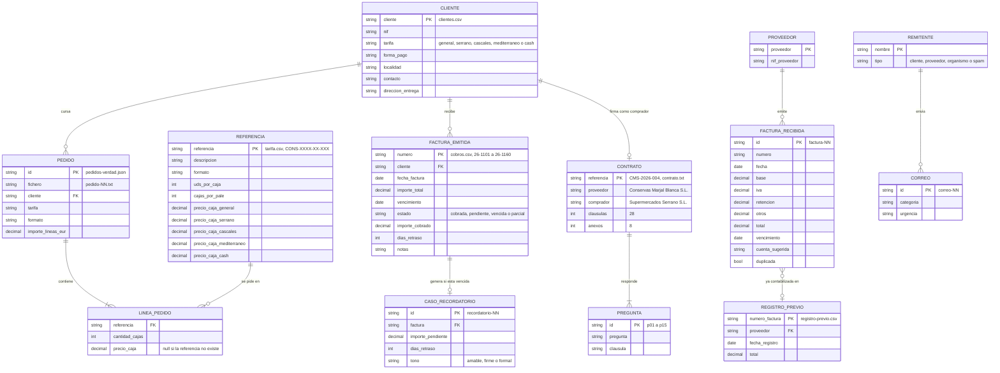

**Español** · [English](en/datos.md)

# Los datos

Todo lo que hay en `datos/` es de una empresa inventada, **Conservas Marjal Blanca S.L.** (NIF B38122941), una conservera de Almoradí (Alicante) con unos 40 empleados. Clientes, proveedores, personas, NIF, direcciones, importes y fechas son inventados pero coherentes: los NIF tienen dígito de control válido, las direcciones son plausibles, los precios de los pedidos cuadran con la tarifa, los totales de las facturas cuadran con base, IVA, retención y otros impuestos, y los dominios de correo terminan en `.example` a propósito. Ninguna empresa ni persona es real.

Índice: [Cifras y reglas de la carpeta](#cifras-y-reglas-de-la-carpeta) · [Modelo de datos](#modelo-de-datos) · [pedidos/](#pedidos) · [correos/](#correos) · [contrato/](#contrato) · [facturas/](#facturas) · [cobros/](#cobros) · [esquemas/](#esquemas) · [CHECKSUMS.sha256](#checksumssha256)

## Cifras y reglas de la carpeta

| | |
|---|---|
| Versión de los datos | 1.0.0 (2026-09-08). Son byte a byte los ficheros con los que el blog midió las cifras de la semana 2026-W37 |
| Ficheros | 85: 23 en `pedidos/`, 31 en `correos/`, 2 en `contrato/`, 27 en `facturas/`, 2 en `cobros/` |
| Codificación | UTF-8 sin BOM, saltos de línea LF. `.gitattributes` lo fija (`eol=lf`), así que un clon en Windows tiene los mismos bytes |
| Casos | 100: 20 pedidos, 30 correos, 15 preguntas, 25 facturas, 10 recordatorios |
| Fechas de referencia | Pedidos: jueves 10 de septiembre de 2026. Correos y cobros: lunes 14 de septiembre de 2026 |
| Idiomas | Español; un pedido y un correo en valenciano; un pedido y dos correos en inglés (un importador británico); un SaaS irlandés factura en inglés |
| Ficheros de verdad | Uno por carpeta, `*-verdad.json` (en el contrato, `contrato-preguntas.json`). Cada uno empieza con un campo `_comentario` que explica el criterio |
| Lo que no hay | Ficheros binarios: los PDF, las fotos y los escaneos están como texto ya extraído (con los defectos del OCR incluidos) |

Los ficheros de datos no cambian sin subir la versión y anotarlo en `CHANGELOG.md`. `python -m kit_pyme verificar` comprueba los 85 contra `CHECKSUMS.sha256`, que no haya ficheros de más y que los cinco prompts compuestos a partir de estos bytes sigan dando el SHA-256 publicado en [`tareas.md`](tareas.md#verificación-de-los-prompts).

## Modelo de datos



Las entidades no están en una base de datos: son las columnas de los CSV y los campos de los JSON. Los mismos 13 clientes aparecen en `clientes.csv`, en los pedidos, en `cobros.csv`, en los correos y en el contrato (Supermercados Serrano es el comprador). Un proveedor, la Cooperativa Agrícola San Isidro de Callosa, es a la vez cliente: aparece en `clientes.csv` y factura hortalizas en `factura-07.txt`.

## pedidos/

23 ficheros: 20 pedidos, la tarifa, los clientes y la verdad.

### `tarifa.csv` (4.757 bytes)

40 referencias, separador `;`, decimales con coma. Columnas: `referencia` (formato `CONS-XXXX-XX-XXX`: familia, preparación, formato), `descripcion`, `formato` (envase y pesos), `uds_por_caja`, `cajas_por_pale`, `precio_caja_general`, `precio_caja_serrano`, `precio_caja_cascales`, `precio_caja_mediterraneo`, `precio_caja_cash`. Las columnas de precio son la general con descuento: Serrano −8 %, Cascales −12 %, Mediterráneo −5 %, Cash −10 %. Familias: atún (en oliva, girasol, natural, escabeche, pack de 3, lata de 1 kg), bonito, melva, caballa, sardinillas, sardinas, anchoas, mejillones, berberechos, calamares, pulpo, alcachofa (corazones y fondos en tarro y en lata de 3 kg), piquillo, tomate (triturado y frito), habitas, judías verdes, garbanzos, lentejas, alubias, pisto, aceitunas, alcaparras, ñoras y dátil de Elche.

### `clientes.csv` (1.926 bytes)

13 clientes. Columnas: `cliente`, `nif`, `tarifa`, `forma_pago`, `localidad`, `contacto`, `direccion_entrega`.

| Cliente | NIF | Tarifa | Forma de pago | Localidad | Contacto |
|---|---|---|---|---|---|
| Supermercados Serrano S.L. | B34029173 | serrano | 60 días f.f. | Elche | Amparo Sellés |
| Distribuciones Hermanos Cascales S.L. | B33911082 | cascales | 60 días f.f. | Orihuela | Paco Cascales |
| Grupo Hostelero Mediterráneo S.L. | B37205416 | mediterraneo | 30 días f.f. | Benidorm | Rubén Ortolá |
| Ultramarinos La Font S.L.U. | B35647304 | general | contado | Alcoy | Vicent Ferrándiz |
| Cash Vega Baja S.A. | A32884553 | cash | 45 días f.f. | Almoradí | Loli Marco |
| Restaurante Casa Pepa (Josefa Belmonte Cano) | 21489302B | general | contado | Torrevieja | Pepa Belmonte |
| Cooperativa Agrícola San Isidro de Callosa S. Coop. V. | F30117295 | general | 30 días f.f. | Callosa de Segura | Mari Carmen Gil |
| Supermercados Alifresc S.L. | B36700235 | general | 60 días f.f. | Alicante | Sergio Baeza |
| Catering Lucentum Eventos S.L. | B35541986 | general | 30 días f.f. | San Vicente del Raspeig | Nuria Pastor |
| Bar-Cafetería El Racó de Toni (Antoni Buigues Soler) | 53210077Z | general | contado | Xàbia | Toni Buigues |
| Sabores de Levante Online S.L. | B36988020 | general | 30 días f.f. | Elche | Irene Mora |
| Distribuciones Bernabéu e Hijos S.L. | B31304660 | general | 60 días f.f. | Villena | Juanjo Bernabéu |
| Mediterranean Pantry Ltd | GB 447 2201 93 | general | prepago | Londres | Helen Whitcombe |

### `pedido-01.txt` … `pedido-20.txt`

Cada fichero es un pedido tal como llega: la cabecera del correo (`De`, `Para`, `Fecha`, `Asunto`) y el cuerpo. Los formatos están elegidos para cubrir lo que recibe una conservera de verdad.

| Fichero | Bytes | Cliente | Tarifa | Formato | Líneas | Incidencia obligatoria |
|---|---:|---|---|---|---:|---|
| `pedido-01.txt` | 1024 | Supermercados Serrano S.L. | serrano | correo en texto, con referencias | 5 | — |
| `pedido-02.txt` | 782 | Distribuciones Hermanos Cascales S.L. | cascales | tabla pegada desde Excel (tabuladores), con precios | 7 | — |
| `pedido-03.txt` | 2356 | Grupo Hostelero Mediterráneo S.L. | mediterraneo | orden de compra en PDF (texto extraído, cabeceras y pies de página) | 6 | — |
| `pedido-04.txt` | 1051 | Cash Vega Baja S.A. | cash | hoja de cálculo exportada a CSV (punto y coma) | 8 | — |
| `pedido-05.txt` | 639 | Restaurante Casa Pepa (Josefa Belmonte Cano) | general | nota manuscrita escaneada con OCR sucio | 4 | — |
| `pedido-06.txt` | 519 | Bar-Cafetería El Racó de Toni (Antoni Buigues Soler) | general | correo en valenciano, sin referencias (solo descripciones) | 3 | — |
| `pedido-07.txt` | 638 | Supermercados Alifresc S.L. | general | correo con referencias; UNA NO EXISTE en la tarifa | 5 | referencia-inexistente |
| `pedido-08.txt` | 671 | Ultramarinos La Font S.L.U. | general | correo con precios escritos por el cliente; UNO NO COINCIDE con la tarifa | 4 | precio-distinto-de-tarifa |
| `pedido-09.txt` | 688 | Distribuciones Bernabéu e Hijos S.L. | general | «lo de siempre» con el pedido anterior citado en el hilo | 5 | — |
| `pedido-10.txt` | 695 | Sabores de Levante Online S.L. | general | cantidades en unidades (no cajas) y SKU propios del cliente | 3 | — |
| `pedido-11.txt` | 385 | Distribuciones Hermanos Cascales S.L. | cascales | cantidades en palés y medios palés | 3 | — |
| `pedido-12.txt` | 3001 | Supermercados Serrano S.L. | serrano | pedido de compra en PDF de dos páginas (texto extraído), con una línea partida entre páginas | 9 | — |
| `pedido-13.txt` | 615 | Catering Lucentum Eventos S.L. | general | mensaje de WhatsApp reenviado por una compañera, lenguaje informal | 2 | — |
| `pedido-14.txt` | 905 | Mediterranean Pantry Ltd | general | pedido en inglés de un importador, EXW | 5 | — |
| `pedido-15.txt` | 734 | Cooperativa Agrícola San Isidro de Callosa S. Coop. V. | general | sin referencias, cantidades en letras | 4 | — |
| `pedido-16.txt` | 586 | Supermercados Alifresc S.L. | general | pedido con corrección posterior en el mismo correo (quita una línea, sube otra) | 4 | — |
| `pedido-17.txt` | 808 | Grupo Hostelero Mediterráneo S.L. | mediterraneo | correo que mezcla una reclamación y un pedido urgente | 3 | — |
| `pedido-18.txt` | 1008 | Cash Vega Baja S.A. | cash | tabla con barras verticales copiada de un portal de compras | 6 | — |
| `pedido-19.txt` | 401 | Ultramarinos La Font S.L.U. | general | correo corto sin referencias, cantidades en letras, con un producto añadido «ah, y…» | 4 | — |
| `pedido-20.txt` | 586 | Sabores de Levante Online S.L. | general | una referencia repartida en dos entregas (hay que sumar) | 4 | — |

### `pedidos-verdad.json` (31.526 bytes)

```text
{ _comentario, empresa, fecha_referencia: "2026-09-10", pedidos: [20] }
pedidos[i] = { id, fichero, cliente, nif_cliente, tarifa, formato,
               lineas: [{ referencia, descripcion, cantidad_cajas, precio_caja }],
               importe_lineas_eur, incidencias: [{ tipo, detalle, obligatoria }], nota }
```

`cantidad_cajas` está siempre en cajas (convertidas con `uds_por_caja` y `cajas_por_pale`). `precio_caja` es el de la columna de tarifa del cliente, o `null` si la referencia no existe. `nota` explica la trampa de cada caso.

## correos/

31 ficheros: 30 correos y la verdad. Cada correo lleva cabecera (`De`, `Para`, `Fecha`, `Asunto`) y cuerpo; hay adjuntos descritos como texto y un hilo citado.

| Fichero | Bytes | Remitente | Categoría | Urgencia | Resumen |
|---|---:|---|---|---|---|
| `correo-01.txt` | 714 | Supermercados Serrano S.L. | `reclamacion` | `media` | Serrano reclama 11 latas de bonito abolladas por un palé sin retractilar y pide abono. |
| `correo-02.txt` | 340 | Distribuciones Hermanos Cascales S.L. | `consulta` | `media` | Cascales pregunta si su pedido del jueves puede recogerse el miércoles. |
| `correo-03.txt` | 498 | Supermercados Alifresc S.L. | `cambio-pedido` | `alta` | Alifresc pide cambiar 10 cajas de escabeche por natural en el pedido que sale mañana. |
| `correo-04.txt` | 684 | Envases Metálicos del Vinalopó S.L. | `factura-proveedor` | `baja` | Factura de hojalata del proveedor de envases, vencimiento a 60 días, con aviso de subida de recargo en octubre. |
| `correo-05.txt` | 846 | premios@empresa-excelente-europa.example | `spam` | `baja` | Correo de un supuesto premio empresarial que pide 390 € para confirmarlo: spam. |
| `correo-06.txt` | 698 | Cash Vega Baja S.A. | `reclamacion` | `alta` | Cash Vega Baja recibió 68 cajas de atún en vez de 80 y necesita las 12 que faltan hoy porque mañana empieza una promoción. |
| `correo-07.txt` | 360 | Restaurante Casa Pepa (Josefa Belmonte Cano) | `consulta` | `baja` | Casa Pepa pregunta por atún bajo en sal y por bonito en formato hostelería. |
| `correo-08.txt` | 877 | Asesoría Vega Fiscal | `administrativo` | `media` | La asesoría pide facturas, un justificante y autorización para un certificado antes del 25 de septiembre. |
| `correo-09.txt` | 785 | Almazara Sierra de Mariola S. Coop. | `aviso-proveedor` | `media` | El proveedor de aceite sube el precio un 11 % desde octubre; pedir antes del 20 mantiene el precio actual. |
| `correo-10.txt` | 626 | Ultramarinos La Font S.L.U. | `reclamacion` | `alta` | La Font ha encontrado dos tarros de alcachofa del lote L26187 con la tapa hinchada: posible problema de seguridad alimentaria. |
| `correo-11.txt` | 465 | Mediterranean Pantry Ltd | `consulta` | `media` | El importador británico pregunta si el pedido estará listo el 21 y pide la proforma para pagar. |
| `correo-12.txt` | 365 | Distribuciones Bernabéu e Hijos S.L. | `cambio-pedido` | `baja` | Bernabéu retrasa una semana la entrega de su pedido, sin más cambios. |
| `correo-13.txt` | 715 | Transportes Orihuela Express S.L. | `factura-proveedor` | `baja` | Factura mensual del transportista con recargo de combustible y dos esperas facturadas aparte. |
| `correo-14.txt` | 594 | seguridad@sabadell-verificacion.example (suplantación) | `spam` | `baja` | Phishing que imita al banco y pide verificar datos bancarios en un enlace falso. |
| `correo-15.txt` | 738 | Ayuntamiento de Almoradí | `administrativo` | `media` | El ayuntamiento notifica la tasa de residuos de 2026 (1.248,60 €) con plazo voluntario hasta el 16 de noviembre. |
| `correo-16.txt` | 721 | Sabores de Levante Online S.L. | `cambio-pedido` | `media` | Sabores de Levante adelanta 6 cajas de dátil a la primera entrega y pregunta si pueden facturarse las entregas por separado. |
| `correo-17.txt` | 332 | Bar-Cafetería El Racó de Toni (Antoni Buigues Soler) | `pedido` | `media` | El Racó de Toni pide en valenciano cuatro cajas para el viernes por la mañana. |
| `correo-18.txt` | 416 | Distribuciones Hermanos Cascales S.L. | `reclamacion` | `media` | Cascales reclama que la factura 26/1132 lleva precio de tarifa general en vez del suyo y pide rectificativa antes del giro. |
| `correo-19.txt` | 529 | Cooperativa Agrícola San Isidro de Callosa S. Coop. V. | `consulta` | `baja` | La cooperativa pide precio para 40-60 cajas de dátil de Elche para las cestas de Navidad. |
| `correo-20.txt` | 782 | Túnidos Congelados Atlántico S.A. | `aviso-proveedor` | `alta` | El contenedor de atún llega 10 días tarde; el proveedor ofrece 6.000 kg alternativos el 16 con sobrecoste. |
| `correo-21.txt` | 836 | Conselleria de Sanitat – CSP Orihuela | `administrativo` | `alta` | Sanidad anuncia inspección oficial el martes 15 a las 10:00 y pide tener lista la documentación de autocontrol. |
| `correo-22.txt` | 696 | Boletín de ferias | `spam` | `baja` | Boletín comercial de ferias y tendencias; sin acción necesaria. |
| `correo-23.txt` | 627 | Catering Lucentum Eventos S.L. | `reclamacion` | `media` | Catering Lucentum se queja de que el pedido llegó un día tarde y pide aviso previo y un gesto en el precio. |
| `correo-24.txt` | 637 | Supermercados Alifresc S.L. | `consulta` | `media` | Alifresc pide documentación de calidad de 14 referencias para su auditoría de octubre, antes del 25 de septiembre. |
| `correo-25.txt` | 443 | Supermercados Serrano S.L. | `cambio-pedido` | `media` | Serrano reduce de 24 a 14 cajas la línea de alcachofa 720 del pedido del día 15. |
| `correo-26.txt` | 577 | Laboratorio Analítico del Segura S.L. | `factura-proveedor` | `baja` | El laboratorio envía resultados conformes de dos lotes y su factura a 30 días. |
| `correo-27.txt` | 305 | Restaurante Casa Pepa (Josefa Belmonte Cano) | `consulta` | `alta` | Casa Pepa pregunta si el pedido llega hoy antes de las 12 porque tiene el comedor lleno. |
| `correo-28.txt` | 621 | Gráficas Lucentum S.L. | `aviso-proveedor` | `media` | La imprenta necesita aprobar la etiqueta del dátil antes del jueves para entregar el 28. |
| `correo-29.txt` | 642 | Mediterranean Pantry Ltd | `reclamacion` | `alta` | Dos palés retenidos en Dover por falta de certificado sanitario de las anchoas; hay 48 horas para enviarlo. |
| `correo-30.txt` | 614 | Banco – Oficina de Empresas | `administrativo` | `media` | El banco pide documentación antes del 30/09 para renovar la póliza de crédito que vence el 31 de octubre. |

Reparto: 6 reclamaciones, 6 consultas, 4 cambios de pedido, 1 pedido, 3 facturas de proveedor, 3 avisos de proveedor, 4 administrativos, 3 spam; 7 urgencias altas, 14 medias, 9 bajas.

### `correos-verdad.json` (14.466 bytes)

```text
{ _comentario, categorias: [8], urgencias: [3], correos: [30] }
correos[i] = { id, fichero, categoria, urgencia, remitente, accion, resumen }
```

## contrato/

2 ficheros.

### `contrato.txt` (187.847 bytes)

Contrato marco de suministro de conservas alimentarias entre Conservas Marjal Blanca S.L. (Proveedor) y Supermercados Serrano S.L. (Comprador), referencia interna CMS-2026-004, firmado el 26 de enero de 2026 con efectos del 1 de febrero de 2026. 28.396 palabras (unas 60 páginas), con índice, reunidos, expositivos, 28 cláusulas y 8 anexos:

| Cláusulas | Anexos |
|---|---|
| 1 Definiciones · 2 Objeto · 3 Duración, prórroga y preaviso · 4 Productos · 5 Previsiones y pedidos · 6 Precios · 7 Entrega e Incoterms · 8 Riesgo y reserva de dominio · 9 Facturación, plazo de pago y morosidad · 10 Garantía de calidad · 11 Recepción y reclamaciones · 12 Retirada de producto · 13 Penalizaciones · 14 Nivel de servicio · 15 Marca del distribuidor · 16 Propiedad intelectual · 17 Confidencialidad · 18 Protección de datos · 19 Seguros · 20 Fuerza mayor · 21 Cesión y subcontratación · 22 Resolución · 23 Consecuencias de la terminación · 24 Responsabilidad · 25 Cumplimiento normativo · 26 Notificaciones · 27 Ley aplicable, mediación y jurisdicción · 28 Disposiciones finales | I Productos y especificaciones · II Tarifa y condiciones económicas · III Nivel de servicio y penalizaciones · IV Requisitos logísticos · V Calidad y certificaciones · VI Reclamaciones y retirada · VII Modelos de acta · VIII Contactos y notificaciones |

### `contrato-preguntas.json` (9.024 bytes)

```text
{ _comentario, fichero: "contrato.txt", preguntas: [15] }
preguntas[i] = { id, pregunta, respuesta, clausula, debe_contener_alguno: [[...], ...], clausulas_aceptadas: [...] }
```

Las quince preguntas y sus cláusulas están en [`tareas.md`](tareas.md#3-buscar-en-contrato). Cubren plazo de pago (9.2), interés de demora (9.5), plazo de entrega (7.3), penalizaciones (13.2), Incoterm (7.1), vida útil (10.4), reclamaciones en recepción (11.2), duración (3), confidencialidad (17.4), seguro (19.1), fuerza mayor (20), pedido mínimo (5.4), rappel (Anexo II.3), tasa de servicio (14.2) y resolución de conflictos (27).

## facturas/

27 ficheros: 25 facturas recibidas, el registro previo y la verdad. Cada factura es texto tal como se extraería de un PDF o de un correo: cabecera del proveedor, datos del cliente (siempre con el NIF B38122941), líneas, base, IVA, total y condiciones de pago.

### `registro-previo.csv` (585 bytes)

7 facturas ya contabilizadas. Columnas: `fecha_registro`, `proveedor`, `nif`, `numero_factura`, `total`.

| Registrada | Proveedor | Número | Total |
|---|---|---|---:|
| 2026-07-06 | Envases Metálicos del Vinalopó S.L. | EMV/2026/1102 | 21.084,30 |
| 2026-07-31 | Transportes Orihuela Express S.L. | TOE/26/0711 | 3.402,15 |
| 2026-08-03 | Asesoría Vega Fiscal S.L.P. | VF-2026-0812 | 580,80 |
| 2026-08-10 | Energía Levante Comercializadora S.L. | EL-26-0718820 | 8.103,44 |
| 2026-08-12 | Almazara Sierra de Mariola S. Coop. V. | A/26/0410 | 12.106,25 |
| 2026-08-20 | Cartonajes del Segura S.A. | 2026/0781 | 6.969,60 |
| 2026-08-25 | Mantenimientos Industriales Segura S.L. | MIS/26/0771 | 1.989,85 |

Cinco de esos proveedores vuelven a facturar en el lote (con otro número, salvo Mantenimientos Industriales Segura, que aparece dos veces con el mismo `MIS/26/0771`).

### `factura-01.txt` … `factura-25.txt`

| Fichero | Bytes | Proveedor | Número | Total | Vencimiento | Cuenta | Duplicada | Particularidad |
|---|---:|---|---|---:|---|---|---|---|
| `factura-01.txt` | 1424 | Envases Metálicos del Vinalopó S.L. | EMV/2026/1187 | 22.845,41 € | 2026-11-03 | 602 | no | Vencimiento calculado: 60 días desde el 04/09 |
| `factura-02.txt` | 724 | Almazara Sierra de Mariola S. Coop. V. | A/26/0472 | 16.140,80 € | 2026-10-02 | 601 | no | IVA superreducido del 4 % (aceite de oliva) |
| `factura-03.txt` | 1347 | Túnidos Congelados Atlántico S.A. | 2026/A/03318 | 137.918,00 € | 2026-11-26 | 601 | no | IVA 10 %; la factura más grande del lote; el vencimiento viene explícito |
| `factura-04.txt` | 904 | Transportes Orihuela Express S.L. | TOE/26/0812 | 3.724,17 € | 2026-10-05 | 624 | no | Incluye dos esperas facturadas aparte |
| `factura-05.txt` | 1482 | Energía Levante Comercializadora S.L. | EL-26-0812931 | 8.306,70 € | 2026-09-10 | 628 | no | El vencimiento es la fecha de cargo en cuenta |
| `factura-06.txt` | 887 | Gráficas Lucentum S.L. | GL-2026-2210 | 4.029,30 € | 2026-11-07 | 602 | no | — |
| `factura-07.txt` | 1350 | Cooperativa Agrícola San Isidro de Callosa S. Coop. V. | V-2026-1088 | 14.352,00 € | 2026-10-09 | 601 | no | IVA 4 %; proveedor que también es cliente: no confundir con las facturas emitidas |
| `factura-08.txt` | 730 | Asesoría Vega Fiscal S.L.P. | VF-2026-0911 | 580,80 € | 2026-09-05 | 623 | no | Recibo domiciliado el día 5 de cada mes |
| `factura-09.txt` | 789 | Mantenimientos Industriales Segura S.L. | MIS/26/0771 | 1.989,85 € | 2026-09-20 | 622 | sí | Ya figura en el registro previo (contabilizada el 25/08): duplicada |
| `factura-10.txt` | 1304 | Mutua Aseguradora del Mediterráneo, M.P.S. | REC-2026-0771208 | 4.380,00 € | 2026-10-01 | 625 | no | Sin IVA (exento); lleva impuesto sobre primas de seguros (380,00 €) |
| `factura-11.txt` | 765 | Inmobiliaria Las Maromas S.L. | 2026-09-A14 | 2.448,00 € | 2026-09-05 | 621 | no | Retención IRPF 19 %: 2.400 + 504 − 456 = 2.448,00 |
| `factura-12.txt` | 1389 | Aquavega Gestión del Agua S.A. | AQ/26/0088123 | 2.103,53 € | 2026-09-27 | 628 | no | IVA 10 % |
| `factura-13.txt` | 738 | Comunicaciones Levante Telecom S.L. | CLT-260900412 | 260,03 € | 2026-09-12 | 629 | no | — |
| `factura-14.txt` | 909 | Laboratorio Analítico del Segura S.L. | F/26/2210 | 847,00 € | 2026-10-11 | 623 | no | — |
| `factura-15.txt` | 761 | Nimbus ERP Ltd | INV-2026-091877 | 289,00 € | 2026-09-01 | 629 | no | Sin IVA por inversión del sujeto pasivo (autorrepercusión en el 303); ya cobrada con tarjeta |
| `factura-16.txt` | 526 | Carburantes Vega S.L. | T-26-118820 | 740,82 € | 2026-09-08 | 628 | no | Pagada al contado: vencimiento = fecha de factura |
| `factura-17.txt` | 793 | Mantenimientos Industriales Segura S.L. | MIS/26/0803 | 1.636,40 € | 2026-10-09 | 622 | no | Trampa: mismo proveedor y misma mano de obra que la 09, pero número, fecha y total distintos; no es duplicada |
| `factura-18.txt` | 1371 | Uniformes y Vestuario Laboral Alicante S.L. | UVA-26-0930 | 945,01 € | 2026-10-10 | 629 | no | — |
| `factura-19.txt` | 863 | Limpiezas Industriales Costa Blanca S.L. | LICB/2026/0902 | 2.008,60 € | 2026-10-01 | 629 | no | — |
| `factura-20.txt` | 620 | Ferretería Industrial Almoradí S.L. | A/26/4471 | 157,54 € | 2026-09-11 | 629 | no | — |
| `factura-21.txt` | 833 | Mantenimientos Industriales Segura S.L. | MIS/26/0771 | 1.989,85 € | 2026-09-20 | 622 | sí | Mismo número y proveedor que la 09 y que el registro previo: duplicada |
| `factura-22.txt` | 790 | Miguel Ángel Sáez Peral | 2026-031 | 1.908,00 € | 2026-10-10 | 623 | no | Autónomo, retención IRPF 15 %: 1.800 + 378 − 270 = 1.908,00 |
| `factura-23.txt` | 1294 | Cartonajes del Segura S.A. | 2026/0866 | 11.616,00 € | 2026-11-06 | 602 | no | — |
| `factura-24.txt` | 566 | Sales del Sureste S.L. | SS-26-1902 | 941,60 € | 2026-10-04 | 601 | no | IVA 10 % |
| `factura-25.txt` | 827 | Prevención Activa Levante S.L. | PAL-2026-0388 | 1.361,25 € | 2026-11-02 | 629 | no | — |

### `facturas-verdad.json` (14.269 bytes)

```text
{ _comentario, empresa, facturas: [25] }
facturas[i] = { id, fichero, proveedor, nif_proveedor, numero, fecha, base, tipo_iva, iva, retencion, otros,
                total, vencimiento, cuenta_sugerida, cuenta_nombre, duplicada, nota }
```

Invariante de todas las facturas: `base + iva − retencion + otros = total` (tolerancia 0,011). Las cuentas son del Plan General Contable de pymes (601, 602, 621, 622, 623, 624, 625, 628, 629) y son orientativas: no se puntúan.

## cobros/

2 ficheros.

### `cobros.csv` (8.700 bytes)

60 facturas emitidas, de la 26/1101 a la 26/1160, con fecha entre mayo y septiembre de 2026. Columnas: `numero`, `cliente`, `nif`, `fecha_factura`, `importe_total`, `vencimiento`, `forma_pago`, `estado`, `importe_cobrado`, `fecha_cobro`, `dias_retraso`, `ultimo_recordatorio`, `notas`. Fechas en `DD/MM/AAAA`, decimales con coma. Estados: 32 cobradas, 12 pendientes (sin vencer), 15 vencidas y 1 con cobro parcial. La columna `notas` lleva el contexto que cambia la decisión: una disputa de precio, un acuerdo telefónico de pago, un recordatorio reciente, un pago parcial.

### `cobros-verdad.json` (18.035 bytes)

```text
{ _comentario, fecha_referencia: "2026-09-14", empresa,
  firma: { nombre, cargo, telefono, iban },
  tonos: { amable | firme | formal: { descripcion, prohibido: [...], obligatorio: [...] } },
  recordar: [11], no_recordar: [5], casos_recordatorio: [10] }
casos_recordatorio[i] = { id, factura, cliente, contacto, importe_pendiente, vencimiento, dias_retraso, tono,
                          reglas: { debe_contener_alguno, debe_contener_expresion, no_debe_contener,
                                    max_palabras, debe_nombrar_cliente, debe_firmar } }
```

La regla de la casa: se recuerda toda factura vencida y no cobrada (o cobrada en parte) salvo que esté en disputa, haya un acuerdo de pago posterior, se haya recordado en los últimos 7 días o venciera en fin de semana. Tono según retraso: 1-15 días amable, 16-45 firme, más de 45 último aviso formal. `firma`, `tonos.*.descripcion` y `fecha_referencia` son los valores que van dentro del prompt de la tarea.

`recordar` lista las 11 facturas que habría que reclamar el 14 de septiembre; los casos puntuados son 10 de ellas (la 26/1137 de Restaurante Casa Pepa, tono formal, no tiene caso). `no_recordar` lista las cinco vencidas que no se reclaman y por qué:

| Factura | Cliente | Vencimiento | Por qué no se recuerda |
|---|---|---|---|
| 26/1132 | Distribuciones Hermanos Cascales S.L. | 2026-08-31 | en disputa: el cliente reclama precio erróneo (factura 26/1132) y está pendiente la rectificativa |
| 26/1131 | Supermercados Serrano S.L. | 2026-09-04 | acordado por teléfono el pago el 18/09; no reclamar antes |
| 26/1133 | Cash Vega Baja S.A. | 2026-08-22 | se le recordó hace 3 días (11/09); esperar respuesta |
| 26/1153 | Sabores de Levante Online S.L. | 2026-09-13 | vence esta semana (13/09 era domingo → 1 día): se recuerda la semana que viene si sigue pendiente |
| 26/1151 | Grupo Hostelero Mediterráneo S.L. | 2026-09-12 | no ha vencido todavía (vence el 12/09 + margen de cortesía de 2 días laborables acordado en contrato) |

Los diez casos:

| Caso | Factura | Cliente | Contacto | Pendiente | Vencimiento | Retraso | Tono |
|---|---|---|---|---:|---|---:|---|
| `recordatorio-01` | 26/1135 | Supermercados Alifresc S.L. | Sergio Baeza | 4.312,60 € | 2026-09-07 | 7 | amable |
| `recordatorio-02` | 26/1149 | Sabores de Levante Online S.L. | Irene Mora | 1.264,35 € | 2026-09-09 | 5 | amable |
| `recordatorio-03` | 26/1144 | Catering Lucentum Eventos S.L. | Nuria Pastor | 842,10 € | 2026-09-02 | 12 | amable |
| `recordatorio-04` | 26/1150 | Cooperativa Agrícola San Isidro de Callosa S. Coop. V. | Mari Carmen Gil | 655,20 € | 2026-09-11 | 3 | amable |
| `recordatorio-05` | 26/1121 | Supermercados Serrano S.L. | Amparo Sellés | 7.418,90 € | 2026-08-21 | 24 | firme |
| `recordatorio-06` | 26/1118 | Distribuciones Bernabéu e Hijos S.L. | Juanjo Bernabéu | 2.976,40 € | 2026-08-14 | 31 | firme |
| `recordatorio-07` | 26/1140 | Grupo Hostelero Mediterráneo S.L. | Rubén Ortolá | 3.163,42 € | 2026-08-19 | 26 | firme |
| `recordatorio-08` | 26/1125 | Cash Vega Baja S.A. | Loli Marco | 2.104,00 € | 2026-08-15 | 30 | firme |
| `recordatorio-09` | 26/1105 | Distribuciones Bernabéu e Hijos S.L. | Juanjo Bernabéu | 1.188,75 € | 2026-07-10 | 66 | formal |
| `recordatorio-10` | 26/1124 | Ultramarinos La Font S.L.U. | Vicent Ferrándiz | 421,90 € | 2026-06-30 | 76 | formal |

El caso 08 es el del pago parcial: la factura era de 5.104,00 €, el cliente pagó 3.000,00 € el 28/08 y el recordatorio tiene que reclamar 2.104,00 €.

## esquemas/

`datos/esquemas/` contiene un JSON Schema por cada fichero de verdad (`pedidos-verdad`, `correos-verdad`, `contrato-preguntas`, `facturas-verdad`, `cobros-verdad`) y uno por la respuesta esperada de cada tarea (los mismos esquemas que van dentro de `tareas/<id>/tarea.json`). Sirven para validar los ficheros de verdad en los tests y para que quien construya una herramienta sepa exactamente qué forma tiene que devolver.

## CHECKSUMS.sha256

Una línea por fichero de datos, en el formato de `sha256sum`: el hash, dos espacios y la ruta relativa a `datos/`.

```text
b9579711e64458b976434564e777dc3191a13f330630c993dc3e8abfefdd12ff  pedidos/pedido-01.txt
```

Se comprueba con `python -m kit_pyme verificar` (que además avisa si hay ficheros en las cinco carpetas que no están en la lista) o, con las herramientas del sistema, con `cd datos && sha256sum -c CHECKSUMS.sha256`. Los hashes son de los bytes tal cual (UTF-8, LF); un editor que cambie los saltos de línea a CRLF o añada un BOM hará fallar la verificación, y eso es lo que se quiere.

Con los datos intactos:

```console
$ python -m kit_pyme verificar
OK   datos/ y los prompts son los publicados (checksums y sha256 correctos).
$ echo $?
0
```

Y esto es lo que sale cuando no lo están. Sobre una copia de `datos/` con un byte añadido a `factura-08.txt`, `correo-30.txt` borrado y un `extra.csv` que no estaba:

```console
$ python -m kit_pyme verificar
MAL  falta datos/correos/correo-30.txt
MAL  datos/facturas/factura-08.txt ha cambiado (sha256 distinto del publicado)
MAL  datos/cobros/extra.csv no está en CHECKSUMS.sha256: sobra o hay que versionar el kit
3 problema(s): los datos NO son los publicados.
$ echo $?
1
```

Los tres casos importan por separado. Un fichero que falta o que ha cambiado significa que tus cifras no son comparables con las publicadas. Un fichero de más significa que alguien ha añadido un caso sin subir la versión del kit, que es la manera silenciosa de que dos números dejen de medir lo mismo.
