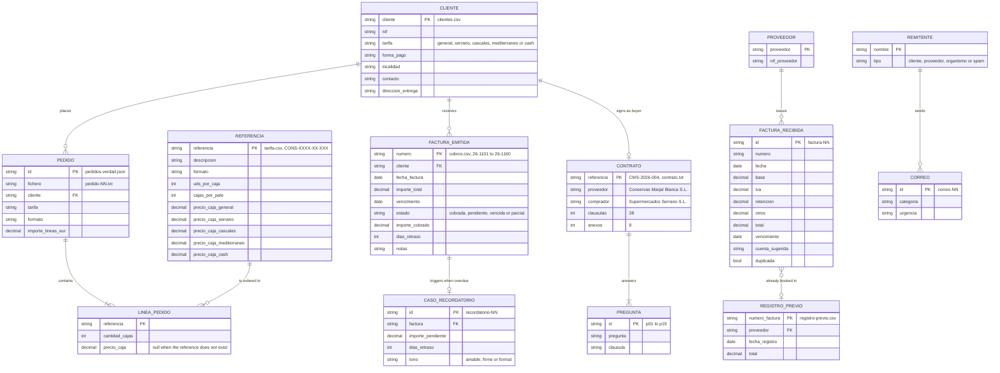

[Español](../datos.md) · **English**

# The data

Everything in `datos/` belongs to an invented company, **Conservas Marjal Blanca S.L.** (Spanish tax number B38122941), a cannery in Almoradí (Alicante) with about 40 employees. Customers, suppliers, people, tax numbers, addresses, amounts and dates are invented but consistent: the tax numbers have valid check digits, the addresses are plausible, the order prices match the price list, the invoice totals match base, VAT, withholding tax and other taxes, and the email domains end in `.example` on purpose. No company and no person is real.

The files themselves are in Spanish and are not translated: they are the input the model has to read, so translating them would mean measuring a different thing. What this document translates is the description of what is inside each one.

Contents: [Figures and rules](#figures-and-rules) · [Data model](#data-model) · [pedidos/](#pedidos) · [correos/](#correos) · [contrato/](#contrato) · [facturas/](#facturas) · [cobros/](#cobros) · [esquemas/](#esquemas) · [CHECKSUMS.sha256](#checksumssha256)

## Figures and rules

| | |
|---|---|
| Data version | 1.0.0 (2026-09-08). Byte for byte the files the blog measured the 2026-W37 figures with |
| Files | 85: 23 in `pedidos/`, 31 in `correos/`, 2 in `contrato/`, 27 in `facturas/`, 2 in `cobros/` |
| Encoding | UTF-8 without BOM, LF line endings. `.gitattributes` pins it (`eol=lf`), so a clone on Windows has the same bytes |
| Cases | 100: 20 orders, 30 emails, 15 questions, 25 invoices, 10 reminders |
| Reference dates | Orders: Thursday 10 September 2026. Emails and collections: Monday 14 September 2026 |
| Languages | Spanish, except: one order and one email in Valencian; one order and two emails in English (a British importer); one invoice in English (an Irish SaaS provider) |
| Ground-truth files | One per folder, `*-verdad.json` (in the contract, `contrato-preguntas.json`). Each one opens with a `_comentario` field explaining the criterion |
| What is not there | Binary files: the PDFs, photos and scans are present as already-extracted text, OCR defects included |

The data files do not change without raising the version and recording it in `CHANGELOG.md`. `python -m kit_pyme verificar` checks the 85 against `CHECKSUMS.sha256`, checks that there are no extra files, and checks that the five prompts composed from these bytes still hash to the SHA-256 published in [`tareas.md`](tareas.md#prompt-verification).

## Data model



The entities are not in a database: they are the columns of the CSV files and the fields of the JSON files. The same 13 customers appear in `clientes.csv`, in the orders, in `cobros.csv`, in the emails and in the contract (Supermercados Serrano is the buyer). One supplier, the Cooperativa Agrícola San Isidro de Callosa, is also a customer: it is in `clientes.csv` and it invoices vegetables in `factura-07.txt`.

## pedidos/

23 files: 20 orders, the price list, the customer list and the ground truth.

### `tarifa.csv` (4,757 bytes)

40 product references, `;` as separator, comma as decimal mark. Columns: `referencia` (shaped `CONS-XXXX-XX-XXX`: family, preparation, format), `descripcion`, `formato` (packaging and weights), `uds_por_caja`, `cajas_por_pale`, `precio_caja_general`, `precio_caja_serrano`, `precio_caja_cascales`, `precio_caja_mediterraneo`, `precio_caja_cash`. The price columns are the general price with a discount: Serrano −8 %, Cascales −12 %, Mediterráneo −5 %, Cash −10 %. Product families: tuna (in olive oil, sunflower oil, brine, escabeche, three-packs, 1 kg tins), bonito, frigate mackerel, mackerel, small sardines, sardines, anchovies, mussels, cockles, squid, octopus, artichoke (hearts and bottoms in jars and 3 kg tins), piquillo peppers, tomato (crushed and fried), broad beans, green beans, chickpeas, lentils, white beans, pisto, olives, capers, ñora peppers and Elche dates.

### `clientes.csv` (1,926 bytes)

13 customers. Columns: `cliente`, `nif`, `tarifa`, `forma_pago`, `localidad`, `contacto`, `direccion_entrega`.

| Customer | Tax number | Price column | Payment terms | Town | Contact |
|---|---|---|---|---|---|
| Supermercados Serrano S.L. | B34029173 | serrano | 60 days from invoice | Elche | Amparo Sellés |
| Distribuciones Hermanos Cascales S.L. | B33911082 | cascales | 60 days from invoice | Orihuela | Paco Cascales |
| Grupo Hostelero Mediterráneo S.L. | B37205416 | mediterraneo | 30 days from invoice | Benidorm | Rubén Ortolá |
| Ultramarinos La Font S.L.U. | B35647304 | general | cash | Alcoy | Vicent Ferrándiz |
| Cash Vega Baja S.A. | A32884553 | cash | 45 days from invoice | Almoradí | Loli Marco |
| Restaurante Casa Pepa (Josefa Belmonte Cano) | 21489302B | general | cash | Torrevieja | Pepa Belmonte |
| Cooperativa Agrícola San Isidro de Callosa S. Coop. V. | F30117295 | general | 30 days from invoice | Callosa de Segura | Mari Carmen Gil |
| Supermercados Alifresc S.L. | B36700235 | general | 60 days from invoice | Alicante | Sergio Baeza |
| Catering Lucentum Eventos S.L. | B35541986 | general | 30 days from invoice | San Vicente del Raspeig | Nuria Pastor |
| Bar-Cafetería El Racó de Toni (Antoni Buigues Soler) | 53210077Z | general | cash | Xàbia | Toni Buigues |
| Sabores de Levante Online S.L. | B36988020 | general | 30 days from invoice | Elche | Irene Mora |
| Distribuciones Bernabéu e Hijos S.L. | B31304660 | general | 60 days from invoice | Villena | Juanjo Bernabéu |
| Mediterranean Pantry Ltd | GB 447 2201 93 | general | prepaid | London | Helen Whitcombe |

### `pedido-01.txt` … `pedido-20.txt`

Each file is an order as it arrives: the email header (`De`, `Para`, `Fecha`, `Asunto`) and the body. The formats were chosen to cover what a real cannery receives.

| File | Bytes | Customer | Price column | Format | Lines | Mandatory incident |
|---|---:|---|---|---|---:|---|
| `pedido-01.txt` | 1024 | Supermercados Serrano S.L. | serrano | plain-text email, with product references | 5 | — |
| `pedido-02.txt` | 782 | Distribuciones Hermanos Cascales S.L. | cascales | table pasted from Excel (tabs), with prices | 7 | — |
| `pedido-03.txt` | 2356 | Grupo Hostelero Mediterráneo S.L. | mediterraneo | purchase order in PDF (extracted text, headers and footers) | 6 | — |
| `pedido-04.txt` | 1051 | Cash Vega Baja S.A. | cash | spreadsheet exported to CSV (semicolons) | 8 | — |
| `pedido-05.txt` | 639 | Restaurante Casa Pepa (Josefa Belmonte Cano) | general | handwritten note scanned with dirty OCR | 4 | — |
| `pedido-06.txt` | 519 | Bar-Cafetería El Racó de Toni (Antoni Buigues Soler) | general | email in Valencian, no references, descriptions only | 3 | — |
| `pedido-07.txt` | 638 | Supermercados Alifresc S.L. | general | email with references; ONE DOES NOT EXIST in the price list | 5 | referencia-inexistente |
| `pedido-08.txt` | 671 | Ultramarinos La Font S.L.U. | general | email with prices written by the customer; ONE DOES NOT MATCH the price list | 4 | precio-distinto-de-tarifa |
| `pedido-09.txt` | 688 | Distribuciones Bernabéu e Hijos S.L. | general | "the usual", with the previous order quoted in the thread | 5 | — |
| `pedido-10.txt` | 695 | Sabores de Levante Online S.L. | general | quantities in units (not boxes) and the customer's own SKUs | 3 | — |
| `pedido-11.txt` | 385 | Distribuciones Hermanos Cascales S.L. | cascales | quantities in pallets and half pallets | 3 | — |
| `pedido-12.txt` | 3001 | Supermercados Serrano S.L. | serrano | two-page PDF purchase order (extracted text), with one line split across the page break | 9 | — |
| `pedido-13.txt` | 615 | Catering Lucentum Eventos S.L. | general | WhatsApp message forwarded by a colleague, informal language | 2 | — |
| `pedido-14.txt` | 905 | Mediterranean Pantry Ltd | general | order in English from an importer, EXW | 5 | — |
| `pedido-15.txt` | 734 | Cooperativa Agrícola San Isidro de Callosa S. Coop. V. | general | no references, quantities written out in words | 4 | — |
| `pedido-16.txt` | 586 | Supermercados Alifresc S.L. | general | order corrected later in the same email (drops one line, raises another) | 4 | — |
| `pedido-17.txt` | 808 | Grupo Hostelero Mediterráneo S.L. | mediterraneo | email mixing a complaint and an urgent order | 3 | — |
| `pedido-18.txt` | 1008 | Cash Vega Baja S.A. | cash | pipe-delimited table copied from a purchasing portal | 6 | — |
| `pedido-19.txt` | 401 | Ultramarinos La Font S.L.U. | general | short email, no references, quantities in words, one product added as an afterthought | 4 | — |
| `pedido-20.txt` | 586 | Sabores de Levante Online S.L. | general | one reference split across two deliveries (they have to be added up) | 4 | — |

### `pedidos-verdad.json` (31,526 bytes)

```text
{ _comentario, empresa, fecha_referencia: "2026-09-10", pedidos: [20] }
pedidos[i] = { id, fichero, cliente, nif_cliente, tarifa, formato,
               lineas: [{ referencia, descripcion, cantidad_cajas, precio_caja }],
               importe_lineas_eur, incidencias: [{ tipo, detalle, obligatoria }], nota }
```

`cantidad_cajas` is always in boxes (converted with `uds_por_caja` and `cajas_por_pale`). `precio_caja` is the one from the customer's price column, or `null` when the reference does not exist. `nota` explains the trap in each case.

## correos/

31 files: 30 emails and the ground truth. Each email has a header (`De`, `Para`, `Fecha`, `Asunto`) and a body; there are attachments described as text and one quoted thread.

| File | Bytes | Sender | `categoria` | `urgencia` | What it says |
|---|---:|---|---|---|---|
| `correo-01.txt` | 714 | Supermercados Serrano S.L. | `reclamacion` | `media` | Serrano claims 11 dented bonito tins from an unwrapped pallet and asks for a credit note. |
| `correo-02.txt` | 340 | Distribuciones Hermanos Cascales S.L. | `consulta` | `media` | Cascales asks whether Thursday's order can be collected on Wednesday. |
| `correo-03.txt` | 498 | Supermercados Alifresc S.L. | `cambio-pedido` | `alta` | Alifresc wants 10 boxes of escabeche swapped for brine in the order shipping tomorrow. |
| `correo-04.txt` | 684 | Envases Metálicos del Vinalopó S.L. | `factura-proveedor` | `baja` | Tinplate invoice from the packaging supplier, 60-day terms, with notice of a surcharge rise in October. |
| `correo-05.txt` | 846 | premios@empresa-excelente-europa.example | `spam` | `baja` | A supposed business award asking for 390 € to confirm it: spam. |
| `correo-06.txt` | 698 | Cash Vega Baja S.A. | `reclamacion` | `alta` | Cash Vega Baja received 68 boxes of tuna instead of 80 and needs the missing 12 today because a promotion starts tomorrow. |
| `correo-07.txt` | 360 | Restaurante Casa Pepa (Josefa Belmonte Cano) | `consulta` | `baja` | Casa Pepa asks about low-salt tuna and about bonito in catering format. |
| `correo-08.txt` | 877 | Asesoría Vega Fiscal | `administrativo` | `media` | The tax adviser asks for invoices, a receipt and authorization for a certificate before 25 September. |
| `correo-09.txt` | 785 | Almazara Sierra de Mariola S. Coop. | `aviso-proveedor` | `media` | The olive oil supplier raises prices 11 % from October; ordering before the 20th keeps the current price. |
| `correo-10.txt` | 626 | Ultramarinos La Font S.L.U. | `reclamacion` | `alta` | La Font found two jars of artichoke from batch L26187 with a swollen lid: a possible food-safety problem. |
| `correo-11.txt` | 465 | Mediterranean Pantry Ltd | `consulta` | `media` | The British importer asks whether the order will be ready on the 21st and requests the proforma to pay. |
| `correo-12.txt` | 365 | Distribuciones Bernabéu e Hijos S.L. | `cambio-pedido` | `baja` | Bernabéu delays delivery of its order by a week, no other changes. |
| `correo-13.txt` | 715 | Transportes Orihuela Express S.L. | `factura-proveedor` | `baja` | Monthly haulier invoice with a fuel surcharge and two waiting periods billed separately. |
| `correo-14.txt` | 594 | seguridad@sabadell-verificacion.example (spoofed) | `spam` | `baja` | Phishing imitating the bank and asking to verify bank details through a fake link. |
| `correo-15.txt` | 738 | Ayuntamiento de Almoradí | `administrativo` | `media` | The town council notifies the 2026 waste tax (1,248.60 €) with a voluntary payment period until 16 November. |
| `correo-16.txt` | 721 | Sabores de Levante Online S.L. | `cambio-pedido` | `media` | Sabores de Levante moves 6 boxes of dates to the first delivery and asks whether deliveries can be invoiced separately. |
| `correo-17.txt` | 332 | Bar-Cafetería El Racó de Toni (Antoni Buigues Soler) | `pedido` | `media` | El Racó de Toni orders four boxes in Valencian for Friday morning. |
| `correo-18.txt` | 416 | Distribuciones Hermanos Cascales S.L. | `reclamacion` | `media` | Cascales complains that invoice 26/1132 carries general list prices instead of its own and asks for a credit note before the direct debit. |
| `correo-19.txt` | 529 | Cooperativa Agrícola San Isidro de Callosa S. Coop. V. | `consulta` | `baja` | The cooperative asks for a price on 40 to 60 boxes of Elche dates for Christmas hampers. |
| `correo-20.txt` | 782 | Túnidos Congelados Atlántico S.A. | `aviso-proveedor` | `alta` | The tuna container arrives 10 days late; the supplier offers 6,000 kg of an alternative on the 16th at extra cost. |
| `correo-21.txt` | 836 | Conselleria de Sanitat – CSP Orihuela | `administrativo` | `alta` | The health authority announces an official inspection on Tuesday the 15th at 10:00 and asks for the self-monitoring records to be ready. |
| `correo-22.txt` | 696 | Trade-fair newsletter | `spam` | `baja` | Commercial newsletter about trade fairs and trends; no action needed. |
| `correo-23.txt` | 627 | Catering Lucentum Eventos S.L. | `reclamacion` | `media` | Catering Lucentum complains the order arrived a day late and asks for advance notice and a gesture on the price. |
| `correo-24.txt` | 637 | Supermercados Alifresc S.L. | `consulta` | `media` | Alifresc asks for quality documentation on 14 references for its October audit, before 25 September. |
| `correo-25.txt` | 443 | Supermercados Serrano S.L. | `cambio-pedido` | `media` | Serrano cuts the artichoke 720 line from 24 to 14 boxes in the order of the 15th. |
| `correo-26.txt` | 577 | Laboratorio Analítico del Segura S.L. | `factura-proveedor` | `baja` | The laboratory sends conforming results for two batches and its 30-day invoice. |
| `correo-27.txt` | 305 | Restaurante Casa Pepa (Josefa Belmonte Cano) | `consulta` | `alta` | Casa Pepa asks whether the order arrives today before 12, because the dining room is full. |
| `correo-28.txt` | 621 | Gráficas Lucentum S.L. | `aviso-proveedor` | `media` | The printer needs the date label approved before Thursday to deliver on the 28th. |
| `correo-29.txt` | 642 | Mediterranean Pantry Ltd | `reclamacion` | `alta` | Two pallets held at Dover for want of a health certificate for the anchovies; there are 48 hours to send it. |
| `correo-30.txt` | 614 | Bank, business office | `administrativo` | `media` | The bank asks for documents before 30/09 to renew the credit line expiring on 31 October. |

Distribution: 6 complaints, 6 inquiries, 4 order changes, 1 order, 3 supplier invoices, 3 supplier notices, 4 administrative, 3 spam; 7 high urgencies, 14 medium, 9 low.

### `correos-verdad.json` (14,466 bytes)

```text
{ _comentario, categorias: [8], urgencias: [3], correos: [30] }
correos[i] = { id, fichero, categoria, urgencia, remitente, accion, resumen }
```

## contrato/

2 files.

### `contrato.txt` (187,847 bytes)

A framework supply agreement for canned food between Conservas Marjal Blanca S.L. (Supplier) and Supermercados Serrano S.L. (Buyer), internal reference CMS-2026-004, signed on 26 January 2026 with effect from 1 February 2026. 28,396 words (around 60 pages), with a table of contents, recitals, 28 clauses and 8 annexes:

| Clauses | Annexes |
|---|---|
| 1 Definitions · 2 Subject matter · 3 Term, renewal and notice · 4 Products · 5 Forecasts and orders · 6 Prices · 7 Delivery and Incoterms · 8 Risk and retention of title · 9 Invoicing, payment terms and late payment · 10 Quality warranty · 11 Acceptance and claims · 12 Product recall · 13 Penalties · 14 Service level · 15 Private label · 16 Intellectual property · 17 Confidentiality · 18 Data protection · 19 Insurance · 20 Force majeure · 21 Assignment and subcontracting · 22 Termination · 23 Consequences of termination · 24 Liability · 25 Regulatory compliance · 26 Notices · 27 Governing law, mediation and jurisdiction · 28 Final provisions | I Products and specifications · II Prices and commercial terms · III Service level and penalties · IV Logistics requirements · V Quality and certifications · VI Claims and recall · VII Model records · VIII Contacts and notices |

### `contrato-preguntas.json` (9,024 bytes)

```text
{ _comentario, fichero: "contrato.txt", preguntas: [15] }
preguntas[i] = { id, pregunta, respuesta, clausula, debe_contener_alguno: [[...], ...], clausulas_aceptadas: [...] }
```

The fifteen questions and their clauses are in [`tareas.md`](tareas.md#3-buscar-en-contrato). They cover payment terms (9.2), late-payment interest (9.5), delivery lead time (7.3), penalties (13.2), Incoterm (7.1), shelf life (10.4), claims on receipt (11.2), term (3), confidentiality (17.4), insurance (19.1), force majeure (20), minimum order (5.4), volume rebate (Annex II.3), service rate (14.2) and dispute resolution (27).

## facturas/

27 files: 25 received invoices, the prior booking register and the ground truth. Each invoice is text as it would be extracted from a PDF or an email: supplier header, customer details (always with tax number B38122941), lines, taxable base, VAT, total and payment terms.

### `registro-previo.csv` (585 bytes)

7 invoices already booked. Columns: `fecha_registro`, `proveedor`, `nif`, `numero_factura`, `total`.

| Booked on | Supplier | Number | Total |
|---|---|---|---:|
| 2026-07-06 | Envases Metálicos del Vinalopó S.L. | EMV/2026/1102 | 21.084,30 |
| 2026-07-31 | Transportes Orihuela Express S.L. | TOE/26/0711 | 3.402,15 |
| 2026-08-03 | Asesoría Vega Fiscal S.L.P. | VF-2026-0812 | 580,80 |
| 2026-08-10 | Energía Levante Comercializadora S.L. | EL-26-0718820 | 8.103,44 |
| 2026-08-12 | Almazara Sierra de Mariola S. Coop. V. | A/26/0410 | 12.106,25 |
| 2026-08-20 | Cartonajes del Segura S.A. | 2026/0781 | 6.969,60 |
| 2026-08-25 | Mantenimientos Industriales Segura S.L. | MIS/26/0771 | 1.989,85 |

Five of those suppliers invoice again in the batch (with a different number, except Mantenimientos Industriales Segura, which appears twice with the same `MIS/26/0771`).

### `factura-01.txt` … `factura-25.txt`

| File | Bytes | Supplier | Number | Total | Due date | Account | `duplicada` | What makes it interesting |
|---|---:|---|---|---:|---|---|---|---|
| `factura-01.txt` | 1424 | Envases Metálicos del Vinalopó S.L. | EMV/2026/1187 | 22.845,41 € | 2026-11-03 | 602 | no | Due date has to be computed: 60 days from 04/09 |
| `factura-02.txt` | 724 | Almazara Sierra de Mariola S. Coop. V. | A/26/0472 | 16.140,80 € | 2026-10-02 | 601 | no | Super-reduced 4 % VAT (olive oil) |
| `factura-03.txt` | 1347 | Túnidos Congelados Atlántico S.A. | 2026/A/03318 | 137.918,00 € | 2026-11-26 | 601 | no | 10 % VAT; the largest invoice in the batch; the due date is stated |
| `factura-04.txt` | 904 | Transportes Orihuela Express S.L. | TOE/26/0812 | 3.724,17 € | 2026-10-05 | 624 | no | Includes two waiting periods billed separately |
| `factura-05.txt` | 1482 | Energía Levante Comercializadora S.L. | EL-26-0812931 | 8.306,70 € | 2026-09-10 | 628 | no | The due date is the direct-debit date |
| `factura-06.txt` | 887 | Gráficas Lucentum S.L. | GL-2026-2210 | 4.029,30 € | 2026-11-07 | 602 | no | — |
| `factura-07.txt` | 1350 | Cooperativa Agrícola San Isidro de Callosa S. Coop. V. | V-2026-1088 | 14.352,00 € | 2026-10-09 | 601 | no | 4 % VAT; a supplier that is also a customer: not to be confused with the issued invoices |
| `factura-08.txt` | 730 | Asesoría Vega Fiscal S.L.P. | VF-2026-0911 | 580,80 € | 2026-09-05 | 623 | no | Direct debit on the 5th of each month |
| `factura-09.txt` | 789 | Mantenimientos Industriales Segura S.L. | MIS/26/0771 | 1.989,85 € | 2026-09-20 | 622 | yes | Already in the prior register (booked on 25/08): duplicate |
| `factura-10.txt` | 1304 | Mutua Aseguradora del Mediterráneo, M.P.S. | REC-2026-0771208 | 4.380,00 € | 2026-10-01 | 625 | no | No VAT (exempt); carries insurance premium tax (380,00 €) |
| `factura-11.txt` | 765 | Inmobiliaria Las Maromas S.L. | 2026-09-A14 | 2.448,00 € | 2026-09-05 | 621 | no | 19 % income-tax withholding: 2,400 + 504 − 456 = 2,448.00 |
| `factura-12.txt` | 1389 | Aquavega Gestión del Agua S.A. | AQ/26/0088123 | 2.103,53 € | 2026-09-27 | 628 | no | 10 % VAT |
| `factura-13.txt` | 738 | Comunicaciones Levante Telecom S.L. | CLT-260900412 | 260,03 € | 2026-09-12 | 629 | no | — |
| `factura-14.txt` | 909 | Laboratorio Analítico del Segura S.L. | F/26/2210 | 847,00 € | 2026-10-11 | 623 | no | — |
| `factura-15.txt` | 761 | Nimbus ERP Ltd | INV-2026-091877 | 289,00 € | 2026-09-01 | 629 | no | No VAT under the reverse charge; already paid by card |
| `factura-16.txt` | 526 | Carburantes Vega S.L. | T-26-118820 | 740,82 € | 2026-09-08 | 628 | no | Paid in cash: due date equals invoice date |
| `factura-17.txt` | 793 | Mantenimientos Industriales Segura S.L. | MIS/26/0803 | 1.636,40 € | 2026-10-09 | 622 | no | The trap: same supplier and same maintenance work as 09, but different number, date and total; not a duplicate |
| `factura-18.txt` | 1371 | Uniformes y Vestuario Laboral Alicante S.L. | UVA-26-0930 | 945,01 € | 2026-10-10 | 629 | no | — |
| `factura-19.txt` | 863 | Limpiezas Industriales Costa Blanca S.L. | LICB/2026/0902 | 2.008,60 € | 2026-10-01 | 629 | no | — |
| `factura-20.txt` | 620 | Ferretería Industrial Almoradí S.L. | A/26/4471 | 157,54 € | 2026-09-11 | 629 | no | — |
| `factura-21.txt` | 833 | Mantenimientos Industriales Segura S.L. | MIS/26/0771 | 1.989,85 € | 2026-09-20 | 622 | yes | Same number and supplier as 09 and as the prior register: duplicate |
| `factura-22.txt` | 790 | Miguel Ángel Sáez Peral | 2026-031 | 1.908,00 € | 2026-10-10 | 623 | no | Sole trader, 15 % withholding: 1,800 + 378 − 270 = 1,908.00 |
| `factura-23.txt` | 1294 | Cartonajes del Segura S.A. | 2026/0866 | 11.616,00 € | 2026-11-06 | 602 | no | — |
| `factura-24.txt` | 566 | Sales del Sureste S.L. | SS-26-1902 | 941,60 € | 2026-10-04 | 601 | no | 10 % VAT |
| `factura-25.txt` | 827 | Prevención Activa Levante S.L. | PAL-2026-0388 | 1.361,25 € | 2026-11-02 | 629 | no | — |

### `facturas-verdad.json` (14,269 bytes)

```text
{ _comentario, empresa, facturas: [25] }
facturas[i] = { id, fichero, proveedor, nif_proveedor, numero, fecha, base, tipo_iva, iva, retencion, otros,
                total, vencimiento, cuenta_sugerida, cuenta_nombre, duplicada, nota }
```

An invariant holds for every invoice: `base + iva − retencion + otros = total` (tolerance 0.011). The accounts are from the Spanish chart of accounts for small companies (601, 602, 621, 622, 623, 624, 625, 628, 629) and are indicative: they are not scored.

## cobros/

2 files.

### `cobros.csv` (8,700 bytes)

60 issued invoices, from 26/1101 to 26/1160, dated between May and September 2026. Columns: `numero`, `cliente`, `nif`, `fecha_factura`, `importe_total`, `vencimiento`, `forma_pago`, `estado`, `importe_cobrado`, `fecha_cobro`, `dias_retraso`, `ultimo_recordatorio`, `notas`. Dates as `DD/MM/YYYY`, comma as decimal mark. States: 32 paid, 12 pending (not yet due), 15 overdue and 1 partially paid. The `notas` column carries the context that changes the decision: a price dispute, a payment agreed by phone, a recent reminder, a partial payment.

### `cobros-verdad.json` (18,035 bytes)

```text
{ _comentario, fecha_referencia: "2026-09-14", empresa,
  firma: { nombre, cargo, telefono, iban },
  tonos: { amable | firme | formal: { descripcion, prohibido: [...], obligatorio: [...] } },
  recordar: [11], no_recordar: [5], casos_recordatorio: [10] }
casos_recordatorio[i] = { id, factura, cliente, contacto, importe_pendiente, vencimiento, dias_retraso, tono,
                          reglas: { debe_contener_alguno, debe_contener_expresion, no_debe_contener,
                                    max_palabras, debe_nombrar_cliente, debe_firmar } }
```

The house rule: every overdue and unpaid (or partly paid) invoice is chased, unless it is disputed, unless a later payment arrangement exists, unless it was already chased within the last 7 days, or unless it fell due at the weekend. Tone by lateness: 1 to 15 days `amable`, 16 to 45 `firme`, more than 45 a formal final notice. `firma`, `tonos.*.descripcion` and `fecha_referencia` are the values that go inside the task prompt.

`recordar` lists the 11 invoices that should be chased on 14 September; the scored cases are 10 of them (26/1137 from Restaurante Casa Pepa, formal tone, has no case). `no_recordar` lists the five overdue invoices that are not chased, and why:

| Invoice | Customer | Due | Why it is not chased |
|---|---|---|---|
| 26/1132 | Distribuciones Hermanos Cascales S.L. | 2026-08-31 | disputed: the customer claims a wrong price (invoice 26/1132) and the credit note is pending |
| 26/1131 | Supermercados Serrano S.L. | 2026-09-04 | payment agreed by phone for 18/09; do not chase before that |
| 26/1133 | Cash Vega Baja S.A. | 2026-08-22 | chased 3 days ago (11/09); wait for an answer |
| 26/1153 | Sabores de Levante Online S.L. | 2026-09-13 | falls due this week (13/09 was a Sunday, so 1 day): chase next week if still pending |
| 26/1151 | Grupo Hostelero Mediterráneo S.L. | 2026-09-12 | not yet due (12/09 plus the two working days of grace agreed in the contract) |

The ten cases:

| Case | Invoice | Customer | Contact | Outstanding | Due | Days late | Tone |
|---|---|---|---|---:|---|---:|---|
| `recordatorio-01` | 26/1135 | Supermercados Alifresc S.L. | Sergio Baeza | 4.312,60 € | 2026-09-07 | 7 | amable |
| `recordatorio-02` | 26/1149 | Sabores de Levante Online S.L. | Irene Mora | 1.264,35 € | 2026-09-09 | 5 | amable |
| `recordatorio-03` | 26/1144 | Catering Lucentum Eventos S.L. | Nuria Pastor | 842,10 € | 2026-09-02 | 12 | amable |
| `recordatorio-04` | 26/1150 | Cooperativa Agrícola San Isidro de Callosa S. Coop. V. | Mari Carmen Gil | 655,20 € | 2026-09-11 | 3 | amable |
| `recordatorio-05` | 26/1121 | Supermercados Serrano S.L. | Amparo Sellés | 7.418,90 € | 2026-08-21 | 24 | firme |
| `recordatorio-06` | 26/1118 | Distribuciones Bernabéu e Hijos S.L. | Juanjo Bernabéu | 2.976,40 € | 2026-08-14 | 31 | firme |
| `recordatorio-07` | 26/1140 | Grupo Hostelero Mediterráneo S.L. | Rubén Ortolá | 3.163,42 € | 2026-08-19 | 26 | firme |
| `recordatorio-08` | 26/1125 | Cash Vega Baja S.A. | Loli Marco | 2.104,00 € | 2026-08-15 | 30 | firme |
| `recordatorio-09` | 26/1105 | Distribuciones Bernabéu e Hijos S.L. | Juanjo Bernabéu | 1.188,75 € | 2026-07-10 | 66 | formal |
| `recordatorio-10` | 26/1124 | Ultramarinos La Font S.L.U. | Vicent Ferrándiz | 421,90 € | 2026-06-30 | 76 | formal |

Case 08 is the partial payment: the invoice was 5,104.00 €, the customer paid 3,000.00 € on 28/08, and the reminder has to chase the remaining 2,104.00 €.

## esquemas/

`datos/esquemas/` holds one JSON Schema per ground-truth file (`pedidos-verdad`, `correos-verdad`, `contrato-preguntas`, `facturas-verdad`, `cobros-verdad`) and one per expected task answer (the same schemas that live inside `tareas/<id>/tarea.json`). They are used to validate the ground-truth files in the tests, and so that anyone building a tool knows exactly what shape it has to return.

## CHECKSUMS.sha256

One line per data file, in `sha256sum` format: the hash, two spaces and the path relative to `datos/`.

```text
b9579711e64458b976434564e777dc3191a13f330630c993dc3e8abfefdd12ff  pedidos/pedido-01.txt
```

It is checked with `python -m kit_pyme verificar` (which also warns about files in the five data folders that are not on the list) or, with system tools, with `cd datos && sha256sum -c CHECKSUMS.sha256`. The hashes are over the raw bytes (UTF-8, LF); an editor that switches the line endings to CRLF or adds a BOM will make the check fail, and that is the intention.

With the data untouched:

```console
$ python -m kit_pyme verificar
OK   datos/ y los prompts son los publicados (checksums y sha256 correctos).
$ echo $?
0
```

And this is what it says when they are not. Over a copy of `datos/` with one byte appended to `factura-08.txt`, `correo-30.txt` deleted and an `extra.csv` that was not there:

```console
$ python -m kit_pyme verificar
MAL  falta datos/correos/correo-30.txt
MAL  datos/facturas/factura-08.txt ha cambiado (sha256 distinto del publicado)
MAL  datos/cobros/extra.csv no está en CHECKSUMS.sha256: sobra o hay que versionar el kit
3 problema(s): los datos NO son los publicados.
$ echo $?
1
```

The three cases matter for different reasons. A missing or changed file means your figures are not comparable with the published ones. An extra file means somebody added a case without raising the kit version, which is the quiet way for two numbers to stop measuring the same thing.
