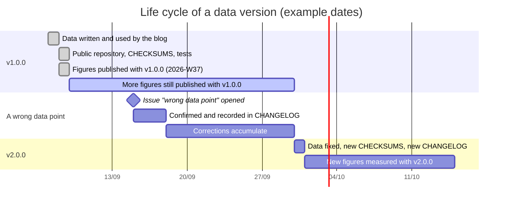

[Español](../metodologia.md) · **English**

# Methodology

What the kit measures, how it measures it, what it leaves out, and how the data is versioned so that figures from different weeks and different people can be put side by side.

Contents: [What it measures](#what-it-measures) · [Why scoring is deterministic](#why-scoring-is-deterministic) · [Fixed conditions](#fixed-conditions) · [What is not measured](#what-is-not-measured) · [How the data was built](#how-the-data-was-built) · [Parity with the blog](#parity-with-the-blog) · [Data versioning](#data-versioning) · [Limits](#limits)

One note on language first. The prose here is English; everything the program prints, sends or reads stays in Spanish and is reproduced verbatim — task ids (`clasificar-facturas`), subcommands, options, file names, JSON keys (`aciertos`, `coste_eur`, `veredicto`), the three verdicts (`lo-usaria-el-lunes`, `todavia-no`, `humo`), the system prompts and the failure sentences. Those are the object being measured, not the wrapping around it.

## What it measures

Whether one specific AI tool, given a reasonable prompt written by a small company and no tricks, does five specific back-office tasks correctly, how long it takes and what it costs. Each task produces four numbers and a verdict:

| Figure | What it is |
|---|---|
| `casos` and `aciertos` | Cases, and correct cases: those answered correctly under the rules of the task. A case is worth 1 or 0 |
| `fallos` | The first three failures, each one a sentence with the expected value and the value obtained |
| `segundos` | Wall-clock time of the whole batch with four cases in flight |
| `coste_eur` | Tokens from every attempt against the price table, rounded to four decimals |
| `veredicto` and `nota` | `lo-usaria-el-lunes` (I would use it on Monday), `todavia-no` (not yet) or `humo` (smoke), decided by rules over the share of correct cases, the cost per case and the cases with no answer |

## Why scoring is deterministic

The usual alternative is to have another model judge the answer. This kit does not, for four reasons:

1. **Reproducibility.** A rule gives the same result today, tomorrow and on your machine. A judge model changes version, changes with temperature and changes with its own prompt.
2. **Auditability.** Every published failure can be checked by reading the rule and the ground-truth file. If you think a rule is wrong, you open an issue with the case and the argument is about data.
3. **Cost.** Scoring 100 cases with rules costs 0 €; with a judge it costs about as much as the test itself.
4. **No family bias.** A judge tends to prefer answers that look like its own. A rule does not know which model answered.

The price of that decision is that the rules are rigid: a correct answer written in a form the rule does not contemplate counts as a failure. Three things reduce it: normalizing the form (case, accents, whitespace, number and date formats, references stripped of punctuation), accepting several forms of the same value in the ground truth (`60 días`, `sesenta días`, `60 naturales`), and scoring only the fields where the correct answer is unambiguous. When a false negative shows up it is documented, and then it is decided whether the rule changes (which raises the version) or whether the model should have followed the prompt.

## Fixed conditions

The same in the blog and in the kit. Change any of them and the figures stop being comparable.

| Condition | Value | Why |
|---|---|---|
| Prompt | The one in `tareas/<id>/tarea.json`, in Spanish, with no example answers and no reasoning instructions | It is what a small company would write; the best possible prompt is not what is measured |
| Schema | Requested inside the prompt (the `FORMATO` line); `response_format` is not sent | It is what works against any OpenAI-compatible endpoint |
| `temperature` | 0, omitted if the model rejects it | Reduces variability; does not remove it |
| `max_tokens` | 6000 for orders, 4000 for the rest | Enough for the answer; cuts off models that reason at length |
| Attempts per case | Up to 3 if the answer is not JSON or does not meet the schema; all of them are paid for | A format failure is not a knowledge failure, but it costs money and it is recorded |
| Concurrency | 4 cases in flight | Fixes the meaning of `segundos` |
| Memory between cases | None: every case is a new conversation | One case cannot help another |
| Data | Version 1.0.0, checksum-verified | The figures refer to these bytes |
| Runs | One. The blog publishes one run and says so; it is not repeated until it comes out well | Repeating until the best result would be selection |

## What is not measured

Worth keeping in view when reading any figure.

- **Writing quality.** In reminders what is scored is the data, the tone by expression list, the length, the name and the signature — not whether the email reads well. In emails, `accion` and `resumen` are not scored. In the contract, `cita` is not scored.
- **The unscored fields.** In invoices, supplier, number, date, taxable base, VAT and suggested ledger account are requested but not compared. In orders, `fecha_entrega`.
- **OCR, PDF or images.** The orders "in PDF" or "with OCR" are the already-extracted text, defects included. Extraction is not measured.
- **Integration.** What it costs to connect the tool to the mailbox, the ERP or the accounting system. Only the answer is measured.
- **Variability.** One single run. With `temperature: 0` most models repeat the result, but not all of them and not always; a one-case difference between two runs is normal.
- **Real cost.** `coste_eur` is an estimate from a price table, not the invoice from the provider. Discounts, prompt caching, taxes and currency conversion are outside it.
- **Perceived latency.** `segundos` is the whole batch with four in parallel from a server; it is not what a person waiting in front of a chat window experiences.
- **Privacy, compliance and contract.** Where the data goes, what is retained, whether the provider meets the GDPR or the AI Act. The kit does not measure it and the blog treats it separately.
- **The best possible prompt.** The prompt is fixed and written the way a small company writes. A specialist would get more out of every model; that is not what is measured.
- **Other sectors and languages.** This is a cannery in Alicante writing in Spanish, with some Valencian and some English. A law firm or an online shop would have different cases.

## How the data was built

- **Invented and internally consistent.** The Spanish tax numbers have valid check digits; the amounts add up (`base + VAT − withholding + other taxes = total`, and the order lines against the price list); the dates match the weekdays of 2026; the email domains end in `.example`.
- **With deliberate traps**, each one recorded in the `nota` of its case: a reference that does not exist, a price that is not the list price, an OCR with zeros for the letter O, quantities in units and in pallets, a line split across a page break, an email that corrects itself, a "the usual" order with the previous thread quoted, a complaint mixed into an order, an invoice with withholding tax, another with insurance premium tax, another under the reverse charge, a cash receipt, a direct debit, two duplicates and one that looks like a duplicate and is not, a partial payment, a phishing email, and a newsletter that talks about the sector.
- **With fixed reference dates**: 10 September 2026 for orders, Monday 14 September 2026 for emails and collections. Urgency and days overdue are counted from there, and the prompt says so.
- **With one correct answer per scored field.** Where several correct forms exist (a term written in figures or in words), the ground truth lists them. Where the correct answer is arguable (the suggested ledger account, the recommended action), the field is not scored.

## Parity with the blog

The blog scores with TypeScript code (`src/pruebas/tareas.ts`, `puntuar.ts`, `index.ts` in its pipeline). The kit reproduces it in Python, and the parity is not asserted: it is checked. The tests in `tests/` load recorded outputs of that TypeScript code run over the same data and require the kit to return the same thing.

What is checked, one row per thing that could drift:

| Check | Against what | Where |
|---|---|---|
| Each task's prompt is byte-for-byte the blog's | SHA-256 of the composed prompt and of the system message for all five tasks | `tests/oro/resumen.json`, and `python -m kit_pyme verificar` |
| The 85 data files are the published ones | `datos/CHECKSUMS.sha256` | `python -m kit_pyme verificar` |
| The correct answers score 100 % | The five `*-verdad.json` files scored against themselves | `tests/oro/respuestas-verdad/` |
| Every rule fails with the exact sentence | More than a hundred doctored answers with their `ok` flag and their failure sentence, recorded from the blog's code | `tests/test_puntuacion.py` |
| The normalization functions agree | Input and output tables for `texto`, `normalizarTexto`, `normalizarReferencia`, `leerNumero`, `leerFecha`, `formatearEuros` and `leerBooleano` | `tests/test_normalizar.py` |
| Verdict and note are the same | 17 combinations of correct cases, cost, cases with no answer and service errors | `tests/test_veredicto.py` |
| Rounding is JavaScript rounding | `Math.round`, `toFixed(1)`, `toFixed(2)` and `Math.ceil` at their edge values | `tests/test_javascript.py` |
| The runner behaves the same when a call fails | A fake server on `127.0.0.1` returning 400, 429, an empty body and recorded answers | `tests/test_ejecutar.py` |

The whole suite is **655 tests** (`python -m pytest`, measured on 2026-09-08 with Python 3.13; one is skipped when `mmdc` is not on the `PATH`). Continuous integration runs them in four jobs: `ruff` (lint and format), `pruebas` (the suite on Python 3.11, 3.12 and 3.13), `datos` (checksums with `sha256sum`, LF in the git index, UTF-8 without BOM, valid JSON and schema validation of the YAML files) and `mermaid` (the 30 diagrams of the documentation, in both languages, rendered with mermaid-cli).

Emulating JavaScript rounding is not a matter of taste. `Math.round(0.5)` goes up and Python's `round()` goes to even, and `toFixed(2)` rounds the exact binary value of the float. Without that, the published cost and the cost computed here would diverge in the fourth decimal, and the two numbers would stop being the same number. The detail is in [`puntuacion.md`](puntuacion.md#rounding).

When the blog changes a rule, a prompt or a threshold, the kit changes in the same version and `CHANGELOG.md` records it with the date. Until then, if the kit and the blog disagree, it is a bug in the kit and it is treated as one.

## Data versioning

The files in `datos/` follow semantic versioning. The version appears in `CHANGELOG.md`, in the README badge, in `CITATION.cff` and in every file in `resultados/` (`kit_datos_version`).

| Change | Version | Effect on the figures |
|---|---|---|
| Documentation, code, tests, CI; not one byte of `datos/` | patch (1.0.x) | None |
| New files, cases or tasks; the existing ones untouched | minor (1.x.0) | Old figures stay comparable task by task |
| An existing data file, a prompt, a schema or a scoring rule changes | major (x.0.0) | Earlier figures are kept with their version and are not compared with the new ones |

Rules:

1. `CHECKSUMS.sha256` is regenerated in the same commit that changes a data file, and `python -m kit_pyme verificar` has to pass in CI.
2. A confirmed wrong data point is not fixed in place: it is recorded in `CHANGELOG.md` under «Conocido» with the affected case and corrected in the next major version, together with whatever else has accumulated. Meanwhile the published ground truth is still the one that scores, because it is the one the figures were measured with.
3. Every file in `resultados/` states which data version it was measured with. A result is never rewritten when the version changes.
4. Commits that touch `datos/` use the `data` type and, if they change an existing file, the `!` breaking-change marker.

## Limits

- **Size.** 100 cases across five tasks of 10 to 30. In the 10-case task one case is 10 percentage points; in the 30-case task, 3.3. Small differences between two models mean nothing.
- **One sector, one language.** Cannery, Alicante, Spanish. The results do not extrapolate to other sectors without testing.
- **Rigid rules.** See above. A model can be right and still fail the rule; it is documented when it happens.
- **Estimates.** Cost and seconds are estimates under fixed conditions, not what you will see on your invoice or on your screen.
- **Contamination.** The kit has been public since 2026-09-08. A model trained after that date may have seen the data. The publication date of each model tested is recorded when it is known, and figures measured after the kit went public are read with that reservation.
