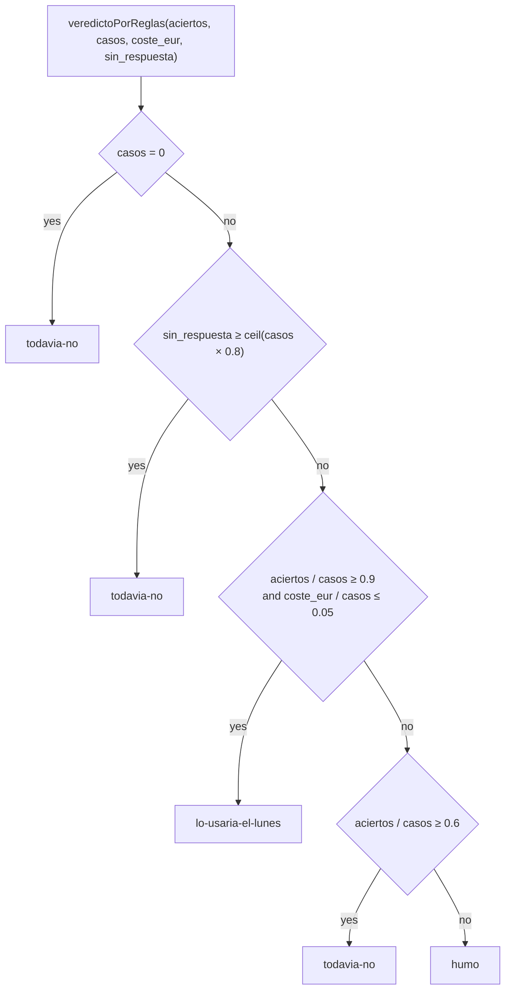

[Español](../puntuacion.md) · **English**

# How scoring works

The kit scores exactly as the blog «A la última» scores, rule by rule. The reference implementation is `src/pruebas/puntuar.ts` (comparators and normalization) and `src/pruebas/index.ts` (thresholds, verdict, note, cost and time) from the blog's pipeline; `kit_pyme` reproduces them in Python and `tests/` checks that it returns the same outputs on the same data, JavaScript rounding included.

Contents: [Principles](#principles) · [Normalization](#normalization) · [Rules per task](#rules-per-task) · [Scoring a whole task](#scoring-a-whole-task) · [Verdict](#verdict) · [Note](#note) · [Cost](#cost) · [Seconds](#seconds) · [Rounding](#rounding) · [JavaScript against Python](#javascript-against-python) · [Known inconsistencies](#known-inconsistencies)

Function names, JSON keys, verdicts and failure sentences are quoted in Spanish throughout, because that is what the program produces.

## Principles

- **Rules, not judges.** No model decides whether another model got it right. Every rule is a comparison against the ground truth written in `datos/*/*-verdad.json`.
- **A case is worth 1 or 0.** No partial credit. An order with nine lines right and one wrong is wrong.
- **The first failure stops the case** and is described in one sentence with the expected and the obtained value, so that a reader of the blog post knows what happened without opening the JSON.
- **Form does not penalize.** Before comparing, case, accents, whitespace, number formats and date formats are normalized, and references are reduced to letters and digits.
- **What is not scored does not count.** Each task scores two or three fields; the rest of the schema is requested from the model but never compared (see [Rules per task](#rules-per-task)).

## Normalization

Every comparison goes through these functions. The outputs in the tables come from the blog's code as executed, and the parity tests reproduce them.

### `texto(v)`

Turns any value into a string: a string is left as is; `null` or missing is `""`; an object or an array is serialized as compact JSON (no spaces, keys in their order, non-ASCII characters not escaped); a boolean is lowercase `true` or `false`; a whole-valued number loses its decimals (`1.0` → `1`).

### `normalizarTexto(v)`

Lowercase, Unicode NFD decomposition and removal of the diacritics (U+0300 to U+036F), every run of whitespace collapsed to one space, and trimmed at both ends. The whitespace set is JavaScript's, which includes U+00A0, U+FEFF and the typographic spaces.

| Input | Output |
|---|---|
| `"  Reclamación   URGENTE\n\tya "` | `reclamacion urgente ya` |
| `"Ñoras"` | `noras` |
| `"Straße"` | `straße` |
| `"İstanbul"` | `istanbul` |
| `null` | `` (empty) |
| `24.5` | `24.5` |
| `true` | `true` |

### `normalizarReferencia(v)`

Uppercase, and only `A-Z` and `0-9` kept. It does not fix OCR errors: a `0` where an `O` belonged stays a `0`; that is the model's job.

| Input | Output |
|---|---|
| `"cons atun-ol_120."` | `CONSATUNOL120` |
| `"C0NS-ATUN-0L-1K"` | `C0NSATUN0L1K` |
| `"cons-ñora"` | `CONSORA` |
| `null` | `` (empty) |

### `leerNumero(v)`

A number is returned as is, if it is finite. For a string: `€` signs and spaces are removed; if it ends in a comma and one or two digits (`4.312,60`) the dots are dropped and the comma becomes a dot; if it ends in a dot and one or two digits (`4312.60`) the commas are dropped; in any other case both dots and commas are dropped. The result is then converted with JavaScript's `Number()` rules. Any other type (boolean, object) is not a number.

| Input | Output |
|---|---|
| `"4.312,60"` | 4312.6 |
| `"1.234 €"` | 1234 |
| `"1 234,56 €"` | 1234.56 |
| `"1,234"` | 1234 |
| `"12,345"` | 12345 |
| `"1e3"` | 1000 |
| `".5"`, `",5"` | 0.5 |
| `"-3,50"` | −3.5 |
| `"12abc"`, `"1_000"`, `"Infinity"`, `""`, `true`, `null` | not a number |

### `leerFecha(v)`

Applied to the normalized text, in this order: `YYYY-M-D` (one or two digits in month and day) → `YYYY-MM-DD`; `D/M/YYYY` with `/`, `.` or `-` → `YYYY-MM-DD`; `D de <month> de YYYY` with the Spanish month names. The first match wins, even if it sits inside a longer text. The calendar is not validated: `2026-13-45` is returned as it is.

| Input | Output |
|---|---|
| `"07/09/2026"`, `"7-9-2026"`, `"07.09.2026"`, `"2026-9-7"`, `"2026-09-07T00:00:00Z"` | `2026-09-07` |
| `"Vence el 3 de Noviembre de 2026"` | `2026-11-03` |
| `"Fecha: 2026-09-07; también 08/09/2026"` | `2026-09-07` (the ISO form is searched first) |
| `"31/12/2026 y 01/01/2027"` | `2026-12-31` |
| `"07/09/26"`, `"20260907"`, `"Septiembre 7, 2026"`, `"el 5 de sept de 2026"`, `12345` | not a date |

### `formatearEuros(n)`

Two decimals with JavaScript's `toFixed(2)` rounding (over the exact binary value, ties away from zero), comma as decimal separator, dot as thousands separator and a trailing ` €`.

| Input | Output |
|---|---|
| 4312.6 | `4.312,60 €` |
| 2448 | `2.448,00 €` |
| 1234567.891 | `1.234.567,89 €` |
| 1.005 | `1,00 €` |
| 2.675 | `2,67 €` |
| 1.455 | `1,46 €` |
| 0.125 | `0,13 €` |
| 999.995 | `1.000,00 €` |
| −1234.5 | `-1.234,50 €` |

### `leerBooleano(v)`

A boolean is returned as is. Over the normalized text: `true`, `si`, `sí`, `duplicada`, `yes` and `1` are true; `false`, `no`, `0` and empty are false; anything else (`quizás`) is neither, and matches no expected value. Consequence: a missing or `null` `duplicada` counts as `false`.

### `etiqueta(id)`

`pedido-06` → `Pedido 06`; `correo-03` → `Correo 03`; `factura-08` → `Factura 08`; `recordatorio-01` → `Recordatorio 01`. An id that does not follow the `<letters>-<digits>` pattern (such as `p01`) is left alone; the contract comparators prepend `Contrato ` themselves.

### The customer of an order

`clienteCoincide(esperado, obtenido)`: the expected name is normalized, `(`, `)`, `.` and `,` become spaces, and the words of four letters or more that are not in the generic list are taken (`supermercados`, `distribuciones`, `restaurante`, `bar`, `cafeteria`, `bar-cafeteria`, `cooperativa`, `agricola`, `grupo`, `hostelero`, `catering`, `ultramarinos`, `cash`, `online`, `eventos`, `hijos`, `hermanos`, `coop`, `ltd`, `sl`, `slu`, `sa`, `v`). It passes if any of those words is a substring of the normalized customer name returned by the model. An empty customer never passes.

## Rules per task

Each rule, its order and the exact failure sentence it produces are in [`tareas.md`](tareas.md). Summary:

| Task | Scored | Tolerances | Not scored |
|---|---|---|---|
| extraer-pedidos | Customer; for each expected line: reference, exact number of boxes, price; extra lines; duplicated lines; mandatory incidents | Price ±0.011 €; reference without punctuation or case; customer by significant word | `fecha_entrega`, the wording of non-mandatory incidents, the order of the lines |
| resumir-correos | `categoria`, `urgencia` | Case, accents, whitespace and `_` turned into `-` | `accion`, `resumen` |
| buscar-en-contrato | The value (groups of accepted forms) across `respuesta` + `clausula` + `cita`; the clause across `clausula` + `respuesta` | Alternative forms listed in the ground truth; whole clause or sub-clause | Wording; the quote does not count toward the clause |
| clasificar-facturas | `total`, `vencimiento`, `duplicada` | Total ±0.011 €; date in four formats; boolean as text | `proveedor`, `numero`, `fecha`, `base`, `iva`, `cuenta_sugerida` |
| redactar-recordatorio | Invoice, amount and due date (in several formats); mandatory tone expressions; forbidden expressions; 220 words maximum; first name; `marjal` | Normalized text for everything except the word count | Style, spelling, subject line (it only counts as text) |

## Scoring a whole task

`puntuar(tarea, casos, respuestas)` walks the cases in order with the answer that belongs to each:

- A **missing** answer (`undefined` in JavaScript; in the kit, a case with no line in the JSONL, or one whose answer failed the schema) counts as a failure with the text `<Etiqueta>: el modelo no devolvió una respuesta válida`. For the contract the label is the bare id (`p01: el modelo no devolvió una respuesta válida`).
- A `null` answer does reach the comparator and produces `no devolvió nada legible` (or `no escribió nada` in reminders).
- `aciertos`, the number of correct cases, is the count of cases marked `ok`. `fallos` holds the first three failures in case order; `todos_los_fallos`, all of them.

Besides the hit or miss, the runner counts two things that feed the verdict and the note:

- `sin_respuesta`: cases with a call error, or whose answer was `undefined` or `null`.
- `errores_servicio`: of those, the ones that were an HTTP 5xx or 429, a network failure (no response from the server), or a case skipped because the model was unavailable.

Both appear in `resultado.json` only when they are greater than zero.

### The `puntuar` subcommand

`python -m kit_pyme puntuar <tarea> <respuestas.jsonl>` reads one JSON line per case, `{"id": "<case id>", "respuesta": <object or null>}`. A case with no line is scored as missing. Every answer that is an object goes through the same rescue of near-miss keys and the same `required` validation as in the blog; if it fails the schema it is treated as missing and counts in `sin_respuesta`, because in the blog an answer like that never reaches scoring. `segundos` and `coste_eur` come out as 0 unless the JSONL lines carry `uso` (tokens) and `segundos`, an extension of the kit for people measuring by hand.

The file is read as UTF-8 and tolerates a byte order mark (Notepad and PowerShell 5.1's `Out-File -Encoding utf8` add one) and CRLF line endings. What is compared is the JSON, not the bytes of the file.

### Checking that your copy scores the same, without calling any model

The repository ships the correct answers for every task in `tests/oro/respuestas-verdad/`. Scoring them has to give 100 %:

```console
$ python -m kit_pyme puntuar clasificar-facturas tests/oro/respuestas-verdad/clasificar-facturas.jsonl
Tarea      clasificar-facturas — Contabilizar 25 facturas recibidas: total, vencimiento y si ya estaba registrada
Modelo     (sin modelo)
Casos      25
Aciertos   25 de 25
Segundos   0
Coste      0 €
Veredicto  lo-usaria-el-lunes
Nota       Acertó los 25 casos a 0,0 céntimos por caso; lo pondría a trabajar el lunes con alguien mirando por encima la primera semana.
```

Break one single value — the due date of `factura-08`, which is the one Haiku 4.5 got wrong in the published issue — and the published failure sentence comes back word for word:

```bash
sed '/"id":"factura-08"/s/2026-09-05/2026-10-05/' \
  tests/oro/respuestas-verdad/clasificar-facturas.jsonl > respuestas.jsonl
python -m kit_pyme puntuar clasificar-facturas respuestas.jsonl
```

```console
Tarea      clasificar-facturas — Contabilizar 25 facturas recibidas: total, vencimiento y si ya estaba registrada
Modelo     (sin modelo)
Casos      25
Aciertos   24 de 25
Segundos   0
Coste      0 €
Veredicto  lo-usaria-el-lunes
Nota       Acertó 24 de 25 a 0,0 céntimos por caso; sirve el lunes si una persona repasa los casos con incidencia. Ejemplo: Factura 08: vencimiento 2026-10-05 donde tocaba 05/09/2026.
Fallos publicados (hasta 3):
  - Factura 08: vencimiento 2026-10-05 donde tocaba 05/09/2026
```

That sentence is the one in [`resultados/2026-W37.json`](../../resultados/2026-W37.json). The correct cases and the note match what was published; seconds and cost come out as 0 because nobody called a model here, and that is why the verdict is decided by the share of correct cases alone.

The same edit in PowerShell 5.1:

```powershell
(Get-Content tests/oro/respuestas-verdad/clasificar-facturas.jsonl) `
  -replace '(?<="id":"factura-08".*)2026-09-05','2026-10-05' | Out-File -Encoding utf8 respuestas.jsonl
python -m kit_pyme puntuar clasificar-facturas respuestas.jsonl
```

## Verdict

The thresholds are constants of the blog's code:

| Threshold | Value |
|---|---|
| `aciertos_lunes` | 0.9 (90 % of the cases) |
| `aciertos_humo` | 0.6 (60 %) |
| `coste_caso_lunes_eur` | 0.05 € per case |



`ceil(casos × 0.8)` is 16 for 20 cases, 24 for 30, 12 for 15, 20 for 25 and 8 for 10. Edge cases covered by the tests:

| Correct cases / cases | Cost | Unanswered | Verdict |
|---|---|---|---|
| 20 / 20 | 0.50 € | 0 | lo-usaria-el-lunes |
| 20 / 20 | 2.00 € (10 cents per case) | 0 | todavia-no |
| 18 / 20 | 1.00 € (exactly 5 cents per case) | 0 | lo-usaria-el-lunes |
| 12 / 20 | 0.10 € | 0 | todavia-no (exactly 60 %) |
| 11 / 20 | 0.10 € | 0 | humo |
| 0 / 0 | 0 | 0 | todavia-no |
| 0 / 25 | 0 | 20 (80 %) | todavia-no |
| 0 / 25 | 0 | 19 (76 %) | humo |
| 15 / 20 (W37, orders) | 0.3822 € | 0 | todavia-no |
| 24 / 25 (W37, invoices) | 0.1428 € | 0 | lo-usaria-el-lunes |

## Note

`notaPorReglas(veredicto, aciertos, casos, coste_eur, fallos, sin_respuesta, errores_servicio)` returns one of these sentences, in this order of priority. `{c}` is the cost per case in cents with one decimal and a comma (`0,6`, `5,0`); `{ejemplo}` is ` Ejemplo: <first failure>.` when there are failures, and nothing when there are none. The sentences are published as they are, so they are quoted here in Spanish.

| Condition | Sentence |
|---|---|
| `errores_servicio ≥ ceil(casos × 0.8)` | `El servicio no contestó en {errores_servicio} de {casos} casos (errores de red o del proveedor): no se ha medido nada. Lo repetiremos.` |
| `sin_respuesta ≥ ceil(casos × 0.8)` | `No devolvió una respuesta que se pudiera leer en {sin_respuesta} de {casos} casos. Puede ser cosa de cómo se lo pedimos y no de lo que sabe: lo repetiremos antes de darlo por malo.` |
| lo-usaria-el-lunes, no failures | `Acertó los {casos} casos a {c} céntimos por caso; lo pondría a trabajar el lunes con alguien mirando por encima la primera semana.` |
| lo-usaria-el-lunes, with failures | `Acertó {aciertos} de {casos} a {c} céntimos por caso; sirve el lunes si una persona repasa los casos con incidencia.{ejemplo}` |
| todavia-no, 90 % or more correct cases | `Acierta ({aciertos} de {casos}) pero sale a {c} céntimos por caso: para este volumen no compensa frente a hacerlo a mano.` |
| todavia-no, the rest | `Falló {casos − aciertos} de {casos}: hay que revisar cada resultado y entonces no ahorra tiempo.{ejemplo}` |
| humo | `Falló {casos − aciertos} de {casos}; no vale para esto todavía.{ejemplo}` |

The two notes published in week 2026-W37 come out of that table: 0.3822 € over 20 cases is 1.911 cents, and the orders note is `Falló 5 de 20: hay que revisar cada resultado y entonces no ahorra tiempo. Ejemplo: Pedido 06: en CONS-BONI-OL-220 puso 34,22 € donde la tarifa dice 37,20 €.`; 0.1428 € over 25 cases is 0.5712 cents, shown as `0,6`, and the invoices note is `Acertó 24 de 25 a 0,6 céntimos por caso; sirve el lunes si una persona repasa los casos con incidencia. Ejemplo: Factura 08: vencimiento 2026-10-05 donde tocaba 05/09/2026.`

## Cost

The cost is not the invoice from the provider: it is an estimate from the tokens the API reports (`usage.prompt_tokens` and `usage.completion_tokens`) and a price table in euros per million tokens.

```text
coste_caso = (tokens_entrada × precio_entrada + tokens_salida × precio_salida) / 1 000 000
coste_eur  = round4(sum of coste_caso over every case and every attempt)
```

- **Every attempt** is added, including the ones discarded for not being JSON or not meeting the schema, and the ones from cases that ended in an error. It is what was paid.
- `round4` is JavaScript's `Math.round(x × 10000) / 10000` (0.38215 → 0.3822; 0.14275 → 0.1427).
- The price is looked up by the model name **the API returns** (`json.model`), normalized: if it has a `/` it is used as is; if it contains `claude`, `anthropic/` is prepended; if it contains `gpt` or an `o` followed by a digit, `openai/`; if it contains `gemini`, `google/`; otherwise the requested name is used. A name that is not in the table falls back to `por_defecto`.

The kit's table (`precios.json`) is a copy of the blog's and can be edited. Version 1.0.0 values:

| Model | Input (€/M tokens) | Output (€/M tokens) |
|---|---:|---:|
| `anthropic/claude-haiku-4-5` | 0.9 | 4.5 |
| `anthropic/claude-sonnet-5` | 2.8 | 14 |
| `anthropic/claude-opus-5` | 14 | 70 |
| `por_defecto` | 3 | 15 |

Worked examples from the tests: Haiku with 3,000 input and 400 output tokens → 0.0045 €; `openai/gpt-6` with the same tokens → 0.015 € (default rate); `anthropic/claude-haiku-4-5-20251001` → 0.015 €, because the dated name is not in the table and falls back to `por_defecto`.

That last case matters when reading the published figures: 0.3822 € for 20 orders with Haiku is 1.9 cents per case, which fits the default rate (around 3,300 input and 600 output tokens per case), not Haiku's rate, which would give half a cent. The likeliest explanation is that the API returned the dated model name. The kit does not correct it, because correcting it would stop computing what the blog computes; it is recorded in `CHANGELOG.md` as a proposal for the blog (add aliases to its table) and, when it changes there, it will change here in the same version.

## Seconds

`segundos` is the wall-clock time of the **whole batch**: a timer starts before the first case is sent and stops when the last one finishes. Cases are sent **four at a time**, keeping their order. The value is rounded to one decimal with `Math.round(ms / 100) / 10` (16,850 ms → 16.9; 16,950 → 17; 149 → 0.1; 150 → 0.2).

That is why seconds depend on concurrency, on the network and on how loaded the provider is at that moment, and why the same task with the same model gave 16.9, 17.5 and 18.2 s in three runs on the same day with the same number of correct cases. The blog measures from a Cloudflare Worker; the kit measures from your machine. To compare, use the same concurrency (4, the runner's default) and read the seconds as an order of magnitude, not as an exact figure. Each case also keeps its own unrounded time in the run detail.

## Rounding

The blog is written in JavaScript and the kit in Python; their rounding does not agree by default, and the kit emulates JavaScript's. Values checked by the tests:

| Operation | Input | Output |
|---|---|---|
| `Math.round(x × 10000) / 10000` (cost) | 0.38215 · 0.38225 · 0.14275 · 0.000025 | 0.3822 · 0.3823 · 0.1427 · 0 |
| `Math.round(ms / 100) / 10` (seconds) | 16850 · 16950 · 16949 · 10450 · 149 · 150 | 16.9 · 17 · 16.9 · 10.5 · 0.1 · 0.2 |
| `toFixed(1)` (cents in the note, printed with a comma) | 0.05 · 0.15 · 0.25 · 0.35 · 0.45 · 2.675 · 0.5712 | 0,1 · 0,1 · 0,3 · 0,3 · 0,5 · 2,7 · 0,6 |
| `toFixed(2)` (euros, printed with a comma) | 1.005 · 2.675 · 1.455 · 0.125 · 8.345 · 24.285 · 0.615 | 1,00 · 2,67 · 1,46 · 0,13 · 8,35 · 24,29 · 0,61 |
| `Math.ceil(casos × 0.8)` | 10 · 15 · 20 · 25 · 30 | 8 · 12 · 16 · 20 · 24 |

`toFixed` rounds the exact binary value of the number with ties away from zero; in Python that is `Decimal(x).quantize(..., ROUND_HALF_UP)` over the `float`, not `round()` and not `Decimal(str(x))`. `Math.round` sends `.5` upwards (toward +∞), not to even.

## JavaScript against Python

The differences that affect parity, and how the kit resolves each one:

| Point | JavaScript (blog) | Python (kit) |
|---|---|---|
| `\s` in regular expressions | Includes U+FEFF (BOM) and the Unicode spaces | The kit uses an explicit class with the same set |
| `\d` | Only `0-9` | The kit uses `[0-9]`, not `\d`, which in Python also matches other Unicode digits |
| `String(true)` | `true` | `str(True)` would be `True`; the kit writes `true` |
| JSON of a whole-valued float | `1` | `json.dumps(1.0)` would be `1.0`; the kit writes `1` |
| `toFixed`, `Math.round` | See [Rounding](#rounding) | Emulated with `Decimal` |
| `slice(0, 80)` in the contract failure sentence | Counts UTF-16 code units | Counts code points. It only differs if the answer has emoji or other characters outside the basic plane within those 80; documented and not corrected |

## Known inconsistencies

- **200 against 220 words.** The `redactar-recordatorio` prompt asks for «menos de 200 palabras» and the scoring rule allows up to 220 (`max_palabras` in the ground truth). The rule wins. The prompt is not changed because the published figures were measured with it.
- **Dated model name and default rate.** See [Cost](#cost).
- **`temperature` in the Claude 5 family.** The blog's bench learns from a 400 that the model does not accept it and repeats without it; the kit does the same. Models that do accept it always get `0`.
