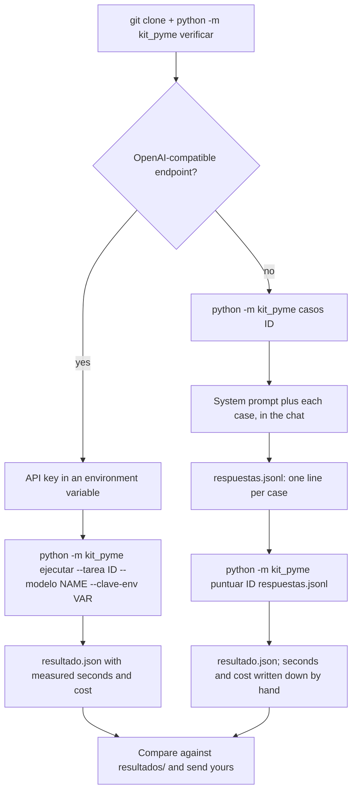

[Español](../reproducir.md) · **English**

# Running the test with your own tool

This is the step-by-step guide to producing a `resultado.json` with your own tool that can be compared with the blog's. There are two routes: **with an API** (your tool exposes an OpenAI-compatible endpoint: Anthropic, OpenAI, Google, Mistral, a local server, your company's proxy) and **without an API** (a chat in the browser, an assistant embedded in your ERP, a tool somebody sold you that you have no idea how to call). The scoring is the same in both.

The command-line interface speaks Spanish and is not translated: `tareas`, `casos`, `prompt`, `puntuar`, `ejecutar`, `verificar`, and options such as `--clave-env` or `--salida`. Type them as they appear here.



## 0. Before you start

You need Python 3.11 or later. The package has no dependencies outside the standard library and nothing has to be installed: the commands are run from the root of the repository.

```bash
git clone https://github.com/Bytenauta-Org/Kit_de_la_pyme.git
cd Kit_de_la_pyme
```

Then check that your copy is the published one, and see which tasks there are:

```console
$ python -m kit_pyme verificar
OK   datos/ y los prompts son los publicados (checksums y sha256 correctos).
$ python -m kit_pyme tareas
id                     casos  max_tokens  nombre
extraer-pedidos           20        6000  Sacar las líneas de 20 pedidos tal como llegan por correo
resumir-correos           30        4000  Clasificar 30 correos del buzón de administración y decir qué hay que hacer
buscar-en-contrato        15        4000  Responder 15 preguntas sobre un contrato de suministro de 60 páginas
clasificar-facturas       25        4000  Contabilizar 25 facturas recibidas: total, vencimiento y si ya estaba registrada
redactar-recordatorio     10        4000  Escribir 10 recordatorios de cobro con el tono que toca
```

`verificar` checks that the 85 files in `datos/` are byte for byte those of the published version, and that the five prompts composed from them still hash to the published SHA-256. If anything does not add up it says so file by file and exits with status 1: at that point whatever you measure is no longer comparable with the blog's figures.

Pick a task. For a first run, `clasificar-facturas` (25 cases, short prompt, results that are easy to read) or `resumir-correos` (30 cases, the cheapest). `buscar-en-contrato` is the expensive one: the whole contract (188 KB, on the order of 50,000 tokens) travels with each of the 15 questions.

## 1. With an API

### 1.1 The key

The API key goes in an environment variable; the runner reads it by name (`--clave-env`) and never prints it or writes it into `resultado.json`. Do not put it on the command line or in a file inside the repository.

```bash
# Linux and macOS
export ANTHROPIC_API_KEY="..."
# PowerShell
$env:ANTHROPIC_API_KEY = "..."
```

### 1.2 Running it

```bash
python -m kit_pyme ejecutar --tarea clasificar-facturas --endpoint https://api.anthropic.com/v1/chat/completions --modelo claude-haiku-4-5 --clave-env ANTHROPIC_API_KEY
```

**`--endpoint` can be left out** when the model id carries a known provider prefix: `anthropic/`, `openai/`, `google/` or `google-ai-studio/`. An id without a slash is taken as Anthropic's. The three endpoints live in `kit_pyme/cliente.py` and are the ones in the table below, so this does the same as the command above:

```bash
python -m kit_pyme ejecutar --tarea clasificar-facturas --modelo anthropic/claude-haiku-4-5 --clave-env ANTHROPIC_API_KEY
```

**Before paying for 25 cases, run 3.** `--casos N` runs only the first N and marks the result as a sample, so it cannot be mistaken for a full run:

```bash
python -m kit_pyme ejecutar --tarea clasificar-facturas --modelo anthropic/claude-haiku-4-5 --clave-env ANTHROPIC_API_KEY --casos 3
```

The first line it prints says what is being measured against what, and it is worth reading before it starts spending:

```text
clasificar-facturas: 3 casos contra anthropic/claude-haiku-4-5 en https://api.anthropic.com/v1/chat/completions (concurrencia 4)
```

What it does, in order: composes the system prompt of the task (with the data files inside it and the `FORMATO` line), prepares the cases, starts the clock, sends the cases to the endpoint four at a time with `temperature: 0`, extracts and validates the JSON of each answer (up to three attempts per case), scores each case, stops the clock, adds up the tokens of every attempt, estimates the cost with `precios.json`, and writes `resultado.json` in the current directory with this shape:

```json
{
  "novedad_url": "",
  "modelo": "claude-haiku-4-5",
  "tarea": "clasificar-facturas",
  "tarea_nombre": "Contabilizar 25 facturas recibidas: total, vencimiento y si ya estaba registrada",
  "casos": 25,
  "aciertos": 24,
  "fallos": ["Factura 08: vencimiento 2026-10-05 donde tocaba 05/09/2026"],
  "segundos": 10.5,
  "coste_eur": 0.1428,
  "veredicto": "lo-usaria-el-lunes",
  "nota": "Acertó 24 de 25 a 0,6 céntimos por caso; sirve el lunes si una persona repasa los casos con incidencia. Ejemplo: Factura 08: vencimiento 2026-10-05 donde tocaba 05/09/2026."
}
```

`sin_respuesta` and `errores_servicio` are added only when they are greater than zero. It is the same shape (`ResultadoPrueba`) and the same key order the blog uses, with `novedad_url` empty. Next to `resultado.json` the runner leaves the per-case detail (the model's answer, the expected value, the failure, seconds and tokens) so you can see what happened in each one.

### 1.3 Endpoints

| Provider or server | `--endpoint` | `--modelo` (example) | `--clave-env` |
|---|---|---|---|
| Anthropic | `https://api.anthropic.com/v1/chat/completions` | `claude-haiku-4-5`, `claude-sonnet-5` | `ANTHROPIC_API_KEY` |
| OpenAI | `https://api.openai.com/v1/chat/completions` | the name of the model you want to test | `OPENAI_API_KEY` |
| Google (Gemini, compatible API) | `https://generativelanguage.googleapis.com/v1beta/openai/chat/completions` | `gemini-…` | `GOOGLE_API_KEY` |
| Ollama, locally | `http://localhost:11434/v1/chat/completions` | the name of the loaded model | any variable with any value |
| LM Studio, locally | `http://localhost:1234/v1/chat/completions` | the name of the loaded model | any variable with any value |
| vLLM or another compatible server | `http://<host>:<port>/v1/chat/completions` | as the server requires | as the server requires |
| A proxy or gateway of your company | the `chat/completions` URL of your proxy | as the proxy requires | as the proxy requires |

The runner sends the standard `chat/completions` request: `model`, `messages` (`system` and `user`), `max_tokens` and `temperature: 0`, with an `authorization: Bearer <key>` header. It does not send `response_format`, exactly as the blog does in direct mode. If the model rejects `temperature` with a 400 that says so, the call is repeated without it.

The three provider endpoints in the table are the ones the blog uses. A compatible endpoint with differences (one that does not return `usage`, for instance) works, but the cost will come out as 0 because there are no tokens to count.

### 1.4 Prices

The cost is an estimate: the input and output tokens the API reports, multiplied by the package's `precios.json` table (euros per million tokens). The 1.0.0 table is the blog's: Haiku 4.5 (0.9 / 4.5), Sonnet 5 (2.8 / 14), Opus 5 (14 / 70) and `por_defecto` (3 / 15). If your model is not there, add it under the exact name the API returns in `model`; if you do not add it, `por_defecto` applies and the result file does not warn you. Details in [`puntuacion.md`](puntuacion.md#cost).

### 1.5 What happens when something fails

| Situation | Behavior (the same as the blog's) |
|---|---|
| Network error | Waits 0.5 s × attempt and retries, up to three attempts |
| HTTP 429 or 5xx | Waits 0.8 s × attempt and retries, up to three attempts |
| HTTP 4xx other than 429 (no such model, bad key, no permission) | Aborts the whole task with a non-zero exit status and the message `el endpoint respondió <status> para <modelo>: no disponible por API todavía`. No `resultado.json` is written |
| The answer is not JSON, or does not meet the schema | It is paid for, discarded and retried; on the third attempt the case is left unanswered and the task carries on |
| Empty answer | Retried |

An unanswered case counts as a failure and adds to `sin_respuesta`. If 80 % or more of the cases end unanswered, the verdict is `todavia-no` with a note saying that nothing has been measured.

The messages go to `stderr` and the exit status tells you why. These are verbatim:

```console
$ python -m kit_pyme ejecutar --tarea clasificar-facturas --modelo anthropic/claude-haiku-4-5 --clave-env NO_EXISTE_ESTA_VARIABLE
kit_pyme: la variable de entorno NO_EXISTE_ESTA_VARIABLE está vacía o no existe
$ echo $?
1

$ python -m kit_pyme ejecutar --tarea clasificar-facturas --modelo un-modelo-raro
clasificar-facturas: 25 casos contra un-modelo-raro en https://api.anthropic.com/v1/chat/completions (concurrencia 4)
kit_pyme: el endpoint respondió 401 para un-modelo-raro: no disponible por API todavía
  respuesta: {"error":{"code":"authentication_error","message":"Invalid Anthropic API Key","type":"invalid_request_error","param":null}}
$ echo $?
3
```

Status **3** means "this model is not available through the API", and it is deliberately different from the 1 of any other error so that a script walking a list of models can skip that one and carry on. In neither case is a `resultado.json` written.

And the two typing mistakes that come up first:

```console
$ python -m kit_pyme casos facturas
kit_pyme: tarea desconocida: facturas (no existe .../tareas/facturas/tarea.json)
$ python -m kit_pyme casos clasificar-facturas --id factura-99
kit_pyme: no hay ningún caso «factura-99» en clasificar-facturas
```

### 1.6 Rough cost per task

With the Haiku 4.5 rate and an answer of normal length, the order of magnitude is: orders, between 0.1 and 0.4 € (the prompt carries the price list and the customer list); emails, a few cents; invoices, between 0.05 and 0.15 €; reminders, a few cents; the contract, between 0.7 and 2.5 € depending on the rate applied (0.8 million input tokens). With a large model, multiply by 3 to 15.

## 2. Without an API

### 2.1 Getting the cases out

```bash
python -m kit_pyme casos resumir-correos                  # all 30, one after another
python -m kit_pyme casos resumir-correos --id correo-14   # only that one
python -m kit_pyme casos resumir-correos --jsonl          # one JSON line {id, entrada} per case
```

With no options it prints the input of each case preceded by its id, like this:

```console
$ python -m kit_pyme casos buscar-en-contrato --id p01
===== p01 =====
¿En qué plazo tiene que pagar Serrano las facturas de Marjal Blanca?
```

Copy them one at a time. For orders, emails and invoices the input is the `.txt` file in `datos/` as it is, so you can also open the file directly. `--jsonl` is how you hand them to a script of your own: one JSON line per case, with no headers or separators to strip afterwards.

### 2.2 The system prompt

Do not copy it out of the JSON by hand: there is a command that composes it.

```bash
python -m kit_pyme prompt resumir-correos                # with the FORMATO line, which is what gets sent
python -m kit_pyme prompt resumir-correos --sin-formato  # only the prompt of the task
```

The system prompt lives in `tareas/<id>/tarea.json`, field `prompt`. Wherever it carries a `{{datos/...}}` marker, the whole content of that file goes in (for orders, `tarifa.csv` and `clientes.csv`; for invoices, `registro-previo.csv`; for the contract, the whole of `contrato.txt`), and that is what `prompt` substitutes. After it comes the `FORMATO` line with the required keys of the schema, which in `clasificar-facturas` is this one:

```text
FORMATO DE LA RESPUESTA: un solo objeto JSON con exactamente estas claves, escritas así: proveedor, numero, fecha, base, iva, total, vencimiento, cuenta_sugerida, duplicada. Sin otras claves, sin comentarios y sin texto antes ni después.
```

The full text of every prompt, with its markers and its `FORMATO` line, is in [`tareas.md`](tareas.md).

In a chat, paste the system prompt as the first message (or into the custom or project instructions, if your tool has them) and then each case as a new message. The closest thing to the original is a fresh conversation per case, because the blog gives the model no memory between cases. For the contract, if the chat will not take 188 KB in one message, attach `contrato.txt` as a file and leave the prompt without the marker; say so when you send the result, because it is not exactly what the blog measures.

### 2.3 Saving the answers

A text file, `respuestas.jsonl`, with one JSON line per case:

```json
{"id": "correo-01", "respuesta": {"categoria": "reclamacion", "urgencia": "media", "accion": "...", "resumen": "..."}}
{"id": "correo-02", "respuesta": {"categoria": "consulta", "urgencia": "media", "accion": "...", "resumen": "..."}}
```

- `respuesta` is the JSON object the tool returned. If it answered with text around the JSON, paste only the JSON.
- If it did not answer, or answered something that cannot be turned into JSON, write `"respuesta": null` or leave the line out: the case counts as unanswered, exactly as in the blog.
- The ids are the ones `casos` prints: `pedido-01`, `correo-01`, `p01`, `factura-01`, `recordatorio-01`.
- For `redactar-recordatorio`, if the tool returns the email as plain text instead of JSON, put the text as a string in `respuesta`: it is scored the same way.
- If you want `resultado.json` to carry time and cost, add `"segundos": <number>` and `"uso": {"tokens_entrada": <n>, "tokens_salida": <n>}` to each line. It is an extension of the kit; the blog does not use it.

The file is read as UTF-8 and accepts a byte order mark and CRLF line endings, which is what Notepad and PowerShell 5.1's `Out-File -Encoding utf8` produce. There is no need to convert it to anything.

### 2.4 Scoring

```bash
python -m kit_pyme puntuar resumir-correos respuestas.jsonl
python -m kit_pyme puntuar resumir-correos respuestas.jsonl --modelo "ChatGPT web, 8 September" --salida .
```

Without `--salida` it prints the table and writes nothing. This is what it looks like, using the correct answers that ship with the repository in `tests/oro/respuestas-verdad/`:

```console
$ python -m kit_pyme puntuar clasificar-facturas tests/oro/respuestas-verdad/clasificar-facturas.jsonl
Tarea      clasificar-facturas — Contabilizar 25 facturas recibidas: total, vencimiento y si ya estaba registrada
Modelo     (sin modelo)
Casos      25
Aciertos   25 de 25
Segundos   0
Coste      0 €
Veredicto  lo-usaria-el-lunes
Nota       Acertó los 25 casos a 0,0 céntimos por caso; lo pondría a trabajar el lunes con alguien mirando por encima la primera semana.
```

That is how you check, before spending anything, that your copy of the kit scores the way ours does. [`puntuacion.md`](puntuacion.md#checking-that-your-copy-scores-the-same-without-calling-any-model) has the same exercise with one value broken on purpose, which returns the failure sentence the blog published.

With `--salida <folder>` it writes `resultado.json` in the same shape as `ejecutar`, applying to each answer the same rescue of near-miss keys and the same schema validation as the blog. Without `segundos` or `uso` in the JSONL, `segundos` and `coste_eur` come out as 0 and the verdict is computed with cost 0, which means with the share of correct cases (`aciertos` over `casos`) alone.

### 2.5 Time and cost by hand

- **Seconds**: the blog measures the whole batch with four cases in parallel. By hand, time from sending the first case to receiving the last one, and say how you did it. It is not comparable with the blog's; it is an order of magnitude.
- **Cost**: if you pay a subscription, divide the monthly fee by the number of requests you make in a month and multiply by the number of cases. If the tool reports tokens, use `precios.json`.

## 3. CLI reference

Six subcommands. Only `ejecutar` goes out to the network; the other five work offline and without a key.

```console
$ python -m kit_pyme --help
usage: python -m kit_pyme [-h] [--raiz RAIZ] [--version] orden ...

El kit de la pyme: banco de pruebas del blog «A la última» de Bytenauta.

positional arguments:
  orden
    tareas     lista las tareas del kit
    casos      imprime la entrada de cada caso de una tarea
    prompt     imprime el mensaje de sistema que se envía al modelo
    puntuar    puntúa respuestas dadas en un jsonl
    ejecutar   llama a un modelo caso a caso y escribe resultado.json
    verificar  comprueba los checksums de datos/ y los prompts

options:
  -h, --help   show this help message and exit
  --raiz RAIZ  carpeta con datos/ y tareas/ (por defecto se busca sola)
  --version    show program's version number and exit
```

The two global options go before the subcommand: `--raiz` runs the kit from another directory (`python -m kit_pyme --raiz ../Kit_de_la_pyme tareas`) and `--version` prints `kit_pyme 1.0.0`.

| Command | Arguments | Options | What it prints or writes |
|---|---|---|---|
| `tareas` | — | — | One line per task: id, cases, `max_tokens` and name |
| `casos` | `<task>` | `--id <case>` (only that case) · `--jsonl` (one `{id, entrada}` line per case) | The input of each case, the one sent as the user message |
| `prompt` | `<task>` | `--sin-formato` (without the trailing `FORMATO` line) | The complete system message, with the data files already substituted |
| `puntuar` | `<task> <respuestas.jsonl>` | `--modelo <text>` (label for the result) · `--salida <folder>` (writes `resultado.json` and `detalle.json`) · `--json` (prints the JSON instead of the table) | The table of correct cases, verdict and failures |
| `ejecutar` | — | `--tarea` and `--modelo` are required; see the table below | `resultado.json` and `detalle.json`, plus the table |
| `verificar` | — | `--regenerar` (rewrites `CHECKSUMS.sha256`; only when raising the kit version) | One `OK` line, or one `MAL` line per problem |

Options of `ejecutar`, the only one that costs money:

| Option | Default | What it is for |
|---|---|---|
| `--tarea <id>` | required | Which task is measured |
| `--modelo <id>` | required | Model id, with or without a provider prefix (`anthropic/claude-haiku-4-5`) |
| `--endpoint <url>` | the provider's, from the id | `chat/completions` URL. Only needed when the provider is not `anthropic`, `openai`, `google` or `google-ai-studio` |
| `--clave-env <VAR>` | none | Name of the environment variable holding the key. The key is never printed and never written to the output files |
| `--modelo-api <name>` | the id without the provider | What goes in the `model` field of the request, when the server expects a different name |
| `--casos <N>` | all of them | Runs only the first N cases and marks the result as a sample |
| `--concurrencia <N>` | 4 | Cases in flight at once. Changing it changes the meaning of `segundos` and the figures stop being comparable |
| `--tiempo-maximo <s>` | 300 | Seconds to wait for a response |
| `--precios <file>` | `kit_pyme/precios.json` | Price table in euros per million tokens |
| `--salida <folder>` | the current directory | Where `resultado.json` and `detalle.json` are written |
| `--novedad-url <url>` | empty | The release being tested, for the `novedad_url` field of the result |
| `--json` | — | Also prints the `resultado.json` on screen |

Exit statuses: **0** if everything went well, **1** on any error (unknown task, missing case, empty environment variable, altered data) and **3** when the endpoint says the model is not available. The 3 exists so that a script walking several models can skip that one and go on to the next.

## 4. Comparing

For two results to be comparable, three things have to match: the **data version** (`verificar` green and `kit_datos_version` in the result file), the **task** (same prompt, same schema, same cases) and the **scoring** (the kit's, which is the blog's). With that, correct cases and failures compare directly; seconds and cost, with the caveats above.

The blog's results are in `resultados/`, one file per issue, with their provenance. The first one is [`resultados/2026-W37.json`](../../resultados/2026-W37.json): Haiku 4.5, 15 out of 20 on orders and 24 out of 25 on invoices.

If you repeat the blog's test exactly (same model, same Anthropic endpoint, data 1.0.0) expect the same number of correct cases or a difference of one or two cases: `temperature: 0` reduces variability but does not remove it, and providers change versions without changing the name. The seconds will change for certain.

## 5. Sending your result

Open an issue with the **Resultado con tu herramienta** template and include: the `resultado.json`, the tool and the model (with the version if you know it), the date, whether it was with or without an API, the output of `verificar`, and any deviation from the procedure (contract attached instead of pasted, a single conversation instead of one per case, translated prompt). Results that follow the procedure are kept in `resultados/terceros/` as explained in [`resultados/README.md`](../../resultados/README.md), which is in Spanish. Issues and pull requests are accepted in Spanish or in English.

## 6. The old zip

Until 2026-09-08 the blog linked to a zip with the data (`kit-de-la-pyme.zip`) instead of this repository. That zip has the same 1.0.0 data without the runner and without the schemas. The blog page about the kit, [bytenauta.com/kit-y-pruebas](https://bytenauta.com/kit-y-pruebas/), now links here.
