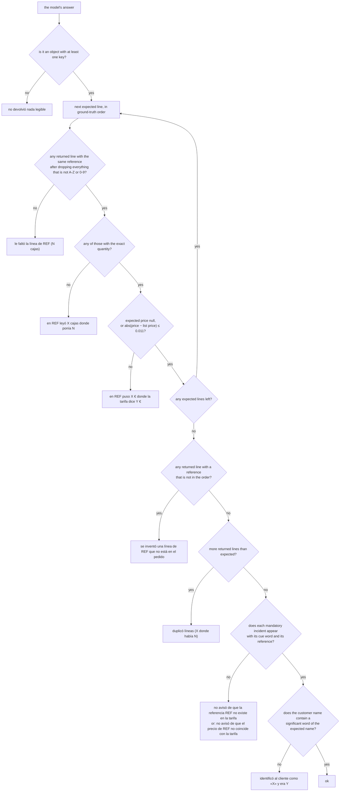
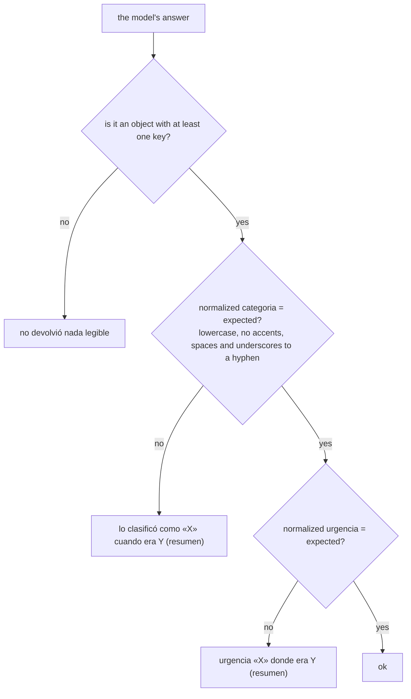
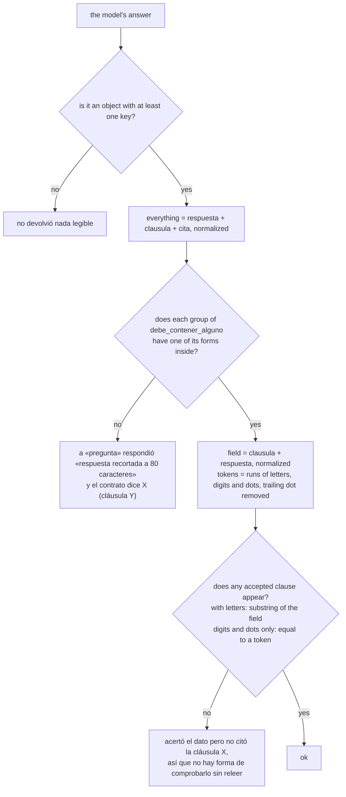
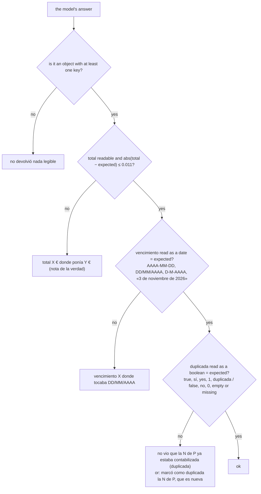
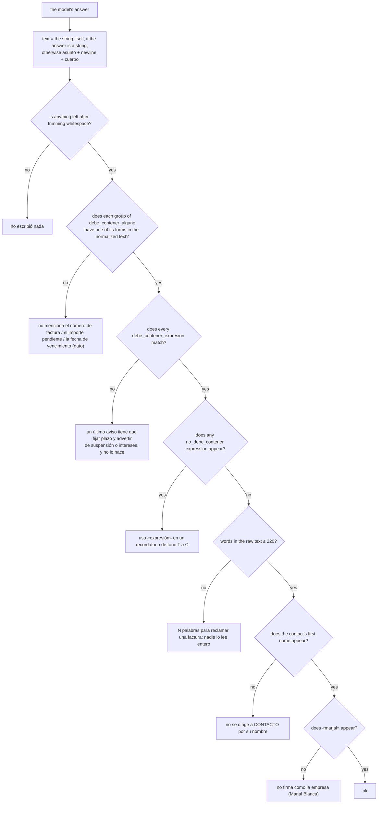

[Español](../tareas.md) · **English**

# The five tasks

This document describes every task in the kit exactly as the blog «A la última» runs and scores it: the verbatim system prompt, the JSON schema of the answer, how each case input is built, which file holds the correct answer, and the exact pass criterion together with the failure sentence each rule produces. The source is the blog's pipeline code (`src/pruebas/tareas.ts` and `src/pruebas/puntuar.ts`); the `kit_pyme` package reproduces it and the tests in `tests/` check the parity against real outputs of that code.

Contents: [What every task shares](#what-every-task-shares) · [Seeing it from the terminal](#seeing-it-from-the-terminal) · [extraer-pedidos](#1-extraer-pedidos) · [resumir-correos](#2-resumir-correos) · [buscar-en-contrato](#3-buscar-en-contrato) · [clasificar-facturas](#4-clasificar-facturas) · [redactar-recordatorio](#5-redactar-recordatorio) · [Prompt verification](#prompt-verification)

The prompts, the schema keys, the task ids and the failure sentences are reproduced in Spanish exactly as they are sent and printed. Translating them would mean measuring something else.

## What every task shares

### What a task is

A task has an `id`, a `nombre` (the one that appears in the blog post), a one-sentence `descripcion`, a system `prompt`, an `esquema` (JSON Schema of the answer), a `max_tokens` and a rule for preparing its cases. Each case has an `id`, an `entrada` (the user message sent to the model) and an `esperado` (the matching object from the `*-verdad.json` file, untouched).

In this repository each task lives in `tareas/<id>/tarea.json`. The `prompt` field is the text from the blog's code; wherever the blog interpolates a data file, the JSON carries a marker with the path (`{{datos/pedidos/tarifa.csv}}`) that the runner replaces with the whole content of the file, its trailing newline included. The result has to be the blog's prompt byte for byte: the SHA-256 hashes in the [last section](#prompt-verification) pin it down and a test checks it.

Canonical order of the tasks: `extraer-pedidos`, `resumir-correos`, `buscar-en-contrato`, `clasificar-facturas`, `redactar-recordatorio`.

### What travels to the model in each case

| Request field | Value |
|---|---|
| `messages[0]` (`system`) | The task prompt plus the `FORMATO` line below |
| `messages[1]` (`user`) | The `entrada` of the case, with no header and no truncation |
| `max_tokens` | The `max_tokens` of the task |
| `temperature` | `0`. If the model answers 400 saying `temperature` is not accepted, the call is repeated without it and that 400 does not count as an attempt |
| `response_format` | Not sent. The prompt asks for JSON and the runner extracts it from the text |

The `FORMATO` line is appended to the prompt, separated by a blank line, with the `required` keys of the schema in their order:

```text
FORMATO DE LA RESPUESTA: un solo objeto JSON con exactamente estas claves, escritas así: <required keys separated by ", ">. Sin otras claves, sin comentarios y sin texto antes ni después.
```

It was added on 2026-09-08 because, without `response_format`, one model answered `base_imponible` where the schema asked for `base` and the bench published 0 out of 25 over a key name.

### What happens to the answer before scoring

1. **Extract the JSON** from the text: if it comes inside a ```` ```json ```` fence, its interior is used; otherwise the first `{` or `[` and the last `}` or `]` are located; if it still does not parse, the runner tries closing open braces and brackets and escaping raw newlines inside strings.
2. **Rescue near-miss keys**: for every missing `required` key (longest first), if there is exactly one free key whose name, lowercased and stripped of punctuation, contains the required one, its value is copied over (`fecha_vencimiento` → `vencimiento`, `Importe Total (EUR)` → `total`). With two candidates, nothing is touched.
3. **Validate against the schema**: only that the root is an object and that every `required` key is present (`null` is acceptable). If any is missing, the answer is discarded and asked again, up to three attempts per case. Discarded attempts are paid for too.
4. If the attempts run out, the case is left **unanswered**: it counts as a failure with the text `<Etiqueta>: el modelo no devolvió una respuesta válida` and adds to `sin_respuesta`.

The failure labels are `Pedido 06`, `Correo 03`, `Factura 08`, `Recordatorio 01` (prefix and number as they appear in the case id) and `Contrato p01` for the contract. The normalization functions are detailed in [`puntuacion.md`](puntuacion.md).

---

## Seeing it from the terminal

The three commands that show a task without calling any model and without spending anything. The output below is real, copied from a run with Python 3.13 and `kit_pyme 1.0.0`.

**Which tasks exist, with their cases and their `max_tokens`:**

```console
$ python -m kit_pyme tareas
id                     casos  max_tokens  nombre
extraer-pedidos           20        6000  Sacar las líneas de 20 pedidos tal como llegan por correo
resumir-correos           30        4000  Clasificar 30 correos del buzón de administración y decir qué hay que hacer
buscar-en-contrato        15        4000  Responder 15 preguntas sobre un contrato de suministro de 60 páginas
clasificar-facturas       25        4000  Contabilizar 25 facturas recibidas: total, vencimiento y si ya estaba registrada
redactar-recordatorio     10        4000  Escribir 10 recordatorios de cobro con el tono que toca
```

**What is sent to the model for one specific case.** `casos` prints the input as it is; with `--id`, only that case. In `buscar-en-contrato` the input is the question alone, because the whole contract travels in the system prompt:

```console
$ python -m kit_pyme casos buscar-en-contrato --id p01
===== p01 =====
¿En qué plazo tiene que pagar Serrano las facturas de Marjal Blanca?
```

**Which system prompt goes with that input.** `prompt` composes the text with the data files already substituted and the `FORMATO` line at the end; with `--sin-formato`, without that line. It is exactly what you paste into a chat if you are going to test without an API:

```console
$ python -m kit_pyme prompt clasificar-facturas | head -3
Trabajas en contabilidad de Conservas Marjal Blanca S.L. (NIF B38122941, Almoradí, Alicante). Te van llegando facturas de proveedores y tienes que dejarlas listas para contabilizar.

Para cada factura devuelve:

$ python -m kit_pyme prompt clasificar-facturas | tail -1
FORMATO DE LA RESPUESTA: un solo objeto JSON con exactamente estas claves, escritas así: proveedor, numero, fecha, base, iva, total, vencimiento, cuenta_sugerida, duplicada. Sin otras claves, sin comentarios y sin texto antes ni después.
```

`prompt` ends its output with a newline, as terminal output does. The system message of all five tasks does not carry one (it ends on the `FORMATO` line), so the default dump is always one byte longer than the text that is sent to the model. With `--sin-formato` it depends on the task:

| Task | Composed prompt ends in a newline | `prompt --sin-formato > file` |
|---|---|---|
| extraer-pedidos | yes (`clientes.csv`) | byte for byte the published prompt, 8,583 bytes |
| resumir-correos | no | one newline more: 1,533 bytes instead of 1,532 |
| buscar-en-contrato | yes (`contrato.txt`) | byte for byte the published prompt, 188,628 bytes |
| clasificar-facturas | yes (`registro-previo.csv`) | byte for byte the published prompt, 2,280 bytes |
| redactar-recordatorio | no | one newline more: 1,387 bytes instead of 1,386 |

To check the SHA-256 hashes of the [last section](#prompt-verification), do not compare the dump: use `python -m kit_pyme verificar`, which composes the prompts in memory and compares them with the published ones without going through a file.

---

## 1. extraer-pedidos

| | |
|---|---|
| Name | Sacar las líneas de 20 pedidos tal como llegan por correo |
| What it is | Twenty real-shaped orders for a cannery (loose email, pasted table, PDF, CSV, photo with OCR, Valencian, one with a reference that does not exist and one with a price that is not the list price): customer, references, boxes and list price. |
| Cases | 20 (`pedido-01` … `pedido-20`) |
| Case input | The whole of `datos/pedidos/pedido-NN.txt`, in ground-truth order |
| Files inside the prompt | `datos/pedidos/tarifa.csv` and `datos/pedidos/clientes.csv` |
| Ground truth | `datos/pedidos/pedidos-verdad.json`, array `pedidos` |
| `max_tokens` | 6000 |
| Required keys | `cliente`, `lineas`, `incidencias` |

### System prompt

```text
Trabajas en administración de Conservas Marjal Blanca S.L., una conservera de Almoradí (Alicante). Te llegan pedidos de clientes por correo en cualquier formato y tienes que pasarlos a líneas para grabarlos en el programa de gestión.

Reglas de la casa:
- Cada línea es una referencia de la tarifa (formato CONS-XXXX-XX-XXX), con la cantidad en CAJAS y el precio por caja que corresponde a ese cliente según la tarifa (cada cliente tiene una columna de precio: general, serrano, cascales, mediterraneo o cash; la columna de cada cliente está en clientes.csv).
- Si el cliente pide unidades, packs, tarros o latas sueltas, convierte a cajas con «uds_por_caja». Si pide palés o medios palés, usa «cajas_por_pale». Si una referencia aparece repartida en varias entregas, una sola línea con el total.
- Si el cliente escribe una descripción en vez de una referencia (también en valenciano o en inglés), busca la referencia en la tarifa por descripción y formato.
- Si el correo se corrige a sí mismo («quita la línea de…», «sube a…»), vale la versión corregida.
- Si dice «lo de siempre» y el pedido anterior viene citado en el hilo, usa el pedido citado con los cambios que indique, y anótalo en incidencias.
- El precio es SIEMPRE el de la tarifa del cliente. Si el cliente escribe otro precio, usa el de la tarifa y anota la diferencia en incidencias.
- Si una referencia no existe en la tarifa, inclúyela tal cual con precio_caja null y anótalo en incidencias. No la sustituyas por una parecida.
- Las reclamaciones, preguntas o comentarios que no sean líneas de pedido no van en «lineas»; si son importantes, en incidencias.
- Referencias siempre en mayúsculas y con guiones, corrigiendo errores evidentes de OCR (0 por O, l por 1).

Responde solo con el JSON del esquema.

=== TARIFA (tarifa.csv, separador ;) ===
{{datos/pedidos/tarifa.csv}}
=== CLIENTES (clientes.csv, separador ;) ===
{{datos/pedidos/clientes.csv}}
```

**What that prompt says.** One line per price-list reference (`CONS-XXXX-XX-XXX`), the quantity in boxes and the price of that customer's column; `clientes.csv` says which of the five columns each customer gets. Units, packs, jars, loose tins, pallets and half pallets are converted with `uds_por_caja` and `cajas_por_pale`, and a reference split across two deliveries becomes a single line with the total. When the customer writes a description instead of a code — in Valencian or in English too — the reference is looked up in the price list by description and format. An email that corrects itself counts in its corrected version, and «lo de siempre» with the previous order quoted in the thread means that order plus whatever changes are stated, noted in `incidencias`. The price is always the list price: if the customer writes a different one, the list price is used and the discrepancy goes in `incidencias`. A reference that is not in the price list is kept as it came, with `precio_caja: null` and a note in `incidencias`, and is never swapped for a similar one. Complaints, questions and comments do not go in `lineas`. References go in uppercase with hyphens, correcting obvious OCR damage (0 for O, l for 1).

Both CSV files end in a newline, so the composed prompt has a blank line between the last row of the price list and the `=== CLIENTES` header, and the prompt ends with the trailing newline of `clientes.csv` (8,583 bytes in total). After that comes the line `FORMATO … cliente, lineas, incidencias …`.

### Answer schema

```json
{
  "type": "object",
  "required": ["cliente", "lineas", "incidencias"],
  "properties": {
    "cliente": { "type": "string", "description": "Nombre del cliente tal como aparece en clientes.csv" },
    "fecha_entrega": { "type": ["string", "null"], "description": "Fecha de entrega pedida, si la hay (texto libre)" },
    "lineas": {
      "type": "array",
      "items": {
        "type": "object",
        "required": ["referencia", "cantidad_cajas", "precio_caja"],
        "properties": {
          "referencia": { "type": "string" },
          "cantidad_cajas": { "type": "integer" },
          "precio_caja": { "type": ["number", "null"], "description": "Precio por caja de la tarifa del cliente, con dos decimales; null si la referencia no existe" }
        }
      }
    },
    "incidencias": { "type": "array", "items": { "type": "string" }, "description": "Una frase por cosa que haya que revisar antes de servir" }
  }
}
```

### What the ground truth holds

Each element of `pedidos[]`: `id`, `fichero`, `cliente`, `nif_cliente`, `tarifa` (`general` | `serrano` | `cascales` | `mediterraneo` | `cash`), `formato` (a description of the email format), `lineas[]` with `referencia`, `descripcion`, `cantidad_cajas` and `precio_caja` (`null` when the reference does not exist), `importe_lineas_eur`, `incidencias[]` with `tipo`, `detalle` and `obligatoria`, and `nota`.

Only two orders have mandatory incidents: `pedido-07` (`referencia-inexistente`: CONS-ATUN-OL-200 is not in the price list) and `pedido-08` (`precio-distinto-de-tarifa`: the customer writes 48,00 €/box for CONS-ANCH-OL-50 and the price list says 52,80 €). `pedido-09` and `pedido-17` carry incidents with `obligatoria: false`, which are not scored.

### Pass criterion



The rules, in this order; the first failure stops the case:

1. If the answer is not an object with at least one key (also `null`, an array or a number): `Pedido NN: no devolvió nada legible`.
2. The returned lines are read from `lineas` (if it is not a list, there are none). From each one: `referencia` normalized (uppercase, only A-Z and 0-9: `cons atun-ol_120.` → `CONSATUNOL120`), the quantity from `cantidad_cajas` or, if missing, from `cantidad`; the price from `precio_caja` or, if missing, from `precio`. Quantity and price are read as numbers even when they arrive as text ("24,29 €" → 24.29).
3. For each expected line, in order:
   - no returned line with the same reference → `Pedido NN: le faltó la línea de <REF> (<N> cajas)`;
   - none of them with exactly the same quantity → `Pedido NN: en <REF> leyó <X> cajas donde ponía <N>` (`X` is the quantity of the first candidate; `¿?` when it could not be read);
   - if the expected price is not `null` and the returned one is missing or differs by more than 0.011 € → `Pedido NN: en <REF> puso <X €> donde la tarifa dice <Y €>` (`sin precio` when missing). With an expected price of `null` (a reference that does not exist) the price is not checked.
4. The first returned line whose reference is not among the expected ones → `Pedido NN: se inventó una línea de <reference as written> que no está en el pedido` (`(sin referencia)` when it came empty).
5. If there are more returned lines than expected (the same reference repeated) → `Pedido NN: duplicó líneas (<X> donde había <N>)`.
6. Mandatory incidents. The `incidencias` are joined with ` | ` and normalized (lowercase, no accents). For each mandatory one, the first `CONS-…` reference in its `detalle` is looked for, plus a cue word depending on the type: for `referencia-inexistente`, one of `no existe`, `inexistente`, `desconocid`, `no esta en`, `no figura`, `no encontr`; for `precio-distinto-de-tarifa`, one of `precio`, `tarifa`, `distint`, `difer`, `discrep`. The cue and the reference (with or without hyphens) both have to appear. Otherwise → `Pedido NN: no avisó de que la referencia <REF> no existe en la tarifa` or `Pedido NN: no avisó de que el precio de <REF> no coincide con la tarifa`.
7. Customer. From the expected name, the words of four letters or more that are not generic are taken (`supermercados`, `distribuciones`, `restaurante`, `bar`, `cafeteria`, `cooperativa`, `agricola`, `grupo`, `hostelero`, `catering`, `ultramarinos`, `cash`, `online`, `eventos`, `hijos`, `hermanos`, `coop`, `ltd`, `sl`, `slu`, `sa`, `v`, …); one of them appearing in the normalized returned customer is enough. Otherwise → `Pedido NN: identificó al cliente como «<X>» y era <Y>` (`nadie` when it came empty).

`fecha_entrega`, the wording of non-mandatory incidents and the order of the lines are not scored.

### Examples

| Answer (abridged) | Result |
|---|---|
| References written as `cons atun ol 120`, customer `Serrano` | ok |
| Quantities and prices as strings `"40"`, `"24,29 €"` | ok |
| Keys `cantidad` and `precio` instead of `cantidad_cajas` and `precio_caja` | ok |
| Price 24.30 where the list says 24.29 (0.01 difference) | ok |
| Price 24.31 where the list says 24.29 | `Pedido 01: en CONS-ATUN-OL-120 puso 24,31 € donde la tarifa dice 24,29 €` |
| `precio_caja: null` in pedido-08 | `Pedido 08: en CONS-ANCH-OL-50 puso sin precio donde la tarifa dice 52,80 €` |
| `lineas: "ninguna"` | `Pedido 02: le faltó la línea de CONS-ATUN-OL-120 (60 cajas)` |
| Incident `consatunol200 no figura en la tarifa` in pedido-07 | ok |
| Customer `Distribuciones S.L.` for Distribuciones Hermanos Cascales S.L. | `Pedido 02: identificó al cliente como «Distribuciones S.L.» y era Distribuciones Hermanos Cascales S.L.` |
| Customer `Hnos. Cascales` | ok |

---

## 2. resumir-correos

| | |
|---|---|
| Name | Clasificar 30 correos del buzón de administración y decir qué hay que hacer |
| What it is | Thirty emails from customers, suppliers, the tax adviser, the bank, the health authority and spam: category, urgency and action. Category and urgency are scored, exact match. |
| Cases | 30 (`correo-01` … `correo-30`) |
| Case input | The whole of `datos/correos/correo-NN.txt` |
| Files inside the prompt | None |
| Ground truth | `datos/correos/correos-verdad.json`, array `correos` |
| `max_tokens` | 4000 |
| Required keys | `categoria`, `urgencia`, `accion`, `resumen` |

### System prompt

```text
Eres la persona de administración de Conservas Marjal Blanca S.L., una conservera de Almoradí (Alicante) con unos 40 empleados. Cada mañana repasas el buzón y decides qué hacer con cada correo.

Para cada correo devuelve:
- categoria, una de: reclamacion (un cliente se queja de algo que hemos hecho mal o de una factura), consulta (pregunta o petición de información, precio, plazo o documentación), cambio-pedido (modifica, anula o retrasa un pedido ya hecho), pedido (un pedido nuevo), factura-proveedor (nos envían una factura), aviso-proveedor (un proveedor avisa de precios, retrasos o plazos que nos afectan), administrativo (gestoría, banco, ayuntamiento, Sanidad, seguros: trámites y plazos legales), spam (publicidad, premios de pago, phishing, boletines).
- urgencia: alta si hay que actuar HOY (una entrega parada, un cliente sin género para mañana, un posible problema sanitario, un plazo legal o de aduana que vence, una inspección anunciada para dentro de pocos días); media si hay que hacerlo esta semana; baja si puede esperar o no hay que hacer nada.
- accion: en una frase, qué haría un buen administrativo con este correo.
- resumen: una línea que explique el correo a quien no lo ha leído.

Fíjate en las fechas: hoy es lunes 14 de septiembre de 2026. Un correo del banco que pide documentación para dentro de dos semanas es media; un tarro hinchado o un palé retenido en aduana es alta; un boletín de ferias es spam aunque hable de nuestro sector.

Responde solo con el JSON del esquema.
```

**What that prompt says.** For every email the model returns a `categoria` from a closed list of eight, each defined in the prompt: `reclamacion` (a customer complains about something done wrong or about an invoice), `consulta` (a question or a request for information, a price, a lead time or paperwork), `cambio-pedido` (changes, cancels or delays an order already placed), `pedido` (a new order), `factura-proveedor` (a supplier sends an invoice), `aviso-proveedor` (a supplier warns about prices, delays or lead times that affect us), `administrativo` (the tax adviser, the bank, the town hall, the health authority, insurers: procedures and legal deadlines) and `spam` (advertising, prize scams, phishing, newsletters). Urgency is `alta` when something has to be done TODAY — a stopped delivery, a customer with no goods for tomorrow, a possible food-safety problem, a legal or customs deadline running out, an inspection announced for the next few days —, `media` when it has to be done this week and `baja` when it can wait or needs nothing. `accion` is one sentence saying what a good administrator would do, and `resumen` one line explaining the email to someone who has not read it. The prompt fixes today as Monday 14 September 2026 and gives three worked examples: a bank email asking for documents due in two weeks is `media`; a swollen jar or a pallet held at customs is `alta`; a trade-fair newsletter is `spam` even when it talks about our sector.

### Answer schema

```json
{
  "type": "object",
  "required": ["categoria", "urgencia", "accion", "resumen"],
  "properties": {
    "categoria": { "type": "string", "enum": ["reclamacion", "consulta", "cambio-pedido", "pedido", "factura-proveedor", "aviso-proveedor", "administrativo", "spam"] },
    "urgencia": { "type": "string", "enum": ["alta", "media", "baja"] },
    "accion": { "type": "string" },
    "resumen": { "type": "string" }
  }
}
```

### What the ground truth holds

Each element of `correos[]`: `id`, `fichero`, `categoria`, `urgencia`, `remitente`, `accion`, `resumen`. All eight categories occur: 6 complaints, 6 inquiries, 4 order changes, 1 order, 3 supplier invoices, 3 supplier notices, 4 administrative and 3 spam. Urgencies: 7 high, 14 medium, 9 low.

### Pass criterion



1. No readable object → `Correo NN: no devolvió nada legible`.
2. The category is normalized (lowercase, no accents, single spaces) and every run of spaces or underscores becomes one hyphen: `Cambio_Pedido` → `cambio-pedido`; `factura  proveedor` → `factura-proveedor`. If it does not match the expected one → `Correo NN: lo clasificó como «<categoria as written>» cuando era <expected> (<summary from the ground truth>)` (`nada` when it came empty).
3. The urgency is normalized the same way. If it does not match → `Correo NN: urgencia «<urgencia as written>» donde era <expected> (<summary>)` (`ninguna` when it came empty).

`accion` and `resumen` are not scored. A double hyphen (`factura--proveedor`) is not repaired and fails.

---

## 3. buscar-en-contrato

| | |
|---|---|
| Name | Responder 15 preguntas sobre un contrato de suministro de 60 páginas |
| What it is | A framework supply agreement of realistic size (28,000 words, 28 clauses and 8 annexes) and the fifteen questions a managing director asks: payment terms, penalties, Incoterm, shelf life, force majeure. The value and the clause citation are scored. |
| Cases | 15 (`p01` … `p15`) |
| Case input | The text of `pregunta`, the question alone |
| Files inside the prompt | `datos/contrato/contrato.txt` (187,847 bytes) |
| Ground truth | `datos/contrato/contrato-preguntas.json`, array `preguntas` |
| `max_tokens` | 4000 |
| Required keys | `respuesta`, `clausula`, `cita` |

### System prompt

```text
Eres el asistente de la gerencia de Conservas Marjal Blanca S.L. Tienes delante el contrato marco de suministro firmado con Supermercados Serrano S.L. Te van a hacer preguntas concretas sobre él.

Reglas:
- Responde solo con lo que dice el contrato. Si el contrato no lo dice, responde «el contrato no lo regula».
- Da el dato concreto (la cifra, el plazo, el porcentaje, el lugar) tal como aparece en el contrato, sin redondear ni interpretar.
- Indica en «clausula» el número de la cláusula o del apartado del anexo donde está (por ejemplo «9.2» o «Anexo II.3»). Si el dato está en varios sitios, cita el principal.
- En «cita» copia la frase literal del contrato en la que te basas (máximo 40 palabras).

Responde solo con el JSON del esquema.

=== CONTRATO ===
{{datos/contrato/contrato.txt}}
```

**What that prompt says.** The model answers only with what the contract says, and when the contract does not cover the question it has to answer the literal phrase «el contrato no lo regula». The answer has to carry the concrete fact — the figure, the term, the percentage, the place — exactly as it appears in the contract, without rounding it or interpreting it. `clausula` holds the number of the clause or of the annex section where the fact is (`9.2`, `Anexo II.3`); when the fact appears in more than one place, the main one is cited. `cita` copies the literal sentence the answer rests on, 40 words at most.

The composed prompt weighs 188,628 bytes and ends with the trailing newline of the contract (`— FIN DEL CONTRATO Y DE SUS ANEXOS —`). It is the task that consumes the most input tokens per case: the whole contract travels fifteen times.

### Answer schema

```json
{
  "type": "object",
  "required": ["respuesta", "clausula", "cita"],
  "properties": {
    "respuesta": { "type": "string", "description": "Respuesta breve con el dato concreto" },
    "clausula": { "type": "string", "description": "Número de cláusula o apartado de anexo, p. ej. «9.2»" },
    "cita": { "type": "string", "description": "Frase literal del contrato, máximo 40 palabras" }
  }
}
```

### What the ground truth holds

Each element of `preguntas[]`: `id`, `pregunta`, `respuesta` (the correct one, written out), `clausula` (the main one), `debe_contener_alguno` (a list of groups; at least one form from each group has to appear) and `clausulas_aceptadas`.

| Id | Question | Clause | Accepted forms of the value (abridged) |
|---|---|---|---|
| p01 | Payment term for invoices | 9.2 | `60 días`, `sesenta días`, `60 naturales` |
| p02 | Late-payment interest | 9.5 | `8 puntos`, `ocho puntos`, `+8` |
| p03 | Standard delivery lead time | 7.3 | `5 días laborables`, `cinco días laborables` |
| p04 | Late-delivery penalty and its cap | 13.2 | `1 %` and `10 %` (two groups) |
| p05 | Incoterm and place of delivery | 7.1 | `DAP` and `Elche` or `plataforma` |
| p06 | Minimum shelf life on delivery | 10.4 | `18 meses` and `dos tercios` or `2/3` |
| p07 | Deadline to claim breakages or shortages | 11.2 | `48 horas`, `48 h` |
| p08 | Term and notice of non-renewal | 3 | `dos años` or `31 de enero de 2028`, and `3 meses` |
| p09 | Duration of the confidentiality duty | 17.4 | `5 años`, `cinco años` |
| p10 | Minimum product liability cover | 19.1 | `3.000.000`, `3 millones`, `3M` |
| p11 | Force majeure: notice and termination | 20 | `5 días` and `60 días` |
| p12 | Minimum order | 5.4 | `1.500` and `2 palés` |
| p13 | Rebate on 420,000 € of purchases | Anexo II.3 | `3 %` |
| p14 | Minimum monthly service rate | 14.2 | `97 %`, `noventa y siete` |
| p15 | Dispute resolution and jurisdiction | 27 | `Alicante` and `mediación` or `Cámara de Comercio` |

The accepted clauses always include the main clause and its whole number (`9.2` and `9`), and in some cases alternatives (`Anexo III` and `III.2` in p04; `II.3`, `Anexo II` and `6.6` in p13; `III.1`, `Anexo III` and `13.3` in p14).

### Pass criterion



1. No readable object → `Contrato pNN: no devolvió nada legible`.
2. `respuesta`, `clausula` and `cita` are concatenated and normalized. For each group of `debe_contener_alguno`, in order, one of its forms (normalized) has to be a substring. If a group fails → `Contrato pNN: a «<pregunta>» respondió «<answer, first 80 characters>» y el contrato dice <ground-truth answer> (cláusula <ground-truth clause>)`.
3. The clause is looked for in `clausula` plus `respuesta` (the `cita` does not count for this). The text is split into tokens at everything that is not a letter, a digit or a dot, and a trailing dot is stripped from each token. An accepted clause containing letters (`Anexo II`) passes if it is a substring of the text; one made only of digits and dots (`9.2`) passes if it equals a token. If none passes → `Contrato pNN: acertó el dato pero no citó la cláusula <clausula>, así que no hay forma de comprobarlo sin releer`.

| Example | Result |
|---|---|
| `clausula: "Cláusula 9.2"` | ok |
| `clausula: "9.2."` | ok (the trailing dot is stripped) |
| `clausula: "9.2.1"` | fails the clause: the token is `9.2.1` |
| `clausula: "anexo ii"` in p13 | ok |
| The value only in the quote, as «sesenta (60) días» | fails the value: it contains neither `60 dias` nor `sesenta dias` |

---

## 4. clasificar-facturas

| | |
|---|---|
| Name | Contabilizar 25 facturas recibidas: total, vencimiento y si ya estaba registrada |
| What it is | Twenty-five supplier invoices as they arrive (tinplate, tuna, electricity, rent with withholding tax, insurance without VAT, an Irish SaaS under the reverse charge, a diesel receipt, and two that were already booked). Total, due date and duplicate flag are scored. |
| Cases | 25 (`factura-01` … `factura-25`) |
| Case input | The whole of `datos/facturas/factura-NN.txt` |
| Files inside the prompt | `datos/facturas/registro-previo.csv` |
| Ground truth | `datos/facturas/facturas-verdad.json`, array `facturas` |
| `max_tokens` | 4000 |
| Required keys | `proveedor`, `numero`, `fecha`, `base`, `iva`, `total`, `vencimiento`, `cuenta_sugerida`, `duplicada` |

### System prompt

```text
Trabajas en contabilidad de Conservas Marjal Blanca S.L. (NIF B38122941, Almoradí, Alicante). Te van llegando facturas de proveedores y tienes que dejarlas listas para contabilizar.

Para cada factura devuelve:
- proveedor y numero de factura tal como aparecen.
- fecha de la factura y base imponible, cuota de IVA y total, en euros con dos decimales (número, no texto). Ojo: el total puede llevar retención de IRPF (alquileres 19 %, profesionales autónomos 15 %) que se resta, o impuestos que no son IVA (primas de seguros) que se suman. Las facturas de servicios de fuera de España con inversión del sujeto pasivo van sin IVA.
- vencimiento en formato AAAA-MM-DD. Si la factura dice «30 días fecha factura», «60 días f.f.», «pagaré a 90 días», cuéntalos desde la fecha de la factura; si dice contado, pagado con tarjeta o en efectivo, el vencimiento es la fecha de la factura; si dice que se domicilia o se carga en cuenta en una fecha, esa fecha; si dice «antes del día 5 del mes», el día 5 de ese mes.
- cuenta_sugerida: cuenta del Plan General Contable de pymes de tres dígitos (600 mercaderías, 601 materias primas, 602 otros aprovisionamientos como envases y embalajes, 621 arrendamientos, 622 reparaciones y conservación, 623 servicios de profesionales, 624 transportes, 625 primas de seguros, 628 suministros, 629 otros servicios).
- duplicada: true si el número de factura de ese mismo proveedor ya aparece en el registro de facturas contabilizadas que tienes abajo. Mismo proveedor y mismo importe con distinto número NO es duplicada.

Responde solo con el JSON del esquema.

=== REGISTRO DE FACTURAS YA CONTABILIZADAS (registro-previo.csv, separador ;) ===
{{datos/facturas/registro-previo.csv}}
```

**What that prompt says.** Supplier and invoice number go in as they appear. Invoice date, taxable base, VAT amount and total go in euros with two decimals, as numbers and not as text; the total may carry an IRPF withholding that is subtracted (19 % on rent, 15 % on self-employed professionals) or a tax that is not VAT and is added (insurance premiums), and services invoiced from outside Spain under the reverse charge carry no VAT at all. `vencimiento` goes in `AAAA-MM-DD`, and the prompt lists how to turn each Spanish payment-terms phrase into one: «30 días fecha factura», «60 días f.f.» and «pagaré a 90 días» are counted from the invoice date; cash, card or paid in cash means the invoice date itself; a direct debit or an account charge on a stated date means that date; «antes del día 5 del mes» means the 5th of that month. `cuenta_sugerida` is a three-digit account of the Spanish chart of accounts for small companies, and the prompt lists the ten that occur. `duplicada` is true only when that same supplier's invoice number is already in the register printed below the prompt: the same supplier and the same amount under a different number is not a duplicate.

The composed prompt weighs 2,280 bytes and ends with the last row of the register (`MIS/26/0771;1989,85`) and its newline.

### Answer schema

```json
{
  "type": "object",
  "required": ["proveedor", "numero", "fecha", "base", "iva", "total", "vencimiento", "cuenta_sugerida", "duplicada"],
  "properties": {
    "proveedor": { "type": "string" },
    "numero": { "type": "string" },
    "fecha": { "type": "string", "description": "AAAA-MM-DD" },
    "base": { "type": "number" },
    "iva": { "type": "number" },
    "total": { "type": "number" },
    "vencimiento": { "type": "string", "description": "AAAA-MM-DD" },
    "cuenta_sugerida": { "type": "string" },
    "duplicada": { "type": "boolean" }
  }
}
```

### What the ground truth holds

Each element of `facturas[]`: `id`, `fichero`, `proveedor`, `nif_proveedor`, `numero`, `fecha`, `base`, `tipo_iva`, `iva`, `retencion`, `otros`, `total`, `vencimiento`, `cuenta_sugerida`, `cuenta_nombre`, `duplicada`, `nota`. In every one, `base + iva − retencion + otros = total` holds with a tolerance of 0.011. The duplicates are `factura-09` and `factura-21` (both `MIS/26/0771` from Mantenimientos Industriales Segura, already in `registro-previo.csv`); `factura-17` is from the same supplier for the same maintenance work but with a different number: not a duplicate.

### Pass criterion



1. No readable object → `Factura NN: no devolvió nada legible`.
2. `total` is read as a number ("2.448,00", "2448.00 €" and 2448 are all the same). If it cannot be read, or differs from the expected value by more than 0.011 → `Factura NN: total <X €> donde ponía <Y €><hint>`, where the hint is the `nota` of the ground truth in brackets and without its final period, when there is one (`sin importe` when it could not be read).
3. `vencimiento` is read as a date: first `AAAA-MM-DD` (also inside a longer text), then `DD/MM/AAAA` with `/`, `.` or `-`, then «D de mes de AAAA». If it does not match the expected date → `Factura NN: vencimiento <text as written> donde tocaba <DD/MM/AAAA>` (`en blanco` when empty). A two-digit year (`03/11/26`) is not recognized.
4. `duplicada` is read as a boolean: `true`, `sí`, `si`, `yes`, `1` and `duplicada` are true; `false`, `no`, `0`, empty and missing are false; anything else is neither and fails. If it does not match → `Factura NN: no vio que la <numero> de <proveedor> ya estaba contabilizada (duplicada)` or `Factura NN: marcó como duplicada la <numero> de <proveedor>, que es nueva`.

`proveedor`, `numero`, `fecha`, `base`, `iva` and `cuenta_sugerida` are not scored.

| Example | Result |
|---|---|
| `{total: "2.448,00", vencimiento: "05/09/2026", duplicada: "no"}` in factura-11 | ok |
| `total: 2904` in factura-11 | `Factura 11: total 2.904,00 € donde ponía 2.448,00 € (Total = base + IVA − retención IRPF 19 %: 2.400 + 504 − 456 = 2.448,00)` |
| `vencimiento: "03/11/26"` in factura-01 | `Factura 01: vencimiento 03/11/26 donde tocaba 03/11/2026` |
| `vencimiento: "Vence el 03/11/2026 (60 días)"` | ok |
| `duplicada` missing in factura-21 | `Factura 21: no vio que la MIS/26/0771 de Mantenimientos Industriales Segura S.L. ya estaba contabilizada (duplicada)` |

---

## 5. redactar-recordatorio

| | |
|---|---|
| Name | Escribir 10 recordatorios de cobro con el tono que toca |
| What it is | Ten overdue invoices from the collections sheet: one email each with the invoice number, the outstanding amount and the due date, friendly at 7 days, firm at a month, final notice at two months. Scored by rules, not by taste. |
| Cases | 10 (`recordatorio-01` … `recordatorio-10`) |
| Case input | A composed record (below) with the row from `datos/cobros/cobros.csv` |
| Files inside the prompt | None; the signature, the tones and the date come from `cobros-verdad.json` and are already resolved in the text |
| Ground truth | `datos/cobros/cobros-verdad.json`, array `casos_recordatorio` |
| `max_tokens` | 4000 |
| Required keys | `asunto`, `cuerpo` |

### System prompt

```text
Eres Marisa Pérez, de Administración de Conservas Marjal Blanca S.L. (Almoradí, Alicante). Escribes correos de recordatorio de cobro a clientes con los que queremos seguir trabajando.

Reglas de la casa:
- Un correo corto (menos de 200 palabras), en español, dirigido a la persona de contacto por su nombre de pila, con asunto.
- Tiene que decir siempre el número de factura, el importe pendiente en euros y la fecha de vencimiento. Si hubo un pago parcial, reconócelo y reclama solo el resto.
- Tono según lo que te indiquen:
  · amable: recordatorio cordial: damos por hecho que es un despiste; sin amenazas ni mención de intereses.
  · firme: firme pero educado: pide fecha concreta de pago y avisa de que es el segundo aviso o de que el retraso es ya importante; sin amenazas legales.
  · formal: último aviso formal: fija un plazo de días para pagar y advierte de suspensión de suministro y/o intereses de demora según contrato; correcto, sin insultos.
- Ofrece siempre la cuenta para el pago (IBAN ES21 0081 1234 5600 0123 4567) y un teléfono (965 70 12 48) por si el pago ya está hecho o hay algún problema con la factura.
- Nunca amenaces con abogados ni denuncias; nunca insultes; nunca digas que «el sistema» lo ha enviado.
- Firma como Marisa Pérez, Administración, Conservas Marjal Blanca S.L.

Hoy es 14/09/2026. Responde solo con el JSON del esquema.
```

**What that prompt says.** The model writes as Marisa Pérez, from Administration: a short email, under 200 words, in Spanish, addressed to the contact by first name, with a subject line. It always has to state the invoice number, the outstanding amount in euros and the due date, and when there was a partial payment it has to acknowledge it and claim only the rest. The tone is given per case: `amable` is a cordial reminder that assumes an oversight, with no threats and no mention of interest; `firme` is firm but polite, asks for a specific payment date and says that this is the second notice or that the delay is already serious, with no legal threats; `formal` is a final notice that sets a deadline in days and warns of suspension of supply and/or late-payment interest under the contract, correct in tone. The email always offers the bank account (IBAN ES21 0081 1234 5600 0123 4567) and a phone number (965 70 12 48) in case the payment has already been made or there is a problem with the invoice. It never threatens with lawyers or lawsuits, never insults, and never says that «el sistema» sent it. It signs as Marisa Pérez, Administración, Conservas Marjal Blanca S.L. The prompt fixes today as 14/09/2026.

The prompt does not end in a newline (1,386 bytes). Note that it asks for «menos de 200 palabras» while the scoring rule allows up to 220 (`max_palabras: 220` in the ground truth). The rule wins; the prompt is not changed because changing it would break comparability with the published figures.

### Answer schema

```json
{
  "type": "object",
  "required": ["asunto", "cuerpo"],
  "properties": {
    "asunto": { "type": "string" },
    "cuerpo": { "type": "string", "description": "El correo completo, con saludo y firma" }
  }
}
```

### How each case input is built

Ten lines joined with `\n`, with no trailing newline:

```text
Factura: <factura>
Cliente: <cliente> (contacto: <contacto>)
Importe pendiente: <amount with two decimals and a comma, no thousands separator> €
Vencimiento: <DD/MM/AAAA>
Días de retraso a día de hoy: <dias_retraso>
Tono requerido: <tono>
Contexto (hoja de cobros): <the `rasgos` field of the «recordar» entry with the same invoice, or empty>

Fila de cobros.csv:
<header row of cobros.csv>
<the row of cobros.csv starting with «<factura>;», or «(no encontrada)»>
```

Example, `recordatorio-01`:

```text
Factura: 26/1135
Cliente: Supermercados Alifresc S.L. (contacto: Sergio Baeza)
Importe pendiente: 4312,60 €
Vencimiento: 07/09/2026
Días de retraso a día de hoy: 7
Tono requerido: amable
Contexto (hoja de cobros): Mencionar la factura 26/1135, 4312,60 € pendientes y el vencimiento del 07/09/2026; tono amable.

Fila de cobros.csv:
numero;cliente;nif;fecha_factura;importe_total;vencimiento;forma_pago;estado;importe_cobrado;fecha_cobro;dias_retraso;ultimo_recordatorio;notas
26/1135;Supermercados Alifresc S.L.;B36700235;09/07/2026;4312,60;07/09/2026;transferencia 60 días f.f.;vencida;0,00;;7;;
```

The `rasgos` string of cases 08, 09 and 10 ends in two consecutive periods (`..`); that is how it is in the JSON and that is how it is copied.

### What the ground truth holds

Each element of `casos_recordatorio[]`: `id`, `factura`, `cliente`, `contacto`, `importe_pendiente`, `vencimiento`, `dias_retraso`, `tono` and `reglas` with `debe_contener_alguno` (three groups: invoice number, amount, due date, each with several formats), `debe_contener_expresion` (mandatory regular expressions; only in the formal tone), `no_debe_contener` (expressions forbidden for that tone), `max_palabras` (220), `debe_nombrar_cliente` (the contact's first name) and `debe_firmar` (`Marjal`).

| Cases | Tone | Forbidden | Mandatory |
|---|---|---|---|
| 01–04 | amable | `requerimiento`, `acciones legales`, `intereses de demora`, `suspensión`, `suspender`, `burofax`, `reclamación judicial`, `último aviso` | — |
| 05–08 | firme | `acciones legales`, `burofax`, `reclamación judicial`, `abogado` | — |
| 09–10 | formal | `abogado`, `denuncia` | `suspensi\|intereses de demora\|último aviso\|ultimo aviso\|plazo` |

Case 08 (Cash Vega Baja, 26/1125) has a partial payment: the outstanding amount is 2,104.00 € of a 5,104.00 € invoice.

### Pass criterion



1. If the answer is a string, that string is scored. If it is an object, the text is `asunto` + a newline + `cuerpo`. If nothing is left after trimming whitespace (`{}`, `null`, arrays and numbers included) → `Recordatorio NN: no escribió nada`.
2. The text is normalized (lowercase, no accents, single spaces). For each of the three groups of `debe_contener_alguno`, in order, one of its forms has to appear. Otherwise → `Recordatorio NN: no menciona el número de factura (<factura>)`, `… el importe pendiente (<importe €>)` or `… la fecha de vencimiento (<DD/MM/AAAA>)`.
3. Each `debe_contener_expresion` is applied as a case-insensitive regular expression over the normalized text (already stripped of accents: `último aviso` does not match, `ultimo aviso` does, which is why the expression carries both). If one does not match → `Recordatorio NN: un último aviso tiene que fijar plazo y advertir de suspensión o intereses, y no lo hace`.
4. Each `no_debe_contener` expression, normalized, must not be a substring of the text. If it is → `Recordatorio NN: usa «<expression as written, with accents>» en un recordatorio de tono <tono> a <cliente>`.
5. The words of the raw text (subject line included) are counted by splitting on whitespace. If there are more than `max_palabras` (220) → `Recordatorio NN: <N> palabras para reclamar una factura; nadie lo lee entero`.
6. If the first name (`debe_nombrar_cliente`, normalized) does not appear → `Recordatorio NN: no se dirige a <contacto> por su nombre`. For «Mari Carmen Gil», `Mari` is enough.
7. If `marjal` does not appear → `Recordatorio NN: no firma como la empresa (Marjal Blanca)`.

| Example | Result |
|---|---|
| «Este es el último aviso.» in a case with the firm tone | ok (it is only forbidden in the friendly tone) |
| «suspensión» in a case with the friendly tone | `Recordatorio 01: usa «suspensión» en un recordatorio de tono amable a Supermercados Alifresc S.L.` |
| 277 words | `Recordatorio 01: 277 palabras para reclamar una factura; nadie lo lee entero` |
| The answer is a bare string with the email in it | scored the same as an object |

---

## Prompt verification

SHA-256 (UTF-8, LF line endings) of each task's prompt once the markers are substituted, and of the system message that is actually sent (prompt plus the `FORMATO` line). A test in `tests/` composes the prompts from `tareas/` and `datos/` and checks these values; if one byte changes, the test fails and the figures stop being comparable.

| Task | Composed prompt | Bytes | System message sent |
|---|---|---:|---|
| extraer-pedidos | `7c613ac2a9cde1ce58fe0b38b24e804ea4b78c0f36f9a6daef52ac6e7cb4aa8c` | 8 583 | `79480c98e6eb90047c6046bae43c1d58d911879a8ae9ce6874c42f5cce3f23cb` |
| resumir-correos | `1760765f27944b1b9e4a1c3054d6703a1c70f0de0178b06231c4955d3233c898` | 1 532 | `cfb42d36e4bd277bcfbec0f37c1dbc64ae9f48e4a59aaa7213a9bda0e4017780` |
| buscar-en-contrato | `41b2c9fcd389eeb87f332a2cac8c67ebcf25512b389c998c8a778d639d983d93` | 188 628 | `8cd3e48027d43d67423002b4a9a1c6119827dee271fa3acf68518ba0aab7b314` |
| clasificar-facturas | `c41359a43546984e292e82ba9248f8e52aec1b4db8d061b1a3c2c24bb217b132` | 2 280 | `01307e1f80c6f7450fa8b0d209f76867fe082b2065e44009e52d26124bf58e4a` |
| redactar-recordatorio | `5aa5c0c0ffe0f403bb403ea0c26c8d41eae4df8c175bb78878fc2911856ea95a` | 1 386 | `d68cbb0ed5ef3b948afbad3063af2cef1e6dac8bcf2257570eff11ceb0f5e011` |

The inputs for orders, emails and invoices are the `.txt` files as they are, so their SHA-256 is the one in `datos/CHECKSUMS.sha256`. The composed inputs of the contract (the question) and the reminders (the record) are checked in the tests against recorded outputs of the blog's code.

To check it yourself:

```console
$ python -m kit_pyme verificar
OK   datos/ y los prompts son los publicados (checksums y sha256 correctos).
```

That single line means two things at once: that the 85 files in `datos/` are byte for byte the published ones, and that the ten hashes in this table come out of composing the prompts with those bytes. If either stops being true, the command says so file by file and exits with status 1; the examples are in [`datos.md`](datos.md#checksumssha256).
