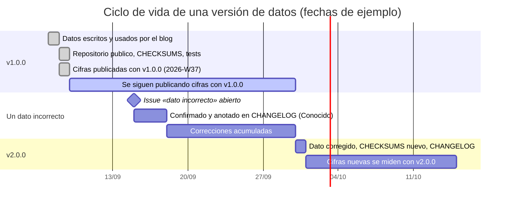

# Metodología

Qué mide el kit, cómo lo mide, qué no mide y cómo se versionan los datos para que las cifras de distintas semanas y de distintas personas se puedan poner una al lado de la otra.

Índice: [Qué mide](#qué-mide) · [Por qué la puntuación es determinista](#por-qué-la-puntuación-es-determinista) · [Condiciones fijas de cada prueba](#condiciones-fijas-de-cada-prueba) · [Qué no se mide](#qué-no-se-mide) · [Diseño de los datos](#diseño-de-los-datos) · [Paridad con el blog](#paridad-con-el-blog) · [Versionado de los datos](#versionado-de-los-datos) · [Limitaciones](#limitaciones)

## Qué mide

Si una herramienta de IA concreta, con un prompt razonable escrito por una pyme y sin trucos, hace bien cinco tareas administrativas concretas, cuánto tarda y cuánto cuesta. Por cada tarea salen cuatro cifras y un veredicto:

| Cifra | Qué es |
|---|---|
| `casos` y `aciertos` | Casos con respuesta correcta según las reglas de la tarea. Un caso vale 1 o 0 |
| `fallos` | Los tres primeros fallos, cada uno en una frase con el dato esperado y el obtenido |
| `segundos` | Tiempo de pared del lote completo con cuatro casos en vuelo |
| `coste_eur` | Tokens de todos los intentos por la tabla de precios, redondeado a cuatro decimales |
| `veredicto` y `nota` | `lo-usaria-el-lunes`, `todavia-no` o `humo`, por reglas sobre tasa de aciertos, coste por caso y casos sin respuesta |

## Por qué la puntuación es determinista

La alternativa habitual es que otro modelo juzgue la respuesta. No se hace, por cuatro razones:

1. **Reproducibilidad.** Una regla da el mismo resultado hoy, mañana y en tu ordenador. Un modelo juez cambia de versión, de humor con la temperatura y de criterio con el prompt.
2. **Auditabilidad.** Cada fallo publicado se puede comprobar leyendo la regla y el fichero de verdad. Si crees que la regla está mal, abres un issue con el caso y se discute sobre datos.
3. **Coste.** Puntuar 100 casos con reglas cuesta 0 €; con un juez cuesta tanto como la prueba.
4. **Sin sesgo de familia.** Un juez tiende a favorecer respuestas parecidas a las suyas. Una regla no sabe qué modelo contestó.

El precio de esta decisión es que las reglas son rígidas: una respuesta correcta escrita de una forma que la regla no contempla cuenta como fallo. Se mitiga de tres maneras: normalizando la forma (mayúsculas, acentos, espacios, formatos de número y fecha, referencias sin signos), aceptando varias formas del dato en la verdad (`60 días`, `sesenta días`, `60 naturales`) y puntuando solo los campos en los que la respuesta correcta es inequívoca. Cuando aparece un falso negativo, se documenta y se decide si la regla cambia (lo que sube la versión) o si el modelo tenía que haber seguido el prompt.

## Condiciones fijas de cada prueba

Las mismas en el blog y en el kit. Cambiar cualquiera hace que las cifras dejen de ser comparables.

| Condición | Valor | Por qué |
|---|---|---|
| Prompt | El de `tareas/<id>/tarea.json`, en español, sin ejemplos de respuesta ni cadenas de razonamiento | Es lo que escribiría una pyme; no se mide el mejor prompt posible |
| Esquema | Se pide en el prompt (línea `FORMATO`); no se envía `response_format` | Es lo que funciona con cualquier endpoint compatible |
| `temperature` | 0 (omitida si el modelo la rechaza) | Reduce la variabilidad; no la elimina |
| `max_tokens` | 6000 en pedidos, 4000 en el resto | Suficiente para la respuesta; corta los modelos que razonan en exceso |
| Intentos por caso | Hasta 3 si la respuesta no es JSON o no cumple el esquema; todos se cobran | Un fallo de formato no es un fallo de conocimiento, pero cuesta dinero y se apunta |
| Concurrencia | 4 casos en vuelo | Fija el significado de `segundos` |
| Memoria entre casos | Ninguna: cada caso es una conversación nueva | Un caso no puede ayudar a otro |
| Datos | Versión 1.0.0, verificada por checksum | Las cifras se refieren a estos bytes |
| Tirada | Una. El blog publica una tirada y lo dice; no se repite hasta que salga bien | Repetir hasta el mejor resultado sería seleccionar |

## Qué no se mide

Conviene tenerlo delante al leer una cifra.

- **La calidad de la redacción.** En recordatorios se puntúan datos, tono por lista de expresiones, longitud, nombre y firma; no si el correo está bien escrito. En correos no se puntúan `accion` ni `resumen`. En el contrato no se puntúa la `cita`.
- **Los campos no puntuados.** En facturas, proveedor, número, fecha, base, IVA y cuenta se piden pero no se comparan; en pedidos, `fecha_entrega`.
- **OCR, PDF ni imágenes.** Los pedidos «en PDF» o «con OCR» son el texto ya extraído, con sus defectos. No se mide la extracción.
- **La integración.** Cuánto cuesta conectar la herramienta al correo, al ERP o a la contabilidad. Solo se mide la respuesta.
- **La variabilidad.** Una sola tirada. Con `temperature: 0` la mayoría de los modelos repiten el resultado, pero no todos y no siempre; una diferencia de un caso entre dos tiradas es normal.
- **El coste real.** `coste_eur` es una estimación por tabla de precios, no la factura del proveedor. Descuentos, caché de prompts, impuestos y cambio de divisa quedan fuera.
- **La latencia percibida.** `segundos` es el lote completo con cuatro en paralelo desde un servidor; no es lo que espera una persona delante de un chat.
- **Privacidad, cumplimiento y contrato.** Dónde van los datos, qué se retiene, si el proveedor cumple el RGPD o el Reglamento de IA. El kit no lo mide y el blog lo trata aparte.
- **El mejor prompt posible.** El prompt es fijo y de pyme. Un especialista sacaría más de cada modelo; eso no es lo que se mide.
- **Otros sectores e idiomas.** Es una conservera de Alicante que escribe en español (con algo de valenciano e inglés). Un despacho de abogados o una tienda online tendrían otros casos.

## Diseño de los datos

- **Inventados y coherentes.** Los NIF tienen dígito de control válido; los importes cuadran (`base + IVA − retención + otros = total`; las líneas de pedido con la tarifa); las fechas son consistentes con los días de la semana de 2026; los dominios son `.example`.
- **Con trampas deliberadas**, cada una anotada en la `nota` de su caso: una referencia que no existe, un precio que no es el de tarifa, un OCR con ceros por oes, cantidades en unidades y en palés, una línea partida por un salto de página, un correo que se corrige a sí mismo, «lo de siempre» con el hilo citado, una reclamación mezclada con un pedido, una factura con retención, otra con impuesto sobre primas, otra con inversión del sujeto pasivo, un ticket al contado, un recibo domiciliado, dos duplicadas y una que parece duplicada y no lo es, un pago parcial, un correo de phishing, un boletín que habla del sector.
- **Con fechas de referencia fijas**: 10 de septiembre de 2026 para los pedidos, lunes 14 de septiembre de 2026 para correos y cobros. Las urgencias y los días de retraso se calculan desde ahí; el prompt lo dice.
- **Con respuesta correcta única por campo puntuado.** Donde caben varias formas correctas (un plazo en cifras o en letras), la verdad las lista. Donde la respuesta correcta es discutible (la cuenta contable sugerida, la acción recomendada), el campo no se puntúa.

## Paridad con el blog

El blog puntúa con código TypeScript (`src/pruebas/tareas.ts`, `puntuar.ts`, `index.ts` de su pipeline). El kit lo reproduce en Python, y la paridad no se afirma: se comprueba. Los tests de `tests/` cargan salidas grabadas de ese código TypeScript ejecutado sobre los mismos datos (prompts compuestos con su SHA-256, entradas de cada caso, respuestas correctas que dan 100 %, más de cien respuestas trucadas con el `ok` y la frase de fallo exactos, tablas de las funciones de normalización, 17 combinaciones de veredicto y nota, y los redondeos de JavaScript) y exigen que el kit devuelva lo mismo.

Cuando el blog cambie una regla, un prompt o un umbral, el kit cambia en la misma versión y el `CHANGELOG.md` lo dice con la fecha. Hasta entonces, si el kit y el blog difieren, es un fallo del kit y se trata como tal.

## Versionado de los datos

Los ficheros de `datos/` siguen versionado semántico. La versión va en `CHANGELOG.md`, en la insignia del README, en `CITATION.cff` y en cada fichero de `resultados/` (`kit_datos_version`).

| Cambio | Versión | Efecto en las cifras |
|---|---|---|
| Documentación, código, tests, CI; ningún byte de `datos/` | parche (1.0.x) | Ninguno |
| Ficheros, casos o tareas nuevas; los existentes no cambian | menor (1.x.0) | Las cifras antiguas siguen siendo comparables tarea a tarea |
| Cambia un fichero de datos existente, un prompt, un esquema o una regla de puntuación | mayor (x.0.0) | Las cifras anteriores se conservan con su versión y no se comparan con las nuevas |

Reglas:

1. `CHECKSUMS.sha256` se regenera en el mismo commit que cambia un dato, y `python -m kit_pyme verificar` tiene que pasar en CI.
2. Un dato incorrecto confirmado no se corrige en caliente: se anota en `CHANGELOG.md` bajo «Conocido» con el caso afectado y se corrige en la siguiente versión mayor, junto con lo que se haya acumulado. Mientras tanto, la verdad publicada sigue siendo la que puntúa, porque es con la que se midieron las cifras.
3. Cada fichero de `resultados/` dice con qué versión de datos se midió. Un resultado nunca se reescribe al cambiar la versión.
4. Los commits que tocan `datos/` llevan tipo `data` y, si cambian un fichero existente, el marcador `!` de cambio incompatible.

## Limitaciones

- **Tamaño.** 100 casos en cinco tareas de 10 a 30. En la tarea de 10 casos, un caso son 10 puntos porcentuales; en la de 30, 3,3. Las diferencias pequeñas entre dos modelos no significan nada.
- **Un sector, un idioma.** Conservera, Alicante, español. Los resultados no se extrapolan a otros sectores sin probar.
- **Reglas rígidas.** Ver arriba. Un modelo puede acertar y fallar la regla; se documenta cuando pasa.
- **Estimaciones.** Coste y segundos son estimaciones bajo condiciones fijas, no lo que verás en tu factura ni en tu pantalla.
- **Contaminación.** El kit es público desde el 08-09-2026. Un modelo entrenado después puede haber visto los datos. Se anota la fecha de publicación de cada modelo probado cuando se conoce, y las cifras posteriores a la publicación del kit se leen con esa reserva.
