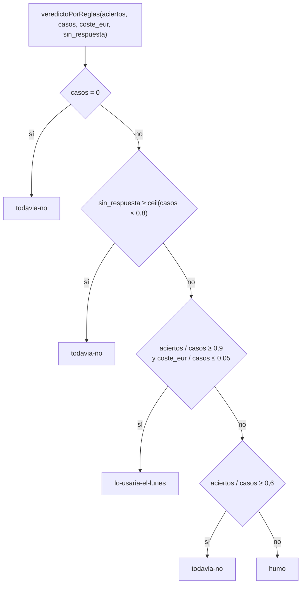

# Cómo se puntúa

La puntuación del kit es la del blog «A la última», regla por regla. El código de referencia es `src/pruebas/puntuar.ts` (comparadores y normalización) y `src/pruebas/index.ts` (umbrales, veredicto, nota, coste y tiempo) del pipeline del blog; `kit_pyme` los reproduce en Python y `tests/` comprueba que devuelve las mismas salidas con los mismos datos, incluidos los redondeos de JavaScript.

Índice: [Principios](#principios) · [Normalización](#normalización) · [Reglas por tarea](#reglas-por-tarea) · [Puntuar una tarea entera](#puntuar-una-tarea-entera) · [Veredicto](#veredicto) · [Nota](#nota) · [Coste](#coste) · [Segundos](#segundos) · [Redondeos](#redondeos) · [Diferencias entre JavaScript y Python](#diferencias-entre-javascript-y-python) · [Incoherencias conocidas](#incoherencias-conocidas)

## Principios

- **Reglas, no jueces.** Ningún modelo decide si otro modelo ha acertado. Cada regla es una comparación con la verdad escrita en `datos/*/*-verdad.json`.
- **Cada caso vale 1 o 0.** No hay puntos parciales. Un pedido con nueve líneas bien y una mal está mal.
- **El primer fallo corta** y se describe en una frase con el dato esperado y el obtenido, para que quien lea el post sepa qué pasó sin abrir el JSON.
- **La forma no penaliza.** Antes de comparar se normalizan mayúsculas, acentos, espacios, formatos de número y de fecha, y las referencias se reducen a letras y dígitos.
- **Lo que no se puntúa no cuenta.** Cada tarea puntúa dos o tres campos; el resto del esquema se pide al modelo pero no se compara (ver [Reglas por tarea](#reglas-por-tarea)).

## Normalización

Todas las comparaciones pasan por estas funciones. Las salidas de la tabla son las del código del blog ejecutado, y los tests de paridad las reproducen.

### `texto(v)`

Convierte cualquier valor a cadena: una cadena se deja igual; `null` o ausente es `""`; un objeto o un array se serializa como JSON compacto (sin espacios, claves en su orden, sin escapar caracteres no ASCII); un booleano es `true` o `false` en minúsculas; un número entero sin decimales (`1.0` → `1`).

### `normalizarTexto(v)`

Minúsculas, descomposición Unicode NFD y eliminación de los diacríticos (U+0300 a U+036F), toda secuencia de espacios en blanco a un espacio, y recorte por los dos lados. El conjunto de espacios en blanco es el de JavaScript, que incluye U+00A0, U+FEFF y los espacios tipográficos.

| Entrada | Salida |
|---|---|
| `"  Reclamación   URGENTE\n\tya "` | `reclamacion urgente ya` |
| `"Ñoras"` | `noras` |
| `"Straße"` | `straße` |
| `"İstanbul"` | `istanbul` |
| `null` | `` (vacío) |
| `24.5` | `24.5` |
| `true` | `true` |

### `normalizarReferencia(v)`

Mayúsculas y solo `A-Z` y `0-9`. No corrige errores de OCR: un `0` donde iba una `O` sigue siendo un `0`; eso es trabajo del modelo.

| Entrada | Salida |
|---|---|
| `"cons atun-ol_120."` | `CONSATUNOL120` |
| `"C0NS-ATUN-0L-1K"` | `C0NSATUN0L1K` |
| `"cons-ñora"` | `CONSORA` |
| `null` | `` (vacío) |

### `leerNumero(v)`

Un número se devuelve tal cual (si es finito). Una cadena: se quitan `€` y espacios; si termina en coma y una o dos cifras (`4.312,60`) se quitan los puntos y la coma pasa a punto; si termina en punto y una o dos cifras (`4312.60`) se quitan las comas; en cualquier otro caso se quitan puntos y comas. Después se convierte con las reglas de `Number()` de JavaScript. Cualquier otro tipo (booleano, objeto) no es un número.

| Entrada | Salida |
|---|---|
| `"4.312,60"` | 4312.6 |
| `"1.234 €"` | 1234 |
| `"1 234,56 €"` | 1234.56 |
| `"1,234"` | 1234 |
| `"12,345"` | 12345 |
| `"1e3"` | 1000 |
| `".5"`, `",5"` | 0.5 |
| `"-3,50"` | −3.5 |
| `"12abc"`, `"1_000"`, `"Infinity"`, `""`, `true`, `null` | no es un número |

### `leerFecha(v)`

Sobre el texto normalizado, en este orden: `AAAA-M-D` (con una o dos cifras en mes y día) → `AAAA-MM-DD`; `D/M/AAAA` con `/`, `.` o `-` → `AAAA-MM-DD`; `D de <mes> de AAAA` con los meses en español. Se acepta la primera coincidencia aunque esté dentro de un texto más largo. No se valida el calendario: `2026-13-45` se devuelve tal cual.

| Entrada | Salida |
|---|---|
| `"07/09/2026"`, `"7-9-2026"`, `"07.09.2026"`, `"2026-9-7"`, `"2026-09-07T00:00:00Z"` | `2026-09-07` |
| `"Vence el 3 de Noviembre de 2026"` | `2026-11-03` |
| `"Fecha: 2026-09-07; también 08/09/2026"` | `2026-09-07` (el formato ISO se busca primero) |
| `"31/12/2026 y 01/01/2027"` | `2026-12-31` |
| `"07/09/26"`, `"20260907"`, `"Septiembre 7, 2026"`, `"el 5 de sept de 2026"`, `12345` | no es una fecha |

### `formatearEuros(n)`

Dos decimales con el redondeo de `toFixed(2)` de JavaScript (sobre el valor binario exacto, empates hacia arriba en magnitud), coma decimal, punto de millar y ` €`.

| Entrada | Salida |
|---|---|
| 4312.6 | `4.312,60 €` |
| 2448 | `2.448,00 €` |
| 1234567.891 | `1.234.567,89 €` |
| 1.005 | `1,00 €` |
| 2.675 | `2,67 €` |
| 1.455 | `1,46 €` |
| 0.125 | `0,13 €` |
| 999.995 | `1.000,00 €` |
| −1234.5 | `-1.234,50 €` |

### `leerBooleano(v)`

Un booleano se devuelve tal cual. Sobre el texto normalizado: `true`, `si`, `sí`, `duplicada`, `yes` y `1` son verdadero; `false`, `no`, `0` y vacío son falso; cualquier otra cosa (`quizás`) no es ni lo uno ni lo otro y no coincide con ningún valor esperado. Consecuencia: `duplicada` ausente o `null` cuenta como `false`.

### `etiqueta(id)`

`pedido-06` → `Pedido 06`; `correo-03` → `Correo 03`; `factura-08` → `Factura 08`; `recordatorio-01` → `Recordatorio 01`. Un id que no siga el patrón `<letras>-<dígitos>` (como `p01`) se deja tal cual; los comparadores de contrato anteponen `Contrato ` por su cuenta.

### Cliente de un pedido

`clienteCoincide(esperado, obtenido)`: se normaliza el nombre esperado, se cambian `(`, `)`, `.` y `,` por espacios y se toman las palabras de cuatro letras o más que no estén en la lista de genéricas (`supermercados`, `distribuciones`, `restaurante`, `bar`, `cafeteria`, `bar-cafeteria`, `cooperativa`, `agricola`, `grupo`, `hostelero`, `catering`, `ultramarinos`, `cash`, `online`, `eventos`, `hijos`, `hermanos`, `coop`, `ltd`, `sl`, `slu`, `sa`, `v`). Acierta si alguna de esas palabras es subcadena del cliente obtenido normalizado. Un cliente obtenido vacío nunca acierta.

## Reglas por tarea

El detalle de cada regla, su orden y la frase de fallo exacta están en [`tareas.md`](tareas.md). Resumen:

| Tarea | Se puntúa | Tolerancias | No se puntúa |
|---|---|---|---|
| extraer-pedidos | Cliente; por cada línea esperada: referencia, cajas exactas, precio; líneas de más; líneas duplicadas; incidencias obligatorias | Precio ±0,011 €; referencia sin signos ni minúsculas; cliente por palabra significativa | `fecha_entrega`, texto de incidencias no obligatorias, orden de las líneas |
| resumir-correos | `categoria`, `urgencia` | Mayúsculas, acentos, espacios y `_` por `-` | `accion`, `resumen` |
| buscar-en-contrato | El dato (grupos de formas aceptadas) en `respuesta` + `clausula` + `cita`; la cláusula en `clausula` + `respuesta` | Formas alternativas listadas en la verdad; cláusula entera o apartado | Redacción; la cita no cuenta para la cláusula |
| clasificar-facturas | `total`, `vencimiento`, `duplicada` | Total ±0,011 €; fecha en cuatro formatos; booleano en texto | `proveedor`, `numero`, `fecha`, `base`, `iva`, `cuenta_sugerida` |
| redactar-recordatorio | Factura, importe y vencimiento (en varios formatos); expresiones obligatorias del tono; expresiones prohibidas; máximo 220 palabras; nombre de pila; `marjal` | Texto normalizado para todo salvo el recuento de palabras | Estilo, ortografía, asunto (solo cuenta como texto) |

## Puntuar una tarea entera

`puntuar(tarea, casos, respuestas)` recorre los casos en orden con la respuesta que les corresponde:

- Una respuesta **ausente** (`undefined` en JavaScript; en el kit, un caso sin línea en el JSONL, o cuya respuesta no cumplió el esquema) cuenta como fallo con el texto `<Etiqueta>: el modelo no devolvió una respuesta válida`. Para el contrato la etiqueta es el id tal cual (`p01: el modelo no devolvió una respuesta válida`).
- Una respuesta `null` sí llega al comparador y produce `no devolvió nada legible` (o `no escribió nada` en recordatorios).
- `aciertos` es el número de casos con `ok`. `fallos` son los tres primeros fallos en orden de caso; `todos_los_fallos`, todos.

Además del acierto, el ejecutor cuenta dos cosas que entran en el veredicto y en la nota:

- `sin_respuesta`: casos con error de llamada, o cuya respuesta fue `undefined` o `null`.
- `errores_servicio`: de esos, los que fueron un error HTTP 5xx o 429, o un fallo de red (sin respuesta del servidor), o un caso saltado porque el modelo no estaba disponible.

Los dos solo aparecen en `resultado.json` cuando son mayores que cero.

### El comando `puntuar` del kit

`python -m kit_pyme puntuar <tarea> <respuestas.jsonl>` lee una línea JSON por caso, `{"id": "<id del caso>", "respuesta": <objeto o null>}`. Un caso sin línea se puntúa como ausente. A cada respuesta que sea un objeto se le aplica el mismo rescate de claves parecidas y la misma validación de `required` que en el blog; si no cumple el esquema se trata como ausente y suma en `sin_respuesta`, porque en el blog una respuesta así nunca llega a puntuarse. `segundos` y `coste_eur` salen a 0 salvo que las líneas del JSONL traigan `uso` (tokens) y `segundos`, una extensión del kit para quien mide a mano.

## Veredicto

Los umbrales son constantes del código del blog:

| Umbral | Valor |
|---|---|
| `aciertos_lunes` | 0,9 (90 % de los casos) |
| `aciertos_humo` | 0,6 (60 %) |
| `coste_caso_lunes_eur` | 0,05 € por caso |



`ceil(casos × 0,8)` vale 16 para 20 casos, 24 para 30, 12 para 15, 20 para 25 y 8 para 10. Casos de borde comprobados en los tests:

| Aciertos / casos | Coste | Sin respuesta | Veredicto |
|---|---|---|---|
| 20 / 20 | 0,50 € | 0 | lo-usaria-el-lunes |
| 20 / 20 | 2,00 € (10 céntimos por caso) | 0 | todavia-no |
| 18 / 20 | 1,00 € (justo 5 céntimos por caso) | 0 | lo-usaria-el-lunes |
| 12 / 20 | 0,10 € | 0 | todavia-no (justo el 60 %) |
| 11 / 20 | 0,10 € | 0 | humo |
| 0 / 0 | 0 | 0 | todavia-no |
| 0 / 25 | 0 | 20 (el 80 %) | todavia-no |
| 0 / 25 | 0 | 19 (el 76 %) | humo |
| 15 / 20 (W37, pedidos) | 0,3822 € | 0 | todavia-no |
| 24 / 25 (W37, facturas) | 0,1428 € | 0 | lo-usaria-el-lunes |

## Nota

`notaPorReglas(veredicto, aciertos, casos, coste_eur, fallos, sin_respuesta, errores_servicio)` devuelve una de estas frases, en este orden de prioridad. `{c}` es el coste por caso en céntimos con un decimal y coma (`0,6`, `5,0`); `{ejemplo}` es ` Ejemplo: <primer fallo>.` si hay fallos y nada si no.

| Condición | Frase |
|---|---|
| `errores_servicio ≥ ceil(casos × 0,8)` | `El servicio no contestó en {errores_servicio} de {casos} casos (errores de red o del proveedor): no se ha medido nada. Lo repetiremos.` |
| `sin_respuesta ≥ ceil(casos × 0,8)` | `No devolvió una respuesta que se pudiera leer en {sin_respuesta} de {casos} casos. Puede ser cosa de cómo se lo pedimos y no de lo que sabe: lo repetiremos antes de darlo por malo.` |
| lo-usaria-el-lunes, sin fallos | `Acertó los {casos} casos a {c} céntimos por caso; lo pondría a trabajar el lunes con alguien mirando por encima la primera semana.` |
| lo-usaria-el-lunes, con fallos | `Acertó {aciertos} de {casos} a {c} céntimos por caso; sirve el lunes si una persona repasa los casos con incidencia.{ejemplo}` |
| todavia-no, con el 90 % o más de aciertos | `Acierta ({aciertos} de {casos}) pero sale a {c} céntimos por caso: para este volumen no compensa frente a hacerlo a mano.` |
| todavia-no, resto | `Falló {casos − aciertos} de {casos}: hay que revisar cada resultado y entonces no ahorra tiempo.{ejemplo}` |
| humo | `Falló {casos − aciertos} de {casos}; no vale para esto todavía.{ejemplo}` |

Las dos notas publicadas en la semana 2026-W37 salen de ahí: 0,3822 € entre 20 casos son 1,911 céntimos, y la nota de pedidos es `Falló 5 de 20: hay que revisar cada resultado y entonces no ahorra tiempo. Ejemplo: Pedido 06: en CONS-BONI-OL-220 puso 34,22 € donde la tarifa dice 37,20 €.`; 0,1428 € entre 25 son 0,5712 céntimos, que se muestran como `0,6`, y la nota de facturas es `Acertó 24 de 25 a 0,6 céntimos por caso; sirve el lunes si una persona repasa los casos con incidencia. Ejemplo: Factura 08: vencimiento 2026-10-05 donde tocaba 05/09/2026.`

## Coste

El coste no es la factura del proveedor: es una estimación a partir de los tokens que devuelve la API (`usage.prompt_tokens` y `usage.completion_tokens`) y una tabla de precios en euros por millón de tokens.

```text
coste_caso = (tokens_entrada × precio_entrada + tokens_salida × precio_salida) / 1 000 000
coste_eur  = round4(suma de coste_caso de todos los casos y todos los intentos)
```

- Se suman **todos los intentos**, también los descartados por no ser JSON o no cumplir el esquema, y los de los casos que acabaron con error. Es lo que se ha pagado.
- `round4` es el redondeo de JavaScript `Math.round(x × 10000) / 10000` (0,38215 → 0,3822; 0,14275 → 0,1427).
- El precio se busca por el nombre de modelo que **devuelve la API** (`json.model`), normalizado: si lleva `/` se usa tal cual; si contiene `claude` se antepone `anthropic/`; si contiene `gpt` u `o` seguido de un dígito, `openai/`; si contiene `gemini`, `google/`; si no, se usa el nombre pedido. Si el nombre no está en la tabla se aplica `por_defecto`.

La tabla del kit (`precios.json`) es una copia de la del blog y se puede editar. Valores de la versión 1.0.0:

| Modelo | Entrada (€/M tokens) | Salida (€/M tokens) |
|---|---:|---:|
| `anthropic/claude-haiku-4-5` | 0,9 | 4,5 |
| `anthropic/claude-sonnet-5` | 2,8 | 14 |
| `anthropic/claude-opus-5` | 14 | 70 |
| `por_defecto` | 3 | 15 |

Ejemplos comprobados: Haiku con 3.000 tokens de entrada y 400 de salida → 0,0045 €; `openai/gpt-6` con los mismos tokens → 0,015 € (tarifa por defecto); `anthropic/claude-haiku-4-5-20251001` → 0,015 €, porque el nombre con fecha no está en la tabla y cae en `por_defecto`.

Ese último caso importa para leer las cifras publicadas: 0,3822 € por 20 pedidos con Haiku son 1,9 céntimos por caso, lo que cuadra con la tarifa por defecto (unos 3.300 tokens de entrada y 600 de salida por caso), no con la de Haiku (saldría medio céntimo). La explicación más probable es que la API devolvió el nombre del modelo con fecha. El kit no lo corrige, porque dejaría de calcular lo mismo que el blog; está anotado en `CHANGELOG.md` como propuesta para el blog (añadir alias en su tabla) y, cuando cambie, cambiará aquí en la misma versión.

## Segundos

`segundos` es el tiempo de pared del **lote completo**: se arranca un cronómetro antes de lanzar el primer caso y se para cuando ha terminado el último. Los casos se lanzan con **cuatro en vuelo** a la vez, conservando el orden. El valor se redondea a un decimal con `Math.round(ms / 100) / 10` (16.850 ms → 16,9; 16.950 → 17; 149 → 0,1; 150 → 0,2).

Por eso los segundos dependen de la concurrencia, de la red y de la carga del proveedor en ese momento, y por eso la misma tarea con el mismo modelo dio 16,9, 17,5 y 18,2 s en tres tiradas del mismo día con los mismos aciertos. El blog mide desde un Worker de Cloudflare; el kit mide desde tu máquina. Para comparar, usa la misma concurrencia (4, que es la del ejecutor por defecto) y toma los segundos como orden de magnitud, no como cifra exacta. Cada caso guarda además su propio tiempo sin redondear en el detalle de la ejecución.

## Redondeos

El blog está escrito en JavaScript y el kit en Python; los redondeos no coinciden por defecto y el kit emula los de JavaScript. Valores comprobados por los tests:

| Operación | Entrada | Salida |
|---|---|---|
| `Math.round(x × 10000) / 10000` (coste) | 0,38215 · 0,38225 · 0,14275 · 0,000025 | 0,3822 · 0,3823 · 0,1427 · 0 |
| `Math.round(ms / 100) / 10` (segundos) | 16850 · 16950 · 16949 · 10450 · 149 · 150 | 16,9 · 17 · 16,9 · 10,5 · 0,1 · 0,2 |
| `toFixed(1)` (céntimos de la nota) | 0,05 · 0,15 · 0,25 · 0,35 · 0,45 · 2,675 · 0,5712 | 0,1 · 0,1 · 0,3 · 0,3 · 0,5 · 2,7 · 0,6 |
| `toFixed(2)` (euros) | 1,005 · 2,675 · 1,455 · 0,125 · 8,345 · 24,285 · 0,615 | 1,00 · 2,67 · 1,46 · 0,13 · 8,35 · 24,29 · 0,61 |
| `Math.ceil(casos × 0,8)` | 10 · 15 · 20 · 25 · 30 | 8 · 12 · 16 · 20 · 24 |

`toFixed` redondea el valor binario exacto del número con empates hacia arriba en magnitud; en Python equivale a `Decimal(x).quantize(..., ROUND_HALF_UP)` sobre el `float`, no a `round()` ni a `Decimal(str(x))`. `Math.round` redondea el `.5` hacia arriba (hacia +∞), no al par.

## Diferencias entre JavaScript y Python

Las que afectan a la paridad y cómo las resuelve el kit:

| Punto | JavaScript (blog) | Python (kit) |
|---|---|---|
| `\s` en expresiones regulares | Incluye U+FEFF (BOM) y los espacios Unicode | El kit usa una clase explícita con el mismo conjunto |
| `\d` | Solo `0-9` | El kit usa `[0-9]`, no `\d` (que en Python acepta otros dígitos Unicode) |
| `String(true)` | `true` | `str(True)` sería `True`; el kit escribe `true` |
| JSON de un `float` entero | `1` | `json.dumps(1.0)` sería `1.0`; el kit escribe `1` |
| `toFixed`, `Math.round` | Ver [Redondeos](#redondeos) | Emulados con `Decimal` |
| `slice(0, 80)` en la frase de fallo del contrato | Cuenta unidades UTF-16 | Cuenta puntos de código. Solo difiere si la respuesta lleva emoji u otros caracteres fuera del plano básico en los primeros 80; se documenta y no se corrige |

## Incoherencias conocidas

- **200 frente a 220 palabras.** El prompt de `redactar-recordatorio` pide «menos de 200 palabras»; la regla que puntúa admite hasta 220 (`max_palabras` en la verdad). Manda la regla. No se cambia el prompt porque las cifras publicadas se midieron con él.
- **Nombre de modelo con fecha y tarifa por defecto.** Ver [Coste](#coste).
- **`temperature` en la familia Claude 5.** El banco del blog aprende de un 400 que el modelo no la admite y repite sin ella; el kit hace lo mismo. Los modelos que sí la admiten reciben siempre `0`.
