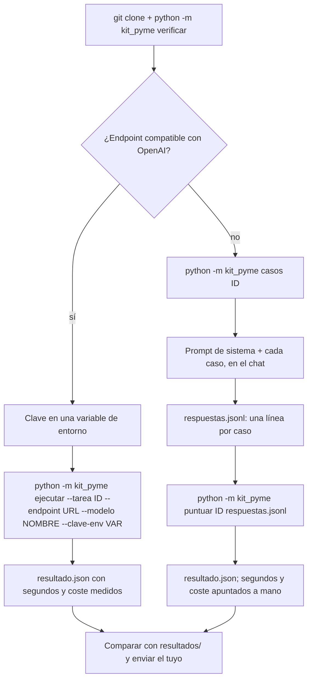

**Español** · [English](en/reproducir.md)

# Cómo repetir la prueba con tu herramienta

Este documento es el paso a paso para obtener, con tu herramienta, un `resultado.json` comparable con los del blog. Hay dos caminos: **con API** (tu herramienta expone un endpoint compatible con OpenAI: Anthropic, OpenAI, Google, Mistral, un servidor local, un proxy de tu empresa) y **sin API** (un chat en el navegador, un asistente integrado en tu ERP, una herramienta que te han vendido y que no sabes cómo llamar). La puntuación es la misma en los dos.



## 0. Antes de empezar

Hace falta Python 3.11 o superior. El paquete no tiene dependencias fuera de la biblioteca estándar y no hay que instalar nada: los comandos se ejecutan desde la raíz del repositorio.

```bash
git clone https://github.com/Bytenauta-Org/Kit_de_la_pyme.git
cd Kit_de_la_pyme
```

Después, comprueba que la copia es la publicada y mira qué tareas hay:

```console
$ python -m kit_pyme verificar
OK   datos/ y los prompts son los publicados (checksums y sha256 correctos).
$ python -m kit_pyme tareas
id                     casos  max_tokens  nombre
extraer-pedidos           20        6000  Sacar las líneas de 20 pedidos tal como llegan por correo
resumir-correos           30        4000  Clasificar 30 correos del buzón de administración y decir qué hay que hacer
buscar-en-contrato        15        4000  Responder 15 preguntas sobre un contrato de suministro de 60 páginas
clasificar-facturas       25        4000  Contabilizar 25 facturas recibidas: total, vencimiento y si ya estaba registrada
redactar-recordatorio     10        4000  Escribir 10 recordatorios de cobro con el tono que toca
```

`verificar` comprueba que los 85 ficheros de `datos/` son byte a byte los de la versión publicada y que los cinco prompts que se componen con ellos dan el SHA-256 publicado. Si algo no cuadra lo dice fichero a fichero y devuelve código de salida 1: entonces las cifras que midas no son comparables con las del blog.

Elige una tarea. Para una primera prueba, `clasificar-facturas` (25 casos, prompt corto, resultado fácil de leer) o `resumir-correos` (30 casos, la más barata). `buscar-en-contrato` es la más cara: el contrato entero (188 KB, del orden de 50.000 tokens) viaja en cada una de las 15 preguntas.

## 1. Con API

### 1.1 La clave

La clave de la API va en una variable de entorno; el ejecutor la lee por su nombre (`--clave-env`) y nunca la escribe en pantalla ni en `resultado.json`. No la pongas en la línea de comandos ni en un fichero del repositorio.

```bash
# Linux y macOS
export ANTHROPIC_API_KEY="..."
# PowerShell
$env:ANTHROPIC_API_KEY = "..."
```

### 1.2 Ejecutar

```bash
python -m kit_pyme ejecutar --tarea clasificar-facturas --endpoint https://api.anthropic.com/v1/chat/completions --modelo claude-haiku-4-5 --clave-env ANTHROPIC_API_KEY
```

**`--endpoint` se puede omitir** cuando el id del modelo lleva prefijo de proveedor conocido: `anthropic/`, `openai/`, `google/` o `google-ai-studio/`. Un id sin barra se toma como de Anthropic. Los tres endpoints están en `kit_pyme/cliente.py` y son los mismos de la tabla de abajo, así que esto hace lo mismo que la orden anterior:

```bash
python -m kit_pyme ejecutar --tarea clasificar-facturas --modelo anthropic/claude-haiku-4-5 --clave-env ANTHROPIC_API_KEY
```

**Antes de pagar los 25 casos, prueba 3.** `--casos N` ejecuta solo los N primeros y marca el resultado como muestra, para que no se confunda con una tirada completa:

```bash
python -m kit_pyme ejecutar --tarea clasificar-facturas --modelo anthropic/claude-haiku-4-5 --clave-env ANTHROPIC_API_KEY --casos 3
```

La primera línea que imprime dice contra qué se está midiendo, y conviene leerla antes de que empiece a gastar:

```text
clasificar-facturas: 3 casos contra anthropic/claude-haiku-4-5 en https://api.anthropic.com/v1/chat/completions (concurrencia 4)
```

Qué hace, en orden: compone el prompt de sistema de la tarea (con los ficheros de datos dentro y la línea `FORMATO`), prepara los casos, arranca el cronómetro, envía los casos al endpoint con cuatro en vuelo a la vez y `temperature: 0`, extrae y valida el JSON de cada respuesta (hasta tres intentos por caso), puntúa cada caso, para el cronómetro, suma los tokens de todos los intentos, estima el coste con `precios.json` y escribe `resultado.json` en el directorio actual con esta forma:

```json
{
  "novedad_url": "",
  "modelo": "claude-haiku-4-5",
  "tarea": "clasificar-facturas",
  "tarea_nombre": "Contabilizar 25 facturas recibidas: total, vencimiento y si ya estaba registrada",
  "casos": 25,
  "aciertos": 24,
  "fallos": ["Factura 08: vencimiento 2026-10-05 donde tocaba 05/09/2026"],
  "segundos": 10.5,
  "coste_eur": 0.1428,
  "veredicto": "lo-usaria-el-lunes",
  "nota": "Acertó 24 de 25 a 0,6 céntimos por caso; sirve el lunes si una persona repasa los casos con incidencia. Ejemplo: Factura 08: vencimiento 2026-10-05 donde tocaba 05/09/2026."
}
```

`sin_respuesta` y `errores_servicio` se añaden solo si son mayores que cero. Es la misma forma (`ResultadoPrueba`) y el mismo orden de claves que usa el blog, con `novedad_url` vacío. Junto a `resultado.json` el ejecutor deja el detalle de cada caso (respuesta del modelo, esperado, fallo, segundos y tokens) para que puedas ver qué pasó en cada uno.

### 1.3 Endpoints

| Proveedor o servidor | `--endpoint` | `--modelo` (ejemplo) | `--clave-env` |
|---|---|---|---|
| Anthropic | `https://api.anthropic.com/v1/chat/completions` | `claude-haiku-4-5`, `claude-sonnet-5` | `ANTHROPIC_API_KEY` |
| OpenAI | `https://api.openai.com/v1/chat/completions` | el nombre del modelo que quieras probar | `OPENAI_API_KEY` |
| Google (Gemini, API compatible) | `https://generativelanguage.googleapis.com/v1beta/openai/chat/completions` | `gemini-…` | `GOOGLE_API_KEY` |
| Ollama en local | `http://localhost:11434/v1/chat/completions` | el nombre del modelo cargado | cualquier variable con cualquier valor |
| LM Studio en local | `http://localhost:1234/v1/chat/completions` | el nombre del modelo cargado | cualquier variable con cualquier valor |
| vLLM u otro servidor compatible | `http://<host>:<puerto>/v1/chat/completions` | según el servidor | según el servidor |
| Un proxy o gateway de tu empresa | la URL de `chat/completions` de tu proxy | según el proxy | según el proxy |

El ejecutor envía la petición estándar de `chat/completions`: `model`, `messages` (`system` y `user`), `max_tokens` y `temperature: 0`, con cabecera `authorization: Bearer <clave>`. No envía `response_format`, igual que el blog en modo directo. Si el modelo rechaza `temperature` con un 400 que lo diga, se repite sin ella.

Los tres endpoints de proveedor de la tabla son los mismos que usa el blog. Un endpoint compatible pero con diferencias (por ejemplo, que no devuelva `usage`) funciona, pero el coste saldrá a 0 porque no hay tokens que contar.

### 1.4 Precios

El coste es una estimación: tokens de entrada y salida que devuelve la API multiplicados por la tabla `precios.json` del paquete (euros por millón de tokens). La tabla de la versión 1.0.0 es la del blog: Haiku 4.5 (0,9 / 4,5), Sonnet 5 (2,8 / 14), Opus 5 (14 / 70) y `por_defecto` (3 / 15). Si tu modelo no está, añádelo con el nombre exacto que devuelve la API en `model`; si no lo añades, se aplica `por_defecto` y el fichero de resultado no lo avisa. Detalles en [`puntuacion.md`](puntuacion.md#coste).

### 1.5 Qué pasa cuando algo falla

| Situación | Comportamiento (el mismo que el blog) |
|---|---|
| Error de red | Espera 0,5 s × intento y repite, hasta tres intentos |
| HTTP 429 o 5xx | Espera 0,8 s × intento y repite, hasta tres intentos |
| HTTP 4xx distinto de 429 (modelo inexistente, clave mala, sin permiso) | Aborta la tarea entera con código de salida distinto de cero y el mensaje `el endpoint respondió <estado> para <modelo>: no disponible por API todavía`. No hay `resultado.json` |
| La respuesta no es JSON o no cumple el esquema | Se paga, se descarta y se repite; al tercer intento el caso queda sin respuesta y la tarea sigue |
| Respuesta vacía | Se repite |

Un caso sin respuesta cuenta como fallo y suma en `sin_respuesta`. Si el 80 % o más de los casos quedan sin respuesta, el veredicto es `todavia-no` con una nota que dice que no se ha medido nada.

Los mensajes van a `stderr` y el código de salida distingue el motivo. Estos son literales:

```console
$ python -m kit_pyme ejecutar --tarea clasificar-facturas --modelo anthropic/claude-haiku-4-5 --clave-env NO_EXISTE_ESTA_VARIABLE
kit_pyme: la variable de entorno NO_EXISTE_ESTA_VARIABLE está vacía o no existe
$ echo $?
1

$ python -m kit_pyme ejecutar --tarea clasificar-facturas --modelo un-modelo-raro
clasificar-facturas: 25 casos contra un-modelo-raro en https://api.anthropic.com/v1/chat/completions (concurrencia 4)
kit_pyme: el endpoint respondió 401 para un-modelo-raro: no disponible por API todavía
  respuesta: {"error":{"code":"authentication_error","message":"Invalid Anthropic API Key","type":"invalid_request_error","param":null}}
$ echo $?
3
```

El **3** es «este modelo no está disponible por API», y es distinto del 1 de cualquier otro error para que un script que recorre varios modelos pueda saltarse ese y seguir. En ninguno de los dos casos se escribe `resultado.json`.

Y los dos errores de escritura que más se dan al empezar:

```console
$ python -m kit_pyme casos facturas
kit_pyme: tarea desconocida: facturas (no existe .../tareas/facturas/tarea.json)
$ python -m kit_pyme casos clasificar-facturas --id factura-99
kit_pyme: no hay ningún caso «factura-99» en clasificar-facturas
```

### 1.6 Coste orientativo por tarea

Con la tarifa de Haiku 4.5 y una respuesta normal, el orden de magnitud es: pedidos, entre 0,1 y 0,4 € (el prompt lleva la tarifa y los clientes); correos, unos céntimos; facturas, entre 0,05 y 0,15 €; recordatorios, unos céntimos; contrato, entre 0,7 y 2,5 € según la tarifa que se aplique (0,8 millones de tokens de entrada). Con un modelo grande, multiplica por 3 a 15.

## 2. Sin API

### 2.1 Sacar los casos

```bash
python -m kit_pyme casos resumir-correos            # los 30, uno detrás de otro
python -m kit_pyme casos resumir-correos --id correo-14   # solo ese
python -m kit_pyme casos resumir-correos --jsonl    # una línea JSON {id, entrada} por caso
```

Sin opciones imprime la entrada de cada caso precedida de su id, así:

```console
$ python -m kit_pyme casos buscar-en-contrato --id p01
===== p01 =====
¿En qué plazo tiene que pagar Serrano las facturas de Marjal Blanca?
```

Cópialas de una en una. Para pedidos, correos y facturas la entrada es el fichero `.txt` de `datos/` tal cual, así que también puedes abrir el fichero directamente. `--jsonl` es la forma de dárselas a un script tuyo: una línea JSON por caso, sin cabeceras ni separadores que haya que quitar después.

### 2.2 El prompt de sistema

No lo copies del JSON a mano: hay una orden que lo compone.

```bash
python -m kit_pyme prompt resumir-correos              # con la línea FORMATO, que es lo que se envía
python -m kit_pyme prompt resumir-correos --sin-formato  # solo el prompt de la tarea
```

El prompt de sistema está en `tareas/<id>/tarea.json`, campo `prompt`. Donde lleva un marcador `{{datos/...}}` va el contenido íntegro de ese fichero (para pedidos, `tarifa.csv` y `clientes.csv`; para facturas, `registro-previo.csv`; para el contrato, `contrato.txt` entero), y eso es lo que `prompt` sustituye. Detrás va la línea `FORMATO` con las claves obligatorias del esquema, que en `clasificar-facturas` es esta:

```text
FORMATO DE LA RESPUESTA: un solo objeto JSON con exactamente estas claves, escritas así: proveedor, numero, fecha, base, iva, total, vencimiento, cuenta_sugerida, duplicada. Sin otras claves, sin comentarios y sin texto antes ni después.
```

El texto completo de cada prompt, con los marcadores y la línea `FORMATO`, está en [`tareas.md`](tareas.md).

En un chat, pega el prompt de sistema como primer mensaje (o en las instrucciones personalizadas o del proyecto, si tu herramienta las tiene) y después cada caso como un mensaje nuevo. Lo más fiel es una conversación nueva por caso, porque el blog no da al modelo memoria entre casos. Para el contrato, si el chat no admite 188 KB en un mensaje, adjunta `contrato.txt` como fichero y deja el prompt sin el marcador; anótalo al enviar el resultado, porque no es exactamente lo que mide el blog.

### 2.3 Guardar las respuestas

Un fichero de texto, `respuestas.jsonl`, con una línea JSON por caso:

```json
{"id": "correo-01", "respuesta": {"categoria": "reclamacion", "urgencia": "media", "accion": "...", "resumen": "..."}}
{"id": "correo-02", "respuesta": {"categoria": "consulta", "urgencia": "media", "accion": "...", "resumen": "..."}}
```

- `respuesta` es el objeto JSON que devolvió la herramienta. Si contestó con texto alrededor del JSON, pega solo el JSON.
- Si no contestó o contestó algo que no se puede convertir en JSON, pon `"respuesta": null` o no escribas la línea: el caso contará como sin respuesta, igual que en el blog.
- Los ids son los de `casos`: `pedido-01`, `correo-01`, `p01`, `factura-01`, `recordatorio-01`.
- Para `redactar-recordatorio`, si la herramienta devuelve el correo como texto y no como JSON, pon el texto como cadena en `respuesta`: se puntúa igual.
- Si quieres que `resultado.json` lleve tiempo y coste, añade a cada línea `"segundos": <número>` y `"uso": {"tokens_entrada": <n>, "tokens_salida": <n>}`. Es una extensión del kit; el blog no la usa.

El fichero se lee en UTF-8 y admite marca de orden de bytes (BOM) y saltos de línea CRLF, que es lo que dejan el Bloc de notas y `Out-File -Encoding utf8` de PowerShell 5.1. No hace falta convertirlo a nada.

### 2.4 Puntuar

```bash
python -m kit_pyme puntuar resumir-correos respuestas.jsonl
python -m kit_pyme puntuar resumir-correos respuestas.jsonl --modelo "ChatGPT web, 8 de septiembre" --salida .
```

Sin `--salida` imprime la tabla y no escribe nada. Así se ve, con las respuestas correctas que trae el propio repositorio en `tests/oro/respuestas-verdad/`:

```console
$ python -m kit_pyme puntuar clasificar-facturas tests/oro/respuestas-verdad/clasificar-facturas.jsonl
Tarea      clasificar-facturas — Contabilizar 25 facturas recibidas: total, vencimiento y si ya estaba registrada
Modelo     (sin modelo)
Casos      25
Aciertos   25 de 25
Segundos   0
Coste      0 €
Veredicto  lo-usaria-el-lunes
Nota       Acertó los 25 casos a 0,0 céntimos por caso; lo pondría a trabajar el lunes con alguien mirando por encima la primera semana.
```

Es la manera de comprobar, antes de gastar nada, que tu copia del kit puntúa igual que la nuestra. En [`puntuacion.md`](puntuacion.md#comprobar-que-tu-copia-puntúa-igual-sin-llamar-a-ningún-modelo) está el mismo ejercicio estropeando un dato a propósito, que devuelve la frase de fallo que se publicó en el blog.

Con `--salida <carpeta>` escribe `resultado.json` con la misma forma que `ejecutar`, aplicando a cada respuesta el mismo rescate de claves parecidas y la misma validación de esquema que el blog. Sin `segundos` ni `uso` en el JSONL, `segundos` y `coste_eur` salen a 0 y el veredicto se calcula con coste 0 (es decir, solo con la tasa de aciertos).

### 2.5 Tiempo y coste a mano

- **Segundos**: el blog mide el lote entero con cuatro casos en paralelo. A mano, cronometra desde que envías el primer caso hasta que recibes el último, y di cómo lo hiciste. No es comparable con el del blog; es un orden de magnitud.
- **Coste**: si pagas una suscripción, divide la cuota mensual entre el número de peticiones que le haces al mes y multiplícalo por los casos. Si la herramienta te da tokens, usa `precios.json`.

## 3. Referencia de la CLI

Seis subcomandos. Solo `ejecutar` sale a la red; los otros cinco funcionan sin conexión y sin clave.

```console
$ python -m kit_pyme --help
usage: python -m kit_pyme [-h] [--raiz RAIZ] [--version] orden ...

El kit de la pyme: banco de pruebas del blog «A la última» de Bytenauta.

positional arguments:
  orden
    tareas     lista las tareas del kit
    casos      imprime la entrada de cada caso de una tarea
    prompt     imprime el mensaje de sistema que se envía al modelo
    puntuar    puntúa respuestas dadas en un jsonl
    ejecutar   llama a un modelo caso a caso y escribe resultado.json
    verificar  comprueba los checksums de datos/ y los prompts

options:
  -h, --help   show this help message and exit
  --raiz RAIZ  carpeta con datos/ y tareas/ (por defecto se busca sola)
  --version    show program's version number and exit
```

Las dos opciones globales van antes del subcomando: `--raiz` sirve para ejecutar el kit desde otro directorio (`python -m kit_pyme --raiz ../Kit_de_la_pyme tareas`) y `--version` imprime `kit_pyme 1.0.0`.

| Orden | Argumentos | Opciones | Qué imprime o escribe |
|---|---|---|---|
| `tareas` | — | — | Una línea por tarea: id, casos, `max_tokens` y nombre |
| `casos` | `<tarea>` | `--id <caso>` (solo ese caso) · `--jsonl` (una línea `{id, entrada}` por caso) | La entrada de cada caso, la que va como mensaje de usuario |
| `prompt` | `<tarea>` | `--sin-formato` (sin la línea `FORMATO` del final) | El mensaje de sistema completo, con los ficheros de datos ya sustituidos |
| `puntuar` | `<tarea> <respuestas.jsonl>` | `--modelo <texto>` (etiqueta del resultado) · `--salida <carpeta>` (escribe `resultado.json` y `detalle.json`) · `--json` (imprime el JSON en vez de la tabla) | La tabla de aciertos, veredicto y fallos |
| `ejecutar` | — | `--tarea` y `--modelo` obligatorias; ver la tabla de abajo | `resultado.json` y `detalle.json`, más la tabla |
| `verificar` | — | `--regenerar` (reescribe `CHECKSUMS.sha256`; solo al subir la versión del kit) | Una línea `OK`, o una línea `MAL` por problema |

Opciones de `ejecutar`, que es la única que gasta dinero:

| Opción | Por defecto | Para qué |
|---|---|---|
| `--tarea <id>` | obligatoria | Qué tarea se mide |
| `--modelo <id>` | obligatoria | Id del modelo, con prefijo de proveedor o sin él (`anthropic/claude-haiku-4-5`) |
| `--endpoint <url>` | el del proveedor del id | URL de `chat/completions`. Solo hace falta si el proveedor no es `anthropic`, `openai`, `google` ni `google-ai-studio` |
| `--clave-env <VAR>` | ninguna | Nombre de la variable de entorno con la clave. La clave nunca se escribe en pantalla ni en los ficheros de salida |
| `--modelo-api <nombre>` | el id sin el proveedor | Lo que se envía en el campo `model` de la petición, cuando el servidor espera otro nombre |
| `--casos <N>` | todos | Ejecuta solo los N primeros casos y marca el resultado como muestra |
| `--concurrencia <N>` | 4 | Casos en vuelo a la vez. Cambiarla cambia el significado de `segundos` y las cifras dejan de ser comparables |
| `--tiempo-maximo <s>` | 300 | Segundos de espera por respuesta |
| `--precios <fichero>` | `kit_pyme/precios.json` | Tabla de precios en euros por millón de tokens |
| `--salida <carpeta>` | el directorio actual | Dónde se escriben `resultado.json` y `detalle.json` |
| `--novedad-url <url>` | vacía | La novedad que se está probando, para el campo `novedad_url` del resultado |
| `--json` | — | Imprime también el `resultado.json` por pantalla |

Códigos de salida: **0** si todo fue bien, **1** ante cualquier error (tarea desconocida, caso inexistente, variable de entorno vacía, datos alterados) y **3** cuando el endpoint responde que el modelo no está disponible. El 3 existe para que un script que recorre varios modelos pueda saltarse ese y seguir con el siguiente.

## 4. Comparar

Para que dos resultados sean comparables tienen que coincidir tres cosas: la **versión de los datos** (`verificar` en verde y `kit_datos_version` en el fichero de resultados), la **tarea** (mismo prompt, mismo esquema, mismos casos) y la **puntuación** (la del kit, que es la del blog). Con eso, aciertos y fallos son comparables directamente; segundos y coste, con las reservas de arriba.

Los resultados del blog están en `resultados/`, un fichero por número, con la procedencia. El primero es [`resultados/2026-W37.json`](../resultados/2026-W37.json): Haiku 4.5, 15 de 20 en pedidos y 24 de 25 en facturas.

Si repites exactamente la prueba del blog (mismo modelo, mismo endpoint de Anthropic, datos 1.0.0) espera los mismos aciertos o una diferencia de uno o dos casos: `temperature: 0` reduce la variabilidad pero no la elimina, y los proveedores cambian versiones sin cambiar el nombre. Los segundos cambiarán seguro.

## 5. Enviar el resultado

Abre un issue con la plantilla **Resultado con tu herramienta** e incluye: el `resultado.json`, la herramienta y el modelo (con la versión si la sabes), la fecha, si fue con API o sin ella, la salida de `verificar`, y cualquier diferencia respecto al procedimiento (contrato adjuntado en vez de pegado, conversación única en vez de una por caso, prompt traducido). Los resultados que cumplan el procedimiento se guardan en `resultados/terceros/` como se explica en [`resultados/README.md`](../resultados/README.md).

## 6. El zip antiguo

Hasta el 08-09-2026 el blog enlazaba un zip con los datos (`kit-de-la-pyme.zip`) en lugar de este repositorio. Ese zip contiene los mismos datos de la versión 1.0.0 sin el ejecutor ni los esquemas. La página del blog sobre el kit, [bytenauta.com/kit-y-pruebas](https://bytenauta.com/kit-y-pruebas/), enlaza aquí.
