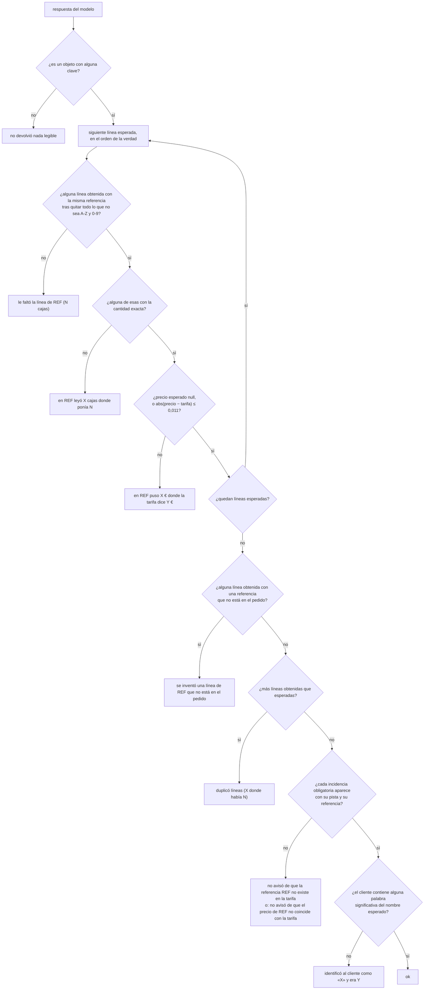
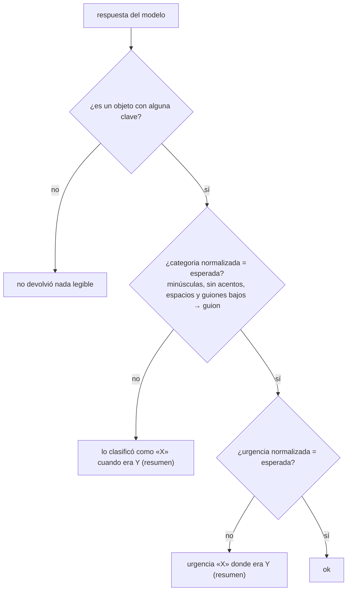
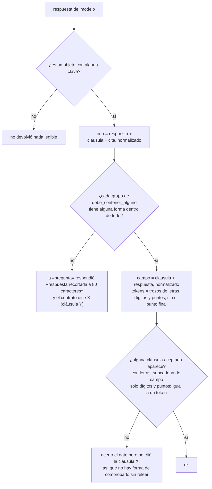
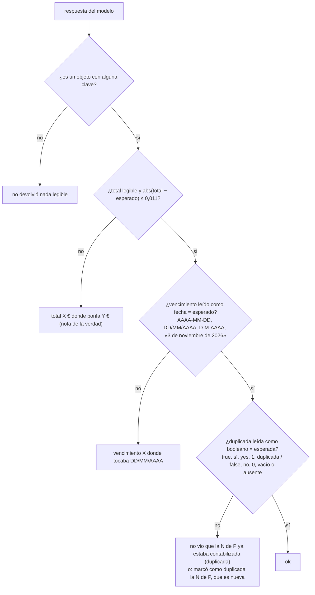
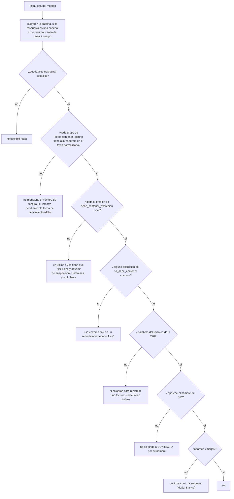

**Español** · [English](en/tareas.md)

# Las cinco tareas

Este documento describe cada tarea del kit tal como la ejecuta y la puntúa el blog «A la última»: el prompt de sistema literal, el esquema JSON de la respuesta, cómo se construye la entrada de cada caso, qué fichero tiene la respuesta correcta y el criterio exacto de acierto con la frase de fallo que produce cada regla. La fuente es el código del pipeline del blog (`src/pruebas/tareas.ts` y `src/pruebas/puntuar.ts`); el paquete `kit_pyme` lo reproduce y los tests de `tests/` comprueban la paridad contra las salidas reales de ese código.

Índice: [Lo común a todas](#lo-común-a-todas) · [Verlo desde la terminal](#verlo-desde-la-terminal) · [extraer-pedidos](#1-extraer-pedidos) · [resumir-correos](#2-resumir-correos) · [buscar-en-contrato](#3-buscar-en-contrato) · [clasificar-facturas](#4-clasificar-facturas) · [redactar-recordatorio](#5-redactar-recordatorio) · [Verificación de los prompts](#verificación-de-los-prompts)

## Lo común a todas

### Qué es una tarea

Una tarea tiene un `id`, un `nombre` (el que sale en el post), una `descripcion` de una frase, un `prompt` de sistema, un `esquema` (JSON Schema de la respuesta), un `max_tokens` y una regla para preparar sus casos. Cada caso tiene un `id`, una `entrada` (el mensaje de usuario que se envía al modelo) y un `esperado` (el objeto correspondiente del fichero `*-verdad.json`, sin tocar).

En este repositorio cada tarea vive en `tareas/<id>/tarea.json`. El campo `prompt` es el texto del código del blog; donde el blog interpola un fichero de datos, el JSON lleva un marcador con la ruta (`{{datos/pedidos/tarifa.csv}}`) que el ejecutor sustituye por el contenido íntegro del fichero, incluido su salto de línea final. El resultado tiene que ser byte a byte el prompt del blog: los SHA-256 de la [última sección](#verificación-de-los-prompts) lo fijan y un test lo comprueba.

Orden canónico de las tareas: `extraer-pedidos`, `resumir-correos`, `buscar-en-contrato`, `clasificar-facturas`, `redactar-recordatorio`.

### Lo que viaja al modelo en cada caso

| Campo de la petición | Valor |
|---|---|
| `messages[0]` (`system`) | El prompt de la tarea más la línea `FORMATO` de abajo |
| `messages[1]` (`user`) | La `entrada` del caso, sin cabecera ni recorte |
| `max_tokens` | El `max_tokens` de la tarea |
| `temperature` | `0`. Si el modelo responde 400 diciendo que `temperature` no se admite, se repite sin ella y ese 400 no cuenta como intento |
| `response_format` | No se envía. El prompt pide JSON y el ejecutor lo extrae del texto |

La línea `FORMATO` se añade al final del prompt, separada por una línea en blanco, con las claves `required` del esquema en su orden:

```text
FORMATO DE LA RESPUESTA: un solo objeto JSON con exactamente estas claves, escritas así: <claves required separadas por ", ">. Sin otras claves, sin comentarios y sin texto antes ni después.
```

Se añadió el 08-09-2026 porque, sin `response_format`, un modelo contestaba `base_imponible` donde el esquema pedía `base` y el banco publicaba 0 de 25 por un nombre de clave.

### Lo que pasa con la respuesta antes de puntuar

1. **Extraer el JSON** del texto: si viene en una valla ```` ```json ```` se usa su interior; si no, se busca el primer `{` o `[` y el último `}` o `]`; si sigue sin parsear, se intenta cerrar llaves y corchetes pendientes y escapar saltos de línea crudos dentro de cadenas.
2. **Rescatar claves parecidas**: por cada clave `required` que falte (las más largas primero), si hay exactamente una clave libre cuyo nombre en minúsculas y sin signos contiene la requerida, se copia su valor (`fecha_vencimiento` → `vencimiento`, `Importe Total (EUR)` → `total`). Si hay dos candidatas no se toca nada.
3. **Validar contra el esquema**: solo se comprueba que la raíz es un objeto y que están todas las claves `required` (con `null` vale). Si falta alguna, la respuesta se descarta y se pide otra vez, hasta tres intentos por caso. Los intentos descartados también se cobran.
4. Si se agotan los intentos, el caso queda **sin respuesta**: cuenta como fallo con el texto `<Etiqueta>: el modelo no devolvió una respuesta válida` y suma en `sin_respuesta`.

Las etiquetas de los fallos son `Pedido 06`, `Correo 03`, `Factura 08`, `Recordatorio 01` (prefijo y número tal como están en el id del caso) y `Contrato p01` para el contrato. El detalle de las funciones de normalización está en [`puntuacion.md`](puntuacion.md).

---

## Verlo desde la terminal

Las tres órdenes que enseñan una tarea sin llamar a ningún modelo y sin gastar nada. La salida es la de verdad, copiada de una ejecución con Python 3.13 y `kit_pyme 1.0.0`.

**Qué tareas hay, con sus casos y su `max_tokens`:**

```console
$ python -m kit_pyme tareas
id                     casos  max_tokens  nombre
extraer-pedidos           20        6000  Sacar las líneas de 20 pedidos tal como llegan por correo
resumir-correos           30        4000  Clasificar 30 correos del buzón de administración y decir qué hay que hacer
buscar-en-contrato        15        4000  Responder 15 preguntas sobre un contrato de suministro de 60 páginas
clasificar-facturas       25        4000  Contabilizar 25 facturas recibidas: total, vencimiento y si ya estaba registrada
redactar-recordatorio     10        4000  Escribir 10 recordatorios de cobro con el tono que toca
```

**Qué se le envía al modelo en un caso concreto.** `casos` imprime la entrada tal cual; con `--id`, solo la de ese caso. En `buscar-en-contrato` la entrada es la pregunta sola, porque el contrato entero va en el prompt de sistema:

```console
$ python -m kit_pyme casos buscar-en-contrato --id p01
===== p01 =====
¿En qué plazo tiene que pagar Serrano las facturas de Marjal Blanca?
```

**Qué prompt de sistema acompaña a esa entrada.** `prompt` compone el texto con los ficheros de datos ya sustituidos y la línea `FORMATO` al final; con `--sin-formato`, sin esa línea. Es exactamente lo que hay que pegar en un chat si vas a probar sin API:

```console
$ python -m kit_pyme prompt clasificar-facturas | head -3
Trabajas en contabilidad de Conservas Marjal Blanca S.L. (NIF B38122941, Almoradí, Alicante). Te van llegando facturas de proveedores y tienes que dejarlas listas para contabilizar.

Para cada factura devuelve:

$ python -m kit_pyme prompt clasificar-facturas | tail -1
FORMATO DE LA RESPUESTA: un solo objeto JSON con exactamente estas claves, escritas así: proveedor, numero, fecha, base, iva, total, vencimiento, cuenta_sugerida, duplicada. Sin otras claves, sin comentarios y sin texto antes ni después.
```

`prompt` termina su salida en un salto de línea por convención de terminal. El mensaje de sistema de las cinco tareas no lo lleva (acaba en la línea `FORMATO`), así que el volcado por defecto tiene siempre un byte más que el texto que se envía al modelo. Con `--sin-formato` depende de la tarea:

| Tarea | El prompt compuesto termina en salto de línea | `prompt --sin-formato > fichero` |
|---|---|---|
| extraer-pedidos | sí (`clientes.csv`) | byte a byte el prompt publicado, 8.583 bytes |
| resumir-correos | no | un salto de línea más: 1.533 bytes en vez de 1.532 |
| buscar-en-contrato | sí (`contrato.txt`) | byte a byte el prompt publicado, 188.628 bytes |
| clasificar-facturas | sí (`registro-previo.csv`) | byte a byte el prompt publicado, 2.280 bytes |
| redactar-recordatorio | no | un salto de línea más: 1.387 bytes en vez de 1.386 |

Para comprobar los SHA-256 de la [última sección](#verificación-de-los-prompts) no compares el volcado: usa `python -m kit_pyme verificar`, que compone los prompts en memoria y los compara con los publicados sin pasar por un fichero.

---

## 1. extraer-pedidos

| | |
|---|---|
| Nombre | Sacar las líneas de 20 pedidos tal como llegan por correo |
| Descripción | Veinte pedidos reales de una conservera (correo suelto, tabla pegada, PDF, CSV, foto con OCR, valenciano, uno con una referencia que no existe y otro con un precio que no es el de tarifa): cliente, referencias, cajas y precio de tarifa. |
| Casos | 20 (`pedido-01` … `pedido-20`) |
| Entrada del caso | `datos/pedidos/pedido-NN.txt` íntegro, en el orden del fichero de verdad |
| Ficheros dentro del prompt | `datos/pedidos/tarifa.csv` y `datos/pedidos/clientes.csv` |
| Verdad | `datos/pedidos/pedidos-verdad.json`, array `pedidos` |
| `max_tokens` | 6000 |
| Claves obligatorias | `cliente`, `lineas`, `incidencias` |

### Prompt de sistema

```text
Trabajas en administración de Conservas Marjal Blanca S.L., una conservera de Almoradí (Alicante). Te llegan pedidos de clientes por correo en cualquier formato y tienes que pasarlos a líneas para grabarlos en el programa de gestión.

Reglas de la casa:
- Cada línea es una referencia de la tarifa (formato CONS-XXXX-XX-XXX), con la cantidad en CAJAS y el precio por caja que corresponde a ese cliente según la tarifa (cada cliente tiene una columna de precio: general, serrano, cascales, mediterraneo o cash; la columna de cada cliente está en clientes.csv).
- Si el cliente pide unidades, packs, tarros o latas sueltas, convierte a cajas con «uds_por_caja». Si pide palés o medios palés, usa «cajas_por_pale». Si una referencia aparece repartida en varias entregas, una sola línea con el total.
- Si el cliente escribe una descripción en vez de una referencia (también en valenciano o en inglés), busca la referencia en la tarifa por descripción y formato.
- Si el correo se corrige a sí mismo («quita la línea de…», «sube a…»), vale la versión corregida.
- Si dice «lo de siempre» y el pedido anterior viene citado en el hilo, usa el pedido citado con los cambios que indique, y anótalo en incidencias.
- El precio es SIEMPRE el de la tarifa del cliente. Si el cliente escribe otro precio, usa el de la tarifa y anota la diferencia en incidencias.
- Si una referencia no existe en la tarifa, inclúyela tal cual con precio_caja null y anótalo en incidencias. No la sustituyas por una parecida.
- Las reclamaciones, preguntas o comentarios que no sean líneas de pedido no van en «lineas»; si son importantes, en incidencias.
- Referencias siempre en mayúsculas y con guiones, corrigiendo errores evidentes de OCR (0 por O, l por 1).

Responde solo con el JSON del esquema.

=== TARIFA (tarifa.csv, separador ;) ===
{{datos/pedidos/tarifa.csv}}
=== CLIENTES (clientes.csv, separador ;) ===
{{datos/pedidos/clientes.csv}}
```

Los dos CSV terminan en salto de línea, así que en el prompt compuesto queda una línea en blanco entre la última fila de la tarifa y la cabecera `=== CLIENTES`, y el prompt termina con el salto de línea final de `clientes.csv` (8.583 bytes en total). Detrás va la línea `FORMATO … cliente, lineas, incidencias …`.

### Esquema de la respuesta

```json
{
  "type": "object",
  "required": ["cliente", "lineas", "incidencias"],
  "properties": {
    "cliente": { "type": "string", "description": "Nombre del cliente tal como aparece en clientes.csv" },
    "fecha_entrega": { "type": ["string", "null"], "description": "Fecha de entrega pedida, si la hay (texto libre)" },
    "lineas": {
      "type": "array",
      "items": {
        "type": "object",
        "required": ["referencia", "cantidad_cajas", "precio_caja"],
        "properties": {
          "referencia": { "type": "string" },
          "cantidad_cajas": { "type": "integer" },
          "precio_caja": { "type": ["number", "null"], "description": "Precio por caja de la tarifa del cliente, con dos decimales; null si la referencia no existe" }
        }
      }
    },
    "incidencias": { "type": "array", "items": { "type": "string" }, "description": "Una frase por cosa que haya que revisar antes de servir" }
  }
}
```

### Lo que hay en la verdad

Cada elemento de `pedidos[]`: `id`, `fichero`, `cliente`, `nif_cliente`, `tarifa` (`general` | `serrano` | `cascales` | `mediterraneo` | `cash`), `formato` (descripción del formato del correo), `lineas[]` con `referencia`, `descripcion`, `cantidad_cajas` y `precio_caja` (`null` si la referencia no existe), `importe_lineas_eur`, `incidencias[]` con `tipo`, `detalle` y `obligatoria`, y `nota`.

Solo dos pedidos tienen incidencias obligatorias: `pedido-07` (`referencia-inexistente`: CONS-ATUN-OL-200 no está en la tarifa) y `pedido-08` (`precio-distinto-de-tarifa`: el cliente escribe 48,00 €/caja en CONS-ANCH-OL-50 y la tarifa dice 52,80 €). `pedido-09` y `pedido-17` tienen incidencias con `obligatoria: false`, que no se puntúan.

### Criterio de acierto



Reglas, en este orden; el primer fallo corta:

1. Si la respuesta no es un objeto con al menos una clave (también `null`, un array o un número): `Pedido NN: no devolvió nada legible`.
2. Se leen las líneas obtenidas de `lineas` (si no es una lista, ninguna). De cada una: `referencia` normalizada (mayúsculas, solo A-Z y 0-9: `cons atun-ol_120.` → `CONSATUNOL120`), `cantidad` de `cantidad_cajas` o, si falta, de `cantidad`; `precio` de `precio_caja` o, si falta, de `precio`. Cantidad y precio se leen como número aunque vengan como texto («24,29 €» → 24.29).
3. Para cada línea esperada, en orden:
   - ninguna obtenida con la misma referencia → `Pedido NN: le faltó la línea de <REF> (<N> cajas)`;
   - ninguna de ellas con la cantidad exactamente igual → `Pedido NN: en <REF> leyó <X> cajas donde ponía <N>` (`X` es la cantidad de la primera candidata; `¿?` si no se pudo leer);
   - si el precio esperado no es `null` y el obtenido falta o difiere en más de 0,011 € → `Pedido NN: en <REF> puso <X €> donde la tarifa dice <Y €>` (`sin precio` si falta). Con precio esperado `null` (referencia inexistente) el precio no se comprueba.
4. La primera línea obtenida cuya referencia no está entre las esperadas → `Pedido NN: se inventó una línea de <referencia tal como la escribió> que no está en el pedido` (`(sin referencia)` si venía vacía).
5. Si hay más líneas obtenidas que esperadas (la misma referencia repetida) → `Pedido NN: duplicó líneas (<X> donde había <N>)`.
6. Incidencias obligatorias. Se unen las `incidencias` con ` | ` y se normalizan (minúsculas, sin acentos). Para cada obligatoria se busca la primera referencia `CONS-…` de su `detalle` y una pista según el tipo: para `referencia-inexistente`, alguna de `no existe`, `inexistente`, `desconocid`, `no esta en`, `no figura`, `no encontr`; para `precio-distinto-de-tarifa`, alguna de `precio`, `tarifa`, `distint`, `difer`, `discrep`. Tiene que aparecer la pista y la referencia (con guiones o sin ellos). Si no → `Pedido NN: no avisó de que la referencia <REF> no existe en la tarifa` o `Pedido NN: no avisó de que el precio de <REF> no coincide con la tarifa`.
7. Cliente. Del nombre esperado se toman las palabras de cuatro letras o más que no sean genéricas (`supermercados`, `distribuciones`, `restaurante`, `bar`, `cafeteria`, `cooperativa`, `agricola`, `grupo`, `hostelero`, `catering`, `ultramarinos`, `cash`, `online`, `eventos`, `hijos`, `hermanos`, `coop`, `ltd`, `sl`, `slu`, `sa`, `v`, …); basta con que una de ellas aparezca en el cliente obtenido, normalizado. Si no → `Pedido NN: identificó al cliente como «<X>» y era <Y>` (`nadie` si venía vacío).

No se puntúan `fecha_entrega`, el texto de las incidencias no obligatorias ni el orden de las líneas.

### Ejemplos

| Respuesta (resumida) | Resultado |
|---|---|
| Referencias como `cons atun ol 120`, cliente `Serrano` | ok |
| Cantidades y precios como cadenas `"40"`, `"24,29 €"` | ok |
| Claves `cantidad` y `precio` en vez de `cantidad_cajas` y `precio_caja` | ok |
| Precio 24,30 donde la tarifa dice 24,29 (diferencia 0,01) | ok |
| Precio 24,31 donde la tarifa dice 24,29 | `Pedido 01: en CONS-ATUN-OL-120 puso 24,31 € donde la tarifa dice 24,29 €` |
| `precio_caja: null` en pedido-08 | `Pedido 08: en CONS-ANCH-OL-50 puso sin precio donde la tarifa dice 52,80 €` |
| `lineas: "ninguna"` | `Pedido 02: le faltó la línea de CONS-ATUN-OL-120 (60 cajas)` |
| Incidencia `consatunol200 no figura en la tarifa` en pedido-07 | ok |
| Cliente `Distribuciones S.L.` para Distribuciones Hermanos Cascales S.L. | `Pedido 02: identificó al cliente como «Distribuciones S.L.» y era Distribuciones Hermanos Cascales S.L.` |
| Cliente `Hnos. Cascales` | ok |

---

## 2. resumir-correos

| | |
|---|---|
| Nombre | Clasificar 30 correos del buzón de administración y decir qué hay que hacer |
| Descripción | Treinta correos de clientes, proveedores, gestoría, banco, Sanidad y spam: categoría, urgencia y acción. Se puntúan categoría y urgencia exactas. |
| Casos | 30 (`correo-01` … `correo-30`) |
| Entrada del caso | `datos/correos/correo-NN.txt` íntegro |
| Ficheros dentro del prompt | Ninguno |
| Verdad | `datos/correos/correos-verdad.json`, array `correos` |
| `max_tokens` | 4000 |
| Claves obligatorias | `categoria`, `urgencia`, `accion`, `resumen` |

### Prompt de sistema

```text
Eres la persona de administración de Conservas Marjal Blanca S.L., una conservera de Almoradí (Alicante) con unos 40 empleados. Cada mañana repasas el buzón y decides qué hacer con cada correo.

Para cada correo devuelve:
- categoria, una de: reclamacion (un cliente se queja de algo que hemos hecho mal o de una factura), consulta (pregunta o petición de información, precio, plazo o documentación), cambio-pedido (modifica, anula o retrasa un pedido ya hecho), pedido (un pedido nuevo), factura-proveedor (nos envían una factura), aviso-proveedor (un proveedor avisa de precios, retrasos o plazos que nos afectan), administrativo (gestoría, banco, ayuntamiento, Sanidad, seguros: trámites y plazos legales), spam (publicidad, premios de pago, phishing, boletines).
- urgencia: alta si hay que actuar HOY (una entrega parada, un cliente sin género para mañana, un posible problema sanitario, un plazo legal o de aduana que vence, una inspección anunciada para dentro de pocos días); media si hay que hacerlo esta semana; baja si puede esperar o no hay que hacer nada.
- accion: en una frase, qué haría un buen administrativo con este correo.
- resumen: una línea que explique el correo a quien no lo ha leído.

Fíjate en las fechas: hoy es lunes 14 de septiembre de 2026. Un correo del banco que pide documentación para dentro de dos semanas es media; un tarro hinchado o un palé retenido en aduana es alta; un boletín de ferias es spam aunque hable de nuestro sector.

Responde solo con el JSON del esquema.
```

### Esquema de la respuesta

```json
{
  "type": "object",
  "required": ["categoria", "urgencia", "accion", "resumen"],
  "properties": {
    "categoria": { "type": "string", "enum": ["reclamacion", "consulta", "cambio-pedido", "pedido", "factura-proveedor", "aviso-proveedor", "administrativo", "spam"] },
    "urgencia": { "type": "string", "enum": ["alta", "media", "baja"] },
    "accion": { "type": "string" },
    "resumen": { "type": "string" }
  }
}
```

### Lo que hay en la verdad

Cada elemento de `correos[]`: `id`, `fichero`, `categoria`, `urgencia`, `remitente`, `accion`, `resumen`. Las ocho categorías aparecen: 6 reclamaciones, 6 consultas, 4 cambios de pedido, 1 pedido, 3 facturas de proveedor, 3 avisos de proveedor, 4 administrativos y 3 spam. Urgencias: 7 altas, 14 medias, 9 bajas.

### Criterio de acierto



1. Sin objeto legible → `Correo NN: no devolvió nada legible`.
2. La categoría se normaliza (minúsculas, sin acentos, espacios simples) y cualquier secuencia de espacios o guiones bajos pasa a un guion: `Cambio_Pedido` → `cambio-pedido`; `factura  proveedor` → `factura-proveedor`. Si no coincide con la esperada → `Correo NN: lo clasificó como «<categoria tal cual>» cuando era <esperada> (<resumen de la verdad>)` (`nada` si venía vacía).
3. La urgencia se normaliza igual. Si no coincide → `Correo NN: urgencia «<urgencia tal cual>» donde era <esperada> (<resumen>)` (`ninguna` si venía vacía).

`accion` y `resumen` no se puntúan. Un doble guion (`factura--proveedor`) no se corrige y falla.

---

## 3. buscar-en-contrato

| | |
|---|---|
| Nombre | Responder 15 preguntas sobre un contrato de suministro de 60 páginas |
| Descripción | Un contrato marco de suministro real en tamaño (28.000 palabras, 28 cláusulas y 8 anexos) y las quince preguntas que hace un gerente: plazo de pago, penalizaciones, Incoterm, vida útil, fuerza mayor… Se puntúa el dato y que cite la cláusula. |
| Casos | 15 (`p01` … `p15`) |
| Entrada del caso | El texto de `pregunta`, solo la pregunta |
| Ficheros dentro del prompt | `datos/contrato/contrato.txt` (187.847 bytes) |
| Verdad | `datos/contrato/contrato-preguntas.json`, array `preguntas` |
| `max_tokens` | 4000 |
| Claves obligatorias | `respuesta`, `clausula`, `cita` |

### Prompt de sistema

```text
Eres el asistente de la gerencia de Conservas Marjal Blanca S.L. Tienes delante el contrato marco de suministro firmado con Supermercados Serrano S.L. Te van a hacer preguntas concretas sobre él.

Reglas:
- Responde solo con lo que dice el contrato. Si el contrato no lo dice, responde «el contrato no lo regula».
- Da el dato concreto (la cifra, el plazo, el porcentaje, el lugar) tal como aparece en el contrato, sin redondear ni interpretar.
- Indica en «clausula» el número de la cláusula o del apartado del anexo donde está (por ejemplo «9.2» o «Anexo II.3»). Si el dato está en varios sitios, cita el principal.
- En «cita» copia la frase literal del contrato en la que te basas (máximo 40 palabras).

Responde solo con el JSON del esquema.

=== CONTRATO ===
{{datos/contrato/contrato.txt}}
```

El prompt compuesto pesa 188.628 bytes y termina con el salto de línea final del contrato (`— FIN DEL CONTRATO Y DE SUS ANEXOS —`). Es la tarea que más tokens de entrada consume por caso: el contrato entero viaja quince veces.

### Esquema de la respuesta

```json
{
  "type": "object",
  "required": ["respuesta", "clausula", "cita"],
  "properties": {
    "respuesta": { "type": "string", "description": "Respuesta breve con el dato concreto" },
    "clausula": { "type": "string", "description": "Número de cláusula o apartado de anexo, p. ej. «9.2»" },
    "cita": { "type": "string", "description": "Frase literal del contrato, máximo 40 palabras" }
  }
}
```

### Lo que hay en la verdad

Cada elemento de `preguntas[]`: `id`, `pregunta`, `respuesta` (la correcta, redactada), `clausula` (la principal), `debe_contener_alguno` (lista de grupos; de cada grupo tiene que aparecer al menos una forma) y `clausulas_aceptadas`.

| Id | Pregunta | Cláusula | Formas aceptadas del dato (resumen) |
|---|---|---|---|
| p01 | Plazo de pago de las facturas | 9.2 | `60 días`, `sesenta días`, `60 naturales` |
| p02 | Interés de demora | 9.5 | `8 puntos`, `ocho puntos`, `+8` |
| p03 | Plazo de entrega estándar | 7.3 | `5 días laborables`, `cinco días laborables` |
| p04 | Penalización por retraso y tope | 13.2 | `1 %` y `10 %` (dos grupos) |
| p05 | Incoterm y lugar de entrega | 7.1 | `DAP` y `Elche` o `plataforma` |
| p06 | Vida útil mínima a la entrega | 10.4 | `18 meses` y `dos tercios` o `2/3` |
| p07 | Plazo para reclamar roturas o faltas | 11.2 | `48 horas`, `48 h` |
| p08 | Duración y preaviso de no prórroga | 3 | `dos años` o `31 de enero de 2028`, y `3 meses` |
| p09 | Vigencia de la confidencialidad | 17.4 | `5 años`, `cinco años` |
| p10 | Mínimo del seguro de RC de producto | 19.1 | `3.000.000`, `3 millones`, `3M` |
| p11 | Fuerza mayor: aviso y resolución | 20 | `5 días` y `60 días` |
| p12 | Pedido mínimo | 5.4 | `1.500` y `2 palés` |
| p13 | Rappel con 420.000 € de compras | Anexo II.3 | `3 %` |
| p14 | Tasa de servicio mensual mínima | 14.2 | `97 %`, `noventa y siete` |
| p15 | Resolución de conflictos y jurisdicción | 27 | `Alicante` y `mediación` o `Cámara de Comercio` |

Las cláusulas aceptadas incluyen siempre la cláusula principal y su número entero (`9.2` y `9`), y en algunos casos alternativas (`Anexo III` y `III.2` en p04; `II.3`, `Anexo II` y `6.6` en p13; `III.1`, `Anexo III` y `13.3` en p14).

### Criterio de acierto



1. Sin objeto legible → `Contrato pNN: no devolvió nada legible`.
2. Se concatenan `respuesta`, `clausula` y `cita` y se normalizan. Para cada grupo de `debe_contener_alguno`, en orden, alguna de sus formas (normalizada) tiene que ser subcadena. Si un grupo falla → `Contrato pNN: a «<pregunta>» respondió «<respuesta, primeros 80 caracteres>» y el contrato dice <respuesta de la verdad> (cláusula <clausula de la verdad>)`.
3. La cláusula se busca en `clausula` más `respuesta` (la `cita` no cuenta para esto). El texto se parte en tokens por todo lo que no sea letra, dígito o punto, y a cada token se le quita un punto final. Una cláusula aceptada que contenga letras (`Anexo II`) vale si es subcadena del texto; una que solo tenga dígitos y puntos (`9.2`) vale si es igual a un token. Si ninguna vale → `Contrato pNN: acertó el dato pero no citó la cláusula <clausula>, así que no hay forma de comprobarlo sin releer`.

| Ejemplo | Resultado |
|---|---|
| `clausula: "Cláusula 9.2"` | ok |
| `clausula: "9.2."` | ok (se quita el punto final) |
| `clausula: "9.2.1"` | falla la cláusula: el token es `9.2.1` |
| `clausula: "anexo ii"` en p13 | ok |
| El dato solo en la cita como «sesenta (60) días» | falla el dato: no contiene `60 dias` ni `sesenta dias` |

---

## 4. clasificar-facturas

| | |
|---|---|
| Nombre | Contabilizar 25 facturas recibidas: total, vencimiento y si ya estaba registrada |
| Descripción | Veinticinco facturas de proveedores como llegan (hojalata, atún, luz, alquiler con retención, seguro sin IVA, un SaaS irlandés con inversión del sujeto pasivo, un ticket de gasóleo, y dos que ya estaban contabilizadas). Se puntúan total, vencimiento y duplicada. |
| Casos | 25 (`factura-01` … `factura-25`) |
| Entrada del caso | `datos/facturas/factura-NN.txt` íntegro |
| Ficheros dentro del prompt | `datos/facturas/registro-previo.csv` |
| Verdad | `datos/facturas/facturas-verdad.json`, array `facturas` |
| `max_tokens` | 4000 |
| Claves obligatorias | `proveedor`, `numero`, `fecha`, `base`, `iva`, `total`, `vencimiento`, `cuenta_sugerida`, `duplicada` |

### Prompt de sistema

```text
Trabajas en contabilidad de Conservas Marjal Blanca S.L. (NIF B38122941, Almoradí, Alicante). Te van llegando facturas de proveedores y tienes que dejarlas listas para contabilizar.

Para cada factura devuelve:
- proveedor y numero de factura tal como aparecen.
- fecha de la factura y base imponible, cuota de IVA y total, en euros con dos decimales (número, no texto). Ojo: el total puede llevar retención de IRPF (alquileres 19 %, profesionales autónomos 15 %) que se resta, o impuestos que no son IVA (primas de seguros) que se suman. Las facturas de servicios de fuera de España con inversión del sujeto pasivo van sin IVA.
- vencimiento en formato AAAA-MM-DD. Si la factura dice «30 días fecha factura», «60 días f.f.», «pagaré a 90 días», cuéntalos desde la fecha de la factura; si dice contado, pagado con tarjeta o en efectivo, el vencimiento es la fecha de la factura; si dice que se domicilia o se carga en cuenta en una fecha, esa fecha; si dice «antes del día 5 del mes», el día 5 de ese mes.
- cuenta_sugerida: cuenta del Plan General Contable de pymes de tres dígitos (600 mercaderías, 601 materias primas, 602 otros aprovisionamientos como envases y embalajes, 621 arrendamientos, 622 reparaciones y conservación, 623 servicios de profesionales, 624 transportes, 625 primas de seguros, 628 suministros, 629 otros servicios).
- duplicada: true si el número de factura de ese mismo proveedor ya aparece en el registro de facturas contabilizadas que tienes abajo. Mismo proveedor y mismo importe con distinto número NO es duplicada.

Responde solo con el JSON del esquema.

=== REGISTRO DE FACTURAS YA CONTABILIZADAS (registro-previo.csv, separador ;) ===
{{datos/facturas/registro-previo.csv}}
```

El prompt compuesto pesa 2.280 bytes y termina con la última fila del registro (`MIS/26/0771;1989,85`) y su salto de línea.

### Esquema de la respuesta

```json
{
  "type": "object",
  "required": ["proveedor", "numero", "fecha", "base", "iva", "total", "vencimiento", "cuenta_sugerida", "duplicada"],
  "properties": {
    "proveedor": { "type": "string" },
    "numero": { "type": "string" },
    "fecha": { "type": "string", "description": "AAAA-MM-DD" },
    "base": { "type": "number" },
    "iva": { "type": "number" },
    "total": { "type": "number" },
    "vencimiento": { "type": "string", "description": "AAAA-MM-DD" },
    "cuenta_sugerida": { "type": "string" },
    "duplicada": { "type": "boolean" }
  }
}
```

### Lo que hay en la verdad

Cada elemento de `facturas[]`: `id`, `fichero`, `proveedor`, `nif_proveedor`, `numero`, `fecha`, `base`, `tipo_iva`, `iva`, `retencion`, `otros`, `total`, `vencimiento`, `cuenta_sugerida`, `cuenta_nombre`, `duplicada`, `nota`. En todas se cumple `base + iva − retencion + otros = total` con tolerancia de 0,011. Las duplicadas son `factura-09` y `factura-21` (las dos, `MIS/26/0771` de Mantenimientos Industriales Segura, que ya está en `registro-previo.csv`); `factura-17` es del mismo proveedor y la misma mano de obra pero con otro número: no es duplicada.

### Criterio de acierto



1. Sin objeto legible → `Factura NN: no devolvió nada legible`.
2. `total` se lee como número («2.448,00», «2448.00 €» y 2448 valen igual). Si no se puede leer o difiere del esperado en más de 0,011 → `Factura NN: total <X €> donde ponía <Y €><pista>`, donde `pista` es la `nota` de la verdad entre paréntesis y sin su punto final, si la hay (`sin importe` si no se pudo leer).
3. `vencimiento` se lee como fecha: primero `AAAA-MM-DD` (también dentro de un texto más largo), después `DD/MM/AAAA` con `/`, `.` o `-`, después «D de mes de AAAA». Si no coincide con la esperada → `Factura NN: vencimiento <texto tal cual> donde tocaba <DD/MM/AAAA>` (`en blanco` si venía vacío). Un año de dos cifras (`03/11/26`) no se reconoce.
4. `duplicada` se lee como booleano: `true`, `sí`, `si`, `yes`, `1` y `duplicada` son verdadero; `false`, `no`, `0`, vacío y ausente son falso; cualquier otra cosa no es ni lo uno ni lo otro y falla. Si no coincide → `Factura NN: no vio que la <numero> de <proveedor> ya estaba contabilizada (duplicada)` o `Factura NN: marcó como duplicada la <numero> de <proveedor>, que es nueva`.

`proveedor`, `numero`, `fecha`, `base`, `iva` y `cuenta_sugerida` no se puntúan.

| Ejemplo | Resultado |
|---|---|
| `{total: "2.448,00", vencimiento: "05/09/2026", duplicada: "no"}` en factura-11 | ok |
| `total: 2904` en factura-11 | `Factura 11: total 2.904,00 € donde ponía 2.448,00 € (Total = base + IVA − retención IRPF 19 %: 2.400 + 504 − 456 = 2.448,00)` |
| `vencimiento: "03/11/26"` en factura-01 | `Factura 01: vencimiento 03/11/26 donde tocaba 03/11/2026` |
| `vencimiento: "Vence el 03/11/2026 (60 días)"` | ok |
| `duplicada` ausente en factura-21 | `Factura 21: no vio que la MIS/26/0771 de Mantenimientos Industriales Segura S.L. ya estaba contabilizada (duplicada)` |

---

## 5. redactar-recordatorio

| | |
|---|---|
| Nombre | Escribir 10 recordatorios de cobro con el tono que toca |
| Descripción | Diez facturas vencidas de la hoja de cobros: un correo por cada una con el número, el importe pendiente y el vencimiento, amable a los 7 días, firme al mes y último aviso a los dos meses. Se puntúa por reglas, no por gusto. |
| Casos | 10 (`recordatorio-01` … `recordatorio-10`) |
| Entrada del caso | Ficha compuesta (abajo) con la fila de `datos/cobros/cobros.csv` |
| Ficheros dentro del prompt | Ninguno; los valores de la firma, los tonos y la fecha salen de `cobros-verdad.json` y ya están resueltos en el texto |
| Verdad | `datos/cobros/cobros-verdad.json`, array `casos_recordatorio` |
| `max_tokens` | 4000 |
| Claves obligatorias | `asunto`, `cuerpo` |

### Prompt de sistema

```text
Eres Marisa Pérez, de Administración de Conservas Marjal Blanca S.L. (Almoradí, Alicante). Escribes correos de recordatorio de cobro a clientes con los que queremos seguir trabajando.

Reglas de la casa:
- Un correo corto (menos de 200 palabras), en español, dirigido a la persona de contacto por su nombre de pila, con asunto.
- Tiene que decir siempre el número de factura, el importe pendiente en euros y la fecha de vencimiento. Si hubo un pago parcial, reconócelo y reclama solo el resto.
- Tono según lo que te indiquen:
  · amable: recordatorio cordial: damos por hecho que es un despiste; sin amenazas ni mención de intereses.
  · firme: firme pero educado: pide fecha concreta de pago y avisa de que es el segundo aviso o de que el retraso es ya importante; sin amenazas legales.
  · formal: último aviso formal: fija un plazo de días para pagar y advierte de suspensión de suministro y/o intereses de demora según contrato; correcto, sin insultos.
- Ofrece siempre la cuenta para el pago (IBAN ES21 0081 1234 5600 0123 4567) y un teléfono (965 70 12 48) por si el pago ya está hecho o hay algún problema con la factura.
- Nunca amenaces con abogados ni denuncias; nunca insultes; nunca digas que «el sistema» lo ha enviado.
- Firma como Marisa Pérez, Administración, Conservas Marjal Blanca S.L.

Hoy es 14/09/2026. Responde solo con el JSON del esquema.
```

El prompt no termina en salto de línea (1.386 bytes). Nota: el prompt pide «menos de 200 palabras» y la regla que puntúa admite hasta 220 (`max_palabras: 220` en la verdad). Manda la regla; el prompt no se cambia porque cambiarlo rompería la comparabilidad con las cifras publicadas.

### Esquema de la respuesta

```json
{
  "type": "object",
  "required": ["asunto", "cuerpo"],
  "properties": {
    "asunto": { "type": "string" },
    "cuerpo": { "type": "string", "description": "El correo completo, con saludo y firma" }
  }
}
```

### Entrada de cada caso

Diez líneas unidas con `\n`, sin salto de línea final:

```text
Factura: <factura>
Cliente: <cliente> (contacto: <contacto>)
Importe pendiente: <importe con dos decimales y coma, sin separador de millar> €
Vencimiento: <DD/MM/AAAA>
Días de retraso a día de hoy: <dias_retraso>
Tono requerido: <tono>
Contexto (hoja de cobros): <rasgos del elemento de «recordar» con la misma factura, o vacío>

Fila de cobros.csv:
<cabecera de cobros.csv>
<la fila de cobros.csv que empieza por «<factura>;», o «(no encontrada)»>
```

Ejemplo, `recordatorio-01`:

```text
Factura: 26/1135
Cliente: Supermercados Alifresc S.L. (contacto: Sergio Baeza)
Importe pendiente: 4312,60 €
Vencimiento: 07/09/2026
Días de retraso a día de hoy: 7
Tono requerido: amable
Contexto (hoja de cobros): Mencionar la factura 26/1135, 4312,60 € pendientes y el vencimiento del 07/09/2026; tono amable.

Fila de cobros.csv:
numero;cliente;nif;fecha_factura;importe_total;vencimiento;forma_pago;estado;importe_cobrado;fecha_cobro;dias_retraso;ultimo_recordatorio;notas
26/1135;Supermercados Alifresc S.L.;B36700235;09/07/2026;4312,60;07/09/2026;transferencia 60 días f.f.;vencida;0,00;;7;;
```

Los `rasgos` de los casos 08, 09 y 10 terminan en dos puntos seguidos (`..`); así están en el JSON y así se copian.

### Lo que hay en la verdad

Cada elemento de `casos_recordatorio[]`: `id`, `factura`, `cliente`, `contacto`, `importe_pendiente`, `vencimiento`, `dias_retraso`, `tono` y `reglas` con `debe_contener_alguno` (tres grupos: número de factura, importe, vencimiento, cada uno con varios formatos), `debe_contener_expresion` (expresiones regulares obligatorias; solo en tono formal), `no_debe_contener` (expresiones prohibidas según el tono), `max_palabras` (220), `debe_nombrar_cliente` (el nombre de pila) y `debe_firmar` (`Marjal`).

| Casos | Tono | Prohibido | Obligatorio |
|---|---|---|---|
| 01–04 | amable | `requerimiento`, `acciones legales`, `intereses de demora`, `suspensión`, `suspender`, `burofax`, `reclamación judicial`, `último aviso` | — |
| 05–08 | firme | `acciones legales`, `burofax`, `reclamación judicial`, `abogado` | — |
| 09–10 | formal | `abogado`, `denuncia` | `suspensi\|intereses de demora\|último aviso\|ultimo aviso\|plazo` |

El caso 08 (Cash Vega Baja, 26/1125) tiene un pago parcial: el importe pendiente son 2.104,00 € de una factura de 5.104,00 €.

### Criterio de acierto



1. Si la respuesta es una cadena, se puntúa esa cadena. Si es un objeto, el texto es `asunto` + salto de línea + `cuerpo`. Si tras quitar espacios no queda nada (también con `{}`, `null`, arrays o números) → `Recordatorio NN: no escribió nada`.
2. El texto se normaliza (minúsculas, sin acentos, espacios simples). Para cada uno de los tres grupos de `debe_contener_alguno`, en orden, alguna de sus formas tiene que aparecer. Si no → `Recordatorio NN: no menciona el número de factura (<factura>)`, `… el importe pendiente (<importe €>)` o `… la fecha de vencimiento (<DD/MM/AAAA>)`.
3. Cada expresión de `debe_contener_expresion` se aplica como expresión regular, sin distinguir mayúsculas, sobre el texto normalizado (ya sin acentos: `último aviso` no casa, `ultimo aviso` sí; por eso la expresión lleva las dos). Si alguna no casa → `Recordatorio NN: un último aviso tiene que fijar plazo y advertir de suspensión o intereses, y no lo hace`.
4. Cada expresión de `no_debe_contener`, normalizada, no puede ser subcadena del texto. Si lo es → `Recordatorio NN: usa «<expresión tal cual, con acentos>» en un recordatorio de tono <tono> a <cliente>`.
5. Se cuentan las palabras del texto crudo (asunto incluido) partiendo por espacios en blanco. Si son más de `max_palabras` (220) → `Recordatorio NN: <N> palabras para reclamar una factura; nadie lo lee entero`.
6. Si el nombre de pila (`debe_nombrar_cliente`, normalizado) no aparece → `Recordatorio NN: no se dirige a <contacto> por su nombre`. Para «Mari Carmen Gil» basta `Mari`.
7. Si `marjal` no aparece → `Recordatorio NN: no firma como la empresa (Marjal Blanca)`.

| Ejemplo | Resultado |
|---|---|
| «Este es el último aviso.» en un caso de tono firme | ok (solo está prohibido en tono amable) |
| «suspensión» en un caso de tono amable | `Recordatorio 01: usa «suspensión» en un recordatorio de tono amable a Supermercados Alifresc S.L.` |
| 277 palabras | `Recordatorio 01: 277 palabras para reclamar una factura; nadie lo lee entero` |
| La respuesta es una cadena suelta con el correo | se puntúa igual que un objeto |

---

## Verificación de los prompts

SHA-256 (UTF-8, saltos de línea LF) del prompt de cada tarea una vez sustituidos los marcadores, y del prompt de sistema que se envía (prompt + línea `FORMATO`). Un test de `tests/` compone los prompts desde `tareas/` y `datos/` y comprueba estos valores; si un byte cambia, el test falla y las cifras dejan de ser comparables.

| Tarea | Prompt compuesto | Bytes | Prompt de sistema enviado |
|---|---|---:|---|
| extraer-pedidos | `7c613ac2a9cde1ce58fe0b38b24e804ea4b78c0f36f9a6daef52ac6e7cb4aa8c` | 8 583 | `79480c98e6eb90047c6046bae43c1d58d911879a8ae9ce6874c42f5cce3f23cb` |
| resumir-correos | `1760765f27944b1b9e4a1c3054d6703a1c70f0de0178b06231c4955d3233c898` | 1 532 | `cfb42d36e4bd277bcfbec0f37c1dbc64ae9f48e4a59aaa7213a9bda0e4017780` |
| buscar-en-contrato | `41b2c9fcd389eeb87f332a2cac8c67ebcf25512b389c998c8a778d639d983d93` | 188 628 | `8cd3e48027d43d67423002b4a9a1c6119827dee271fa3acf68518ba0aab7b314` |
| clasificar-facturas | `c41359a43546984e292e82ba9248f8e52aec1b4db8d061b1a3c2c24bb217b132` | 2 280 | `01307e1f80c6f7450fa8b0d209f76867fe082b2065e44009e52d26124bf58e4a` |
| redactar-recordatorio | `5aa5c0c0ffe0f403bb403ea0c26c8d41eae4df8c175bb78878fc2911856ea95a` | 1 386 | `d68cbb0ed5ef3b948afbad3063af2cef1e6dac8bcf2257570eff11ceb0f5e011` |

Las entradas de pedidos, correos y facturas son los ficheros `.txt` tal cual, así que su SHA-256 es el de `datos/CHECKSUMS.sha256`. Las entradas compuestas de contrato (la pregunta) y recordatorio (la ficha) se comprueban en los tests contra las salidas grabadas del código del blog.

Para comprobarlo tú:

```console
$ python -m kit_pyme verificar
OK   datos/ y los prompts son los publicados (checksums y sha256 correctos).
```

Esa línea significa dos cosas a la vez: que los 85 ficheros de `datos/` son byte a byte los publicados y que los diez hashes de esta tabla salen de componer los prompts con esos bytes. Si alguna de las dos cosas deja de ser cierta, el comando lo dice fichero a fichero y devuelve código de salida 1; los ejemplos están en [`datos.md`](datos.md#checksumssha256).
